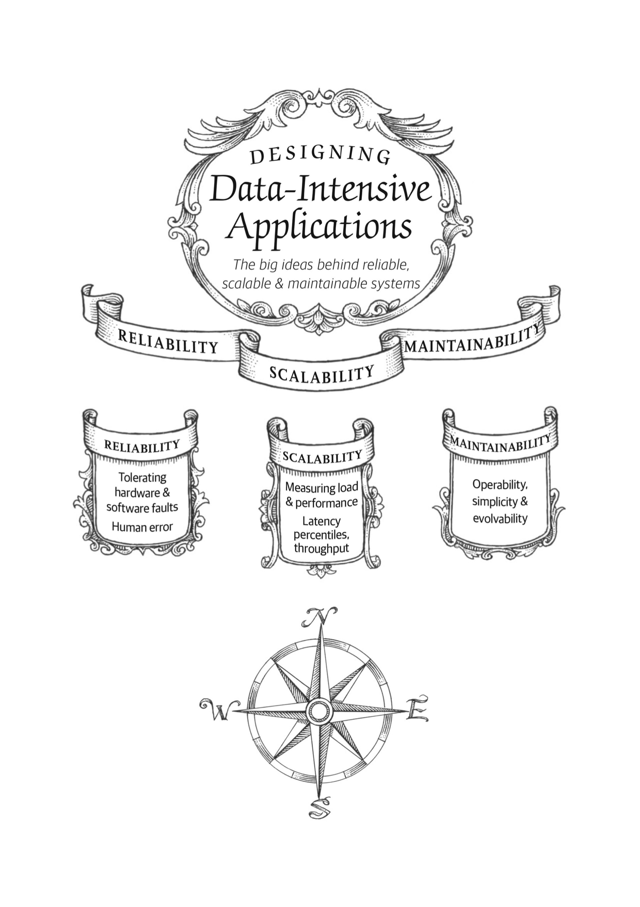

# 第一章：可靠性、可伸缩性和可维护性

> 互联网取得了如此伟大的成就，人们习惯于它的存在就如同海洋自然的存在一样，我们甚至都已经忘记它是一个人造的产物。我们甚至都想不到上一次发生如此伟大的技术革命是在什么时候。
>
> — Alan Kay, 在接受 [Dr Dobb’s 期刊采访](https://www.drdobbs.com/architecture-and-design/interview-with-alan-kay/240003442)时说 (2012)

在如今，很多系统都是**数据密集型**（*data-intensive*）系统，而非**计算密集型**（*compute-intensive*）的。
