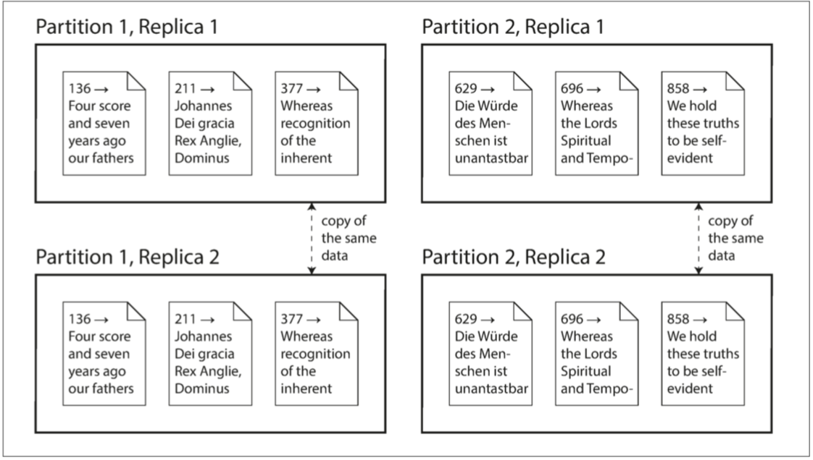

# 第二部分：分布式数据

> 对成功的技术而言，现实必须置于比公共关系更加优先的地位，因为大自然是无法被欺骗的。
>
> — 理查德·费曼，罗杰斯委员会报告（1986）

在本书的第一部分，我们讨论了数据存储在单个机器场景的数据系统。在第二部分，我们不妨更进一层，试问：当有多台机器同事对数据进行存储或检索将会发生什么呢？

以下是把数据库的数据分别放到多台机器上来进行存储的原因：

* 可扩展性:

  如果你的数据体量不断增加，读写负载超过单台机器所能承载的最大值，你可能会把这些负载分摊到多台机器上。

* 容错性/高可用性:

  如果你的应用想要在一台机器（或多台机器，或者网络，或者单个数据中心）故障后仍能继续工作，你可以使用多台机器来为你提供冗余服务。当一个失败后，另外一个可以接管它来执行任务。

* 延迟：

  如果你们的用户遍布世界各地，你可能会希望在世界各地的不同位置都拥有服务器，以便每个用户都可以从一个地理学上更接近他们的数据中心来获得服务。这样就避免了用户需要等待网络包穿越大半个地球才传输过来。

## 应对更高负载的扩展

如果你只是用来应对高负载，那么最简单的办法就是选用一台更加强劲的机器（这种方式也被称为**垂直扩展**或**升级升级**）。多个cpu，多块内存，多个磁盘可以在同一个操作系统下结合使用，快速的连接设备使得cpu可以访问内存或磁盘的任何位置。在这种「共享内存架构」（*shared-memory architecture*）下，所有的组建都可以看作是一台机器[[1](#part2References1)]。[^ In a large machine, although any CPU can access any part of memory, some banks of memory are closer toone CPU than to others (this is called *nonuniform memory access*, or NUMA ). To make efficient use of this architecture, the processing needs to be broken down so that each CPU mostly accesses memory that isnearby—which means that partitioning is still required, even when ostensibly running on one machine.]

共享内存的方式存在的一个问题就是，它的花费开销增长曲线比线性架构增长的更快：一个拥有两倍多的CPU，两倍多的内存以及两倍多磁盘容量的机器，它的开销比起单倍的机器通常要多于两倍。

共享内存体系架构所提供的「**容错性**」是有限的—高端的机器一般都支持热插拔组建（你可以在不关闭电源的情况下来更换硬盘、内存、甚至是CPU）—但这也仅限于在同一地理位置范围内。

另外一种是共享磁盘架构，它使用多台具有独立CPU和内存的机器，但是存储数据的磁盘阵列是被所有机器共享的，他们之间通过快速网络来进行连接。[^ii. *Network Attached Storage* (NAS) or *Storage Area Network* (SAN).]这种架构适用于一些数据仓库场景，但是争用和锁开销限制了共享磁盘架构的可伸缩性[[2](#part2References2)]。

### 无共享架构

相比之下，「**无共享架构**」[[3](#part2References3)]（有时也称为**水平扩展**或**向外扩展**）要更加受青睐。在这种架构下，每一台运行着数据库软件的机器或虚拟机都被称为一个「**节点**」。每一个节点的CPU，内存和磁盘都是独立的。节点与节点之间也是通过传统的网络在软件层面进行协调。

「**无共享架构**」对硬件没有特殊的要求，因此你可以选用架构更合适性价比更高的机器。你可以在多个不同的物理地址之间分发数据，这样可以有效的避免用户请求延迟的问题，而且当一个物理位置的数据中心崩溃后，另外一个能有效的存活下来。随着虚拟机的云部署，你不需要拥有像Google这样级别的运维能力：即使再小的公司，也可以轻松的构建异地多活分布式架构。

在本书的这一部分，我们关注于「**无共享架构**」，尽管它可能不是我们所有应用场景中的最佳选择，但是对于我们，作为一个应用开发者来说是很值得我们去审慎对待的。如果你的数据是跨多个节点分区部署的，你要意识到数据库在这中间所做的规范以及权衡性措施—数据库不会平白无故的就帮助你完成这些事情。

虽然分布式的「**无共享架构**」有很多优点，但它同时也增加了应用的复杂性，有时候甚至会限制你所使用数据模型的表达能力。有时候，一个简单的单线程程序可能拥有比100核CPU的集群更好的性能表现[[4](#part2References4)]。不过，「无共享系统」的能力还是非常强大的。我们将在接下来的几章来详细介绍数据在分布式存储时可能遇到的问题。

### 副本/分区

使得数据分布在多个不同的节点一般有两种比较通用的方式：

* 副本

  在可能分布在不同地理位置的不同节点上保存相同的数据副本。提供冗余复制：当一些节点不可用时，其它数据节点还可以继续提供服务。副本机制还有助于提升性能。我们将在 [第五章](chapter5.md) 来讨论「**副本**」。

* 分区

  把一个大的数据库分解为更小的数据集称做「**分区**」，所以不同的分区可以看作是不同的节点（也可称为分片-*sharding*）。我们将在 [第六章](chapter6.md) 来讨论「**分区**」。

虽说这些都是一些独立的特性，但往往他们可以同时使用。如[图II-1](#figureII-1)所示：

<a id="figureII-1">**图II-1.**</a>一个拥有两个分区，每个分区有两个副本的数据库。

理解了这些概念，我们可以讨论在分布式系统中所面临的困境以及在处理这些问题过程中所做的权衡。我们会在[第七章](chapter7.md) 中讨论事务，这将会帮助你理解在分布式数据系统中可能出错的地方和原因以及我们怎么去避免这些错误。我们将在 [第八章](chapter8.md) 和 [第九章](chapter9.md) 中讨论分布式数据系统基本局限性来结束这一部分的内容。

后面，我们会在本书的 [第三部分](../part3/README.md)来讨论如果把多个数据仓库系统（有可能是分布式的）合并到一个更大的系统中，以此来满足更复杂应用的需求。但前提是，我们得闲讨论分布式数据。

### 参考文献

[<a id="part2References1">1</a>] Ulrich Drepper:[ “What Every Programmer Should Know About Memory,”](http://www.akkadia.org/drepper/cpumemory.pdf) *akka‐dia.org*, November 21, 2007.

[<a id="part2References2">2</a>] Ben Stopford: [“Shared Nothing vs. Shared Disk Architectures: An IndependentView,”](http://www.benstopford.com/2009/11/24/understanding-the-shared-nothing-architecture/) *benstopford.com*, November 24, 2009.

[<a id="part2References3">3</a>] Michael Stonebraker: [“The Case for Shared Nothing,”](#http://db.cs.berkeley.edu/papers/hpts85-nothing.pdf) *IEEE Database Engineering Bulletin*, volume 9, number 1, pages 4–9, March 1986.

[<a id="part2References4">4</a>] Frank McSherry, Michael Isard, and Derek G. Murray: “[Scalability! But at What COST?](#http://www.frankmcsherry.org/assets/COST.pdf),” at *15th USENIX Workshop on Hot Topics in Operating Systems* (HotOS),May 2015.
