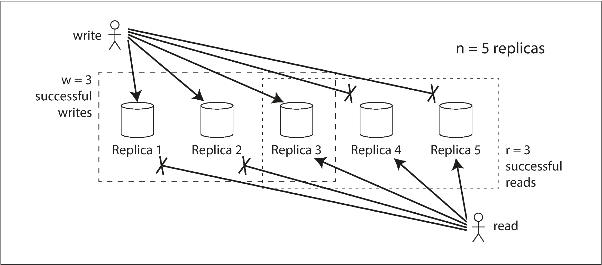

# 第五章：备份

> 一件事情出错和不出错最大的区别在于当一件不可能出错的事情出错时，通常已经难以挽救了。
>
> — Douglas Adams, *Mostly Harmless* (1992)

备份意味着要在被网络连接的多个不同的机器之间存储相同的数据。正如在 [第二部分](README.md) 引言中所描述的，有以下几点原因是为什么需要进行备份：

* 使数据在地理位置上离用户更近（减少延迟）。
* 当部分数据存储服务宕机后，系统仍然可以继续提供服务（提高可用性）。
* 自由伸缩提供读取服务的机器数量（提高读取吞吐量）。

在本章我们假设你的数据量足够小，每台机器都可以完整的保存整个数据集。在[第六章](chapter6.md)会抛开这个假设来谈谈对于单台机器来说数据量过大时怎么来对数据集进行分区（分片）。在后续的章节，我们还会讨论在备份数据系统中可能产生的一些错误或者缺陷，以及如何来解决它们。

如果你的副本数据不随着时间而发生变化，那复制是比较容易的：你只需要一次性的把数据复制到各个节点就可以了。复制机制中所有的难点都在于对更改的数据处理上，这也是我们本章所探讨的重点。我们会谈到节点之间对于变更数据复制的3种主流的算法：单主（*single-leader*）复制，多主（*multi-leader*）复制以及无主（*leaderless*）复制。所有对于分布式数据的处理无外乎这3种方式。他们之间各有利弊，接下来我们将会详细的阐述。

复制（replication）涉及许多权衡考虑，例如是否使用同步或异步复制，以及如何处理失败的副本。这些通常是数据库中的配置选项，尽管具体细节因数据库而异，但原则上他们的实现是相似的。我们将在本章中讨论此他们做出这些选择的原因。

数据库的复制是一个比较久远的话题—自从19世纪70年代以来，它的原理性的东西并没有太大变化[[1](#ch5References1)]，因为底层网络的「**约束规范性条件（fundamental constraints ）**」也一直保持没变。然而，在研究之外，很多开发人员长时间以来一直认为数据库始终都只有一个节点。对于分布式数据的主流应用是近期才出现的。由于很多应用开发人员都是刚接触到这一领域，所以他们对于像「最终一致性（*eventual consistency*）」这些概念存在很多误解。在[延迟同步问题](#延迟同步问题)我们将更深入的叙述「最终一致性」，并且会讨论诸如「**读己写-*read-your-writes***」和「**单调读 -*monotonic reads***」等概念。

## 领导者和追随者

每一个存储数据库拷贝的节点我们称之为一个「**副本-*replica***」。随着多副本的产生，问题也会随之而来：我们怎样确保每个副本中都保存有完整的数据？

每一次对数据库的写请求必须能被所有副本接收并且处理；不然，数据库副本之间就可能会包含不同的数据。对于此类问题最常用的解决方案是如[**图5-1**](#figure5-1)所示的「**基于领导者复制-*leader-based replication***」（也被称作「**主动/被动-*active/passive***」 或者「**主从复制-*master–slave replication***」）。它的工作机制如下：

1. 把其中一个副本设定为「**领导者**」（也被称为「**主-*master***」或「**首要-*primary***」）。如果客户端对数据库写入数据，则必须将他们的请求发送给领导者，领导者会最先把新写入的数据写入到本地。

2. 其它的副本就是我们所说的「**追随者**」（也被叫做***read replicas***，***slaves***，***secondaries***或 ***hot standbys***）。[^i]当领导者把新数据写入本地存储后，还会把变更的数据以变更日志或变更流的形式发送给它的追随者。追随者接受到领导者发送的变更日志后便会更新它本地的数据库备份数据，它会按照领导者的执行顺序来执行本地的变更。

   ---

   [^i]:Different people have different definitions for *hot*, *warm*, and *cold* standby servers. In PostgreSQL, for example, *hot standby* is used to refer to a replica that accepts reads from clients, whereas a *warm standby*processes changes from the leader but doesn’t process any queries from clients. For purposes of this book, the difference isn’t important.

3. 当客户端读取时，它既可以从领导者副本读，也可以从追随者副本读取。但是写入请求只能由领导者副本接收（从客户端的角度来看，追随者副本是只读的）。

<a id="figure5-1">**图5-1.**</a> **基于领导者（主从）复制**

这种复制模型是很多诸如（PostgreSQL (9.0以后版本), MySQL, Oracle Data Guard [[2](#ch5References2)], 以及 SQL Server的

AlwaysOn Availability Groups [[3](#ch5References3)]）等关系型数据库内建特性。同样也被用在包括MongoDB，RethinkDB和Espresso[[4](#ch5References4)]等非关系型数据库中。最后，基于领导者复制并不局限于数据库：像一些分布式消息系统如Kafka[[5](#ch5References5)]和RabbitMQ的高可用队列[[6](#ch5References6)]也是用它来实现的。同样的，一些网络文件系统和DRBD这样的块设备复制也可以用它来实现。

### 同步复制与异步复制

副本系统一个最重要的细节就是复制是同步进行还是异步进行。（在关系型数据库中，这通常是一个配置项；其它的系统通常会硬编码为其中的一种。）

回想一下[**图5-1**](#figure5-1)的用户更新头像的场景。在某一时间点，客户端发送更新请求到领导者副本；随后，leader副本接收到请求，然后在合适的节点把变更数据转发给追随者。最后，leader副本通知客户端数据更新成功。

[**图5-2**](#figure5-2) 展示了系统各组件之间的交互流程：客户端，leader副本，2个追随者副本。时间从左到右。箭头表示请求或响应信息。

<a id="figure5-2">**图5-2.**</a> **基于领导者复制，一个同步复制追随者，一个异步复制追随者。**   

在[**图5-2**](#figure5-2)的例子中，**追随者1**采取的是同步复制：领导者会一直等待，直到接收追随者1确认已经接收到写数据的消息后，才会给用户返回成功消息，在这之前数据对其它客户端是不可见的。**追随者2**采用的是异步复制：领导者发送变更消息后并不会等追随者的确认消息而直接返回。

图中所展示的是**追随者2**在处理数据时存在比较大的延迟。通常情况下，复制是比较快的：大多数数据库系统的追随者一秒钟内就会处理完变更数据的同步。但是，追随者的处理时间并不受我们控制。在某些情况下，追随者可能会落后领导者几分钟甚至更久。例如，追随者刚好是在执行故障恢复，系统刚好处在最大负载值，或者节点之间刚好有网络故障。

同步复制的优势在于追随者始终能够保证和领导者的数据保持一致。当领导者突然宕机，我们仍能够保证追随者副本的数据依旧是有效的。缺点是当同步复制的追随者无响应时（可能发生崩溃，网络错误，或其它的一些原因），写进程将无法继续执行。领导者必须阻塞所有的写操作，直到同步复制重新恢复。

基于这个原因，那么把所有的追随者都设置为同步复制就会显得很不切实际了：因为任何一个节点的中断，都会导致整个系统逐渐停止。实际上，如果允许数据库有同步复制，通常是让其中一个追随者采用同步复制，剩余的追随者则采用异步复制。如果采用同步复制的追随者不可用或复制变慢，那么从异步复制的追随者中挑选一个变为同步复制。这样我们就能够保证至少有两个副本保存有最新的数据：领导者副本和采用同步复制的追随者副本。这种配置机制，我们有时称它为「**半同步-*semi-synchronous***」[[7](#ch5References7)]。

通常，基于领导者复制会被配置称完全同步的。在这种场景下，如果领导者副本发生宕机并且无法恢复时，所有未复制完成的从节点将会丢失这部分写操作数据。这就意味着写入操作不保证能成功的持久化，即使客户端收到了服务端的确认响应。然而，一个完全异步化的配置也有其优势，那就是即使所有的从节点数据同步都落后与领导者副本，也依然不会影响领导者副本的写入。

像「异步复制」这种弱持久性的设计咋看是一个糟糕的折衷办法，但它仍被广泛的应用，尤其是在从节点分布在不同的地理位置这种场景中。我们在[延迟同步问题](#延迟同步问题)这一小节再回过头来讨论这个问题。

---

副本机制探究

对于异步复制系统来说，因为领导者副本出错而导致的数据丢失是一个很严重的问题，所以研究人员依然在寻找一种复制方法，既能保证数据不丢失，又能保持很好的性能和可用性。例如，「链式复制-*chain replication* 」[[8](#ch5References8),[9](#ch5References9)] 这种同步复制的变体，就已经在成功的在微软Azure Storage系统中加以应用。

多副本一致性与共识之间存在很强的联系（多个副本之间值达成一致性），我们将在[第九章](chapter9.md)详细讨论这一点。本章我们主要研究的重点是数据库事件中比较简单通用的副本机制。

---

### 配置新的从节点

当你需要增加副本的数量或者替换异常的节点时，就需要考虑增加新的从节点。那我们又如何来保证新加入的从节点数据和主节点的数据保持一致的呢？

如果还是单纯的把数据从一个节点复制到另一个节点通常是不够的，因为客户端会不断的往数据库中写入数据，这就导致数据始终处于不断变化之中，因此常规的文件拷贝方式将会导致不同的节点上呈现出不同时间点的数据，这种情况往往不是我们愿意看到的。

当然你可以锁定数据库（使其不可写）来使得磁盘上的文件保持一致，但使这会违反「高可用」的设计原则。但好在我们可以在不停机的情况下来设置一个从节点。它的执行步骤如下：

1. 在某一时间点对主节点的数据打一个一致性快照。这样可以避免长时间的锁定整个数据库。现在大多数数据库都支持此特性，同样快照也是系统备份所必需的。某些情况下，可能需要借助第三方工具，比如MySQL的*innobackupex*[[12]](#ch5References12)。

2. 复制镜像数据到新的从节点。
3. 从节点连接主节点并请求在同步快照中间所发生的变更数据。这要求快照能够精确的标识出它在复制日志的具体位置。这个位置有多种不同的称呼：如PostgreSQL将其称为「**日志序列号-*log sequence number***」，MySQL称它为「*binlog coordinates*」。
4. 当从节点同步完快照数据后，再处理变更的积压日志的过程，我们称之为追赶。它将继续处理主节点接下来发生的数据变更。

创建从节点的步骤也会因为数据库的不同存在着很大的差异。在某些系统中，这些处理过程完全是自动化的，而在另外一些系统中工作流程又相对会比较复杂，有时甚至需要管理员手动操作。

### 处理节点中断

系统中的任何一个节点都可能因为故障或计划中系统维护（例如节点重启或安装内核安全补丁）发生宕机，

如果能在不停机的情况下重启节点，将会给运维带来巨大的便利。因此，我们的目标就是在单个节点宕机的情况下，也要保证系统整体可运行，并把节点宕机的影响降至最小。

那么，如何基于领导者复制来保证高可用呢？

#### 从节点失效：追赶式恢复

每个从节点在本地磁盘都维护一份从主节点接收到的变更数据的日志记录。如果从节点崩溃恢复，或者主从节点之间网络暂时中断，从节点也可以轻松的恢复，因为通过本地日志，从节点能够很快查询到在崩溃发生时所处理到的最后一个事务。因此，当从节点重新连上主节点时，再重新请求从崩溃那一刻到恢复期间所有的变更数据就可以了。当把所有的变更数据都同步完成后，便可以像之前一样继续接受来自主节点的数据变更流就可以了。

#### 主节点失效：故障转移

主节点失败处理则会比较棘手：首先要选出一个从节点变更为主节点，客户端要重新配置他们的写请求到新的主节点，其余的从节点也要重新从新的主节点消费变更数据。这个过程便是「**故障转移**」。

故障转移可以切换，主动的通知管理员主节点失效，管理员则会采取一些必要的措施来创建一个新的主节点。也可以自动进行，自动切换的步骤通常如下所示：

1. ***确认主节点失效。***

   导致主节点失效的原因有很多，比如系统崩溃，断电，网络故障等等。目前没有一个万全之策能够精确的检测出到底哪里出现了问题，所以大多数系统都会采用超时机制：节点之间频繁的发送心跳检测信息，如果发现某一节点在较长的一段时间里（例如30s）没有应答，则认为该节点失效（计划中的主节点主动下线维护，不在此考虑范围内）。

2. ***选举新的主节点。***

   可以通过选举的方式在剩余的副本中选出一个作为主节点，或者从之前事先推举的副本中挑选出一个作为主节点。最好的领导者候选人一般是从原有主节点同步数据最多的副本（这样可以最大限度的减少数据丢失）。让所有节点同意某一副本为主节点是典型的共识问题，我们将在[第九章](chapter9.md)详细的讨论。

3. ***重新配置系统配置信息来使新的主节点生效。***

   客户端需要将新的写请求发送给新的主节点（我们在会在[请求路由](chapter6.md#请求路由)这部分讨论）。如果原来的主节点重新上线，它可能并不能感知到其他副本已经强制使其下线而仍然认为自己是主节点。这时候系统要能够确保旧的主节点变为从节点，并能够知晓哪一个是主节点。

   

但是，上述切换过程存在着诸多变数：

* 如果使用异步复制，在旧主节点故障前，新的主节点可能还没有接受到所有来自旧主节点的写入数据。如果等到新的主节点被选举成功后，旧的主节点又重新加入到集群中，那么旧主节点中原有的写入数据将怎么处理呢？同时新的主节点也可能会接收到冲突的写请求数据（旧主节点意识不到自己已经不是主节点，从而还会向其它节点发送同步数据）。针对这种情况，通常的解决方案是原来旧的主节点简单的丢弃掉未复制成功的这部分写数据，但这可能违背客户端的持久化原则。
* 如果有外部的存储系统依赖于数据库的内容做协调数据，那么丢弃写数据将会是特别危险的操作。例如，GitHub的一次事故中[[13](#ch5References13)]，某个未完全同步完成的从节点被晋升为主节点，数据库使用了自增数作为新增行的主键，但是由于新主节点的自增数要落后于原来旧的主节点，所以复用了部分旧主节点已经分配过的数值作为主键。刚好这些主键也被用在了Redis中，造成了MySQL于Redis中的主键不一致问题，从而导致一些私人的数据信息泄漏给了其它的用户。
* 在某些错误的场景下（参见[第八章](chapter8.md)），可能会发生两个节点都认为他们是主节点的情况。这种场景称之为「**脑裂**」，这其实是相当危险的：如果两个主节点都能接收写请求，但是没有处理冲突（参见：[多主复制](#多主复制)），那数据极有可能丢失或损坏。出于安全的应急方案考量，某些系统会制定一些机制，就是当检测到有两个主节点存在时，便会强制关闭其中的一个。[^ii]当然，如果这种机制设计时考虑的不够周全，也可能会出现两个节点都被关闭的情况[[14](#ch5References14)]。
* 如果设置合适的超时时间来限定主节点的失效状态呢？如果设置的超时时间过长，那么意味着一旦出现主节点失效的情况，恢复所需要的时间也会更长。但是，如果设置的超时时间太短，则会导致不必要的故障转移发生。例如，突发的负载峰值可能会导致节点的响应时间超出所设定的超时时间，或者网络故障也可能会导致数据包的延迟。如果系统已经处在负载峰值或网络故障的情况下，一个不必要的故障转移不会使系统变好，反而变得更糟。

对于这些问题没有很好的解决办法。基于这些原因，一些运维团队宁愿选择手动执行故障切换，也不愿意采用自动故障转移的方案。

节点失效，网络不稳定，副本之间对一致性，持久性，可用性和延迟所做的一些妥协措施等等这些问题，实际上都是分布式系统中存在的基本性问题。在[[第八章](#chapter8.md)]和[[第九章](#chapter9.md)]中我们会更加深入的来讨论。

---

[^ii]: This approach is known as *fencing* or, more emphatically, *Shoot The Other Node In The Head* (STONITH).We will discuss fencing in more detail in [“The leader and the lock”](chapter8#主节点和锁) 。

### 同步日志实现

主从复制到底时如何工作的呢？实践中有多种不同的实现方法，让我们先简单的看一下他们大概的实现原理。

#### 基于语句复制

最简单的情况，主节点记录它执行过的每一次写请求（操作语句），然后把操作语句的日志发送给从节点。对于关系型数据库来说，这意味着每一个插入、更新、删除操作原语都会转发给从节点，然后从节点就好像他们是客户端发过来的请求一样，解析并执行这些SQL操作原语。

尽管这听起来很合理，但这种直接使用操作语句复制方式在下面这些场景中就显得不太适用了：

* 一些**非确定性函数**的调用，如获取当前日期和时间函数-NOW() ，和获取随机数函数- RAND() ，在不同的副本中可能会生成不同的值。
* 如果语句中涉及自增列的操作，或者依赖于数据库现有的数据（例如：UPDATE … WHERE *<条件>*），则要求它们在每个副本中的执行顺序要高度一致，否则就可能会产生不同的影响。这其实会对并发事务处理产生诸多限制。
* 一些会产生副作用的语句（例如：触发器，存储过程，自定义函数），除非这些这些语句产生的结果是可控的，否则在不同的副本中就会产生不同的副作用。

这些问题都是可能被解决的，例如，当操作语句被日志化的时候，主节点可以用固定的返回值来替代这些不确定函数，这样，从节点接收到的便都是相同的值了。但是，这里面有太多的边界条件需要考虑，所以现在通常都是使用其它的复制方案。

MySQL在5.1版本之前使用的是基于语句的复制方案。由于这种方案的逻辑和日志存储十分紧凑，所以在现在仍然在某些地方使用。但是，默认情况下，如果有不确定的源于，MySQL会采用「**基于行复制-row based replication**」（稍后讨论）的方案。VoltDB则仍然还在使用基于语句的复制，它是通过事务级别的确定性来保证数据复制的安全。[[15](#ch5References15)]

#### 预写日志（WAL）传输

在[[第三章](../part1/chapter3.md)]中，我么讨论了存储引擎是怎么在磁盘中存储数据的，我们发现通常每个写操作都是以追加写的形式记录到日志中的：

* 对于日志结构存储引擎（参见：[SSTables和LSM-Trees](../part1/chapter3.md#SSTables和LSM-Trees)）,日志是主要的存储方式。后台进程会对日志段进行压缩和回收。
* 对于采用覆盖写磁盘的B-tree（参见：[B-Trees](../part1/chapter3.md#B-Trees)）结构,每次写操作之前都会预先写入日志，如果系统发生崩溃，通过索引就能快速的恢复到和此前的一致性状态。

不管是哪种情况，所有对数据库写入的字节序列都会被记录到日志中。因此可以使用完全相同的日志在另外一个节点上构建新的副本（除了将日志写入磁盘意外，主节点还可以通过网络将其发送给从节点）。

当从节点处理完这些日志后，那么它将拥有和主节点完全一致的数据结构内容。

像PostgreSQL，Oracle和其它一些系统都支持这种复制方式[[16](#ch5References16)]。但是它主要的缺点在于日志描述的数据非常底层：WAL日志通常包含的是哪些磁盘中的block中的哪些字节发生的变动，这便会造成复制机制和存储引擎之间的耦合。如果数据库的数据存储格式发生变动，那么同一个份数据日志将不支持在不同版本的主节点和从节点之间运行。

这看起来只是一个细微实现的变化，但却会对维护产生较大的影响。如果我们采用的复制协议允许从节点可以使用与主节点不同的软件版本，那么你就可以先升级你的从节点系统版本，然后在执行故障转移是其中一个升级后的从节点变为新的主节点，从而实现不停机升级。但是如果复制协议在不同的系统版本之间不能兼容，那么升级就必须要停机处理了。

#### 基于行的逻辑日志复制

另外一种方式是复制日志和存储引擎采用不同的日志格式，这样就可以使得复制日志和存储引擎之间解耦。这种用以和存储引擎（物理上的）数据表示相区分的复制日志称之为「**逻辑日志**」。

关系型数据库的逻辑日志通常是对数据库表中行维度的一系列写操作的记录描述：

* 对于插入行，日志会记录所有列的值。
* 对于删除行，日志中记录能够唯一标识出被删除行的信息。通常情况下都是主键，但如果表中没有主键，那么就需要记录被删除的所有列的值。
* 对于更新行，日志也要记录能够唯一标识出被更新行的所有信息以及每一列更新的新值（或者被更新列的最新值）。

如果一个更新多行的事务，除了会产生上述多条这样的日志记录外，还会跟上一条标记该事务已经提交的记录。MySQL的binlog日志(当配置了基于行复制格式时)就是使用这种方式[[17](ch5References17)]。

正是由于做到逻辑日志和内部存储引擎的解耦，我们就能很容易的做到向后兼容性，从而使得主节点和从节点可以运行不同版本的系统，甚至是不同的存储引擎。

另外逻辑日志也更容易被外部应用系统解析。如果你想要把内容发送到外部系统（例如一个用于离线分析的数据仓库），或者是构建自定义索引和缓存，就显得特别有优势了。这种技术也被称之为「**变更数据捕获-*change data capture***」，我们在[第11章](../part3/chapter11.md)中继续讨论。

#### 基于触发器的复制

到目前为止，我们所讨论的所有复制机制都是由数据库系统自行完成的，这其中并不涉及任何的应用程序代码。这在很多通用场景中都是我们乐意看到的情况，但是也会存在一些场景需要我们我们的系统具备更高的灵活性。例如你只想备份数据的一部分数据，或者想把一种数据库中的数据备份到另外一种数据库中，又或者你需要冲突解决逻辑（参见：[写冲突处理](#写冲突处理)），这时候你必须要把复制交由应用层来实现。

像Oracle的GoldenGate[[19](#ch5References19)]这样的工具，可以通过读取数据库日志的方式让应用程序获取到数据变更。另外就是可以利用关系性数据库本身的特性：「**触发器-*triggers***」和「**储存过程-*stored procedures***」。触发器支持注册应用层代码到数据库系统中，当有数据变更（写事务）发生时系统可以自动的执行你注册的代码。我们就可以利用这个触发器把变更的日志信息记录到一个单独的表中，然后让外部的处理程序读取该表，来实现我们在应用层的自定义逻辑，或者把变更的数据备份到其它的系统中。Oracle的Databus[[20](#References20)]和Postgres的Bucardo[[21](#References21)]就是这种技术的典型代表。

不过，基于触发器的复制通常比其它形式的复制方式开销更高，也比数据库内置的复制更容易出错。但是，它所拥有的高度灵活性使得他仍然又它的用武之地。

## <a id="ReplicationLag">延迟同步问题</a> 

容忍节点故障仅仅是复制的其中一个原因。正如[第二部分](READEME.md)大纲所介绍的，其它原因还包括「可扩展性」（想比单台机器处理更多的请求）和「低延迟性」（将服务部署在物理地址离用户更近的地方）。

「**主从复制**」要求所有的写请求都经过主节点，但是只读查询则可以通过任一副本来进行。对于读多写少（Web应用模式）的工作模式来说，这是一个不错的选择：创建多个从节点，把读请求分发到这些从节点上。减轻主节点工作负载同时又能实现用户的就近访问。

在这种扩展机制下，你可以仅通过简单的增加从节点就能够达到提高读请求吞吐量的目的。但是这种方法仅适用于异步复制，如果你试图对所有的从节点都采用同步复制的方式，那么一个节点的失效或网络故障就将会导致整个系统不可写。而且，你的节点越多，发生这种状况的概率越高，所以，一个完全同步复制的配置可靠性是非常差的。

但是，如果应用从一个异步同步的副本中读取数据，又可能会因为从节点落后主节点太多而导致读取到的数据是过时的。这就会导致数据库中出现明显的不一致现象：如果你在同一时间分别在主节点和从节点执行相同的查询，你可能会得到不同的结果，因为并不是所有的写操作都反应到了从节点上。不过这个不一致现象也只是暂时的：如果你停止写入等待一会，从节点最终会赶上并与主节点数据一致。这个效应就是我们所说的「**最终一致性-*eventual consistency***」[[22](#ch5References22),[23](#ch5References23)]。[^iii]

”最终-eventually“一词其实是一个模糊的概念：通常，一个副本的落后时间并没有一个限制。通常，主节点和从节点完成同一个写操作之间的时间延迟（**同步延迟-*replication lag***）可能不足一秒，像这样的段时间延迟，通常对我们的服务是无感的。但是，如果系统已经达到负载极限或者网络出现问题，那么延迟时间便会很容易的达到几秒甚至是几分钟。

当延迟时间过长时，由它所带来的不一致问题就不仅仅是理论层面的问题了，而是它实实在在的对我们的应用产生影响。在本节中，我们会重点介绍三种「**同步延迟**」的问题，并给出相应的解决方案，

---

[^iii]:  「最终一致性」一词最早由Douglas Terry 提出. [[24](#ch5References24)]，后来经由 Werner Vogels[[22](##ch5References22)]而普及，并称为很多NoSQL项目的标志性口号。但事实上，采用异步复制的关系性数据库同样具有该特性。

### 读己写

很多应用能够使得用户提交一部分数据后，接下来便可以看到他们之前已经提交的数据。这可能存在于用户数据库或者对一个主题帖子的评论中。当新的数据被提交后，它必须先发送到主节点，但是当用户访问这些数据时，它可能是从某一从节点读取的。尤其是在数据读取密集型应用场景中更是如此。

如[**图5-3**](#figure5-3)所示，在异步复制中存在这样一个问题：如果用户是在写后不久便访问该数据，那么新写入的数据可能还没来得及同步到从节点。对于用户来说，看起来好像他提交的数据丢失了，这对用户来说显然是不可接受的。

<a id="figure5-3">**图5-3.**</a> **用户写之后紧接着伴随着一个读操作，为了防止这种异常现象，我们就需要「写后读一致性」。**

在这种场景下，我们就需要「**写后读一致性-*read-after-write consistency***」，也被称作「**读写一致性-*read-your-writes consistency***」[[24](#ch5References4)]。这样就能够保证用户每次刷新页面，都能够看到他们最新提交的内容。不保证其它用户操作的一致性：其它用户的更新操作可能会到晚些时候才能看到。但是，它保证了用户自己的输入一定能够正确的保存。

那么基于「**主从复制**」的系统中怎么来实现「**写后读一致性**」的呢？其实有很多可行性方案，下面来列举一二：

* 当用户读取哪些可能会被修改到的数据时，则从主节点读取，否则，就从从节点读取。这就要求我们需要一种方法来知道你查询的数据是否有可能会被修改到。例如社交网站的用户个人信息通常只能狗被用户自己编辑，而其他人时无权限修改的。所以，我们就可以简单的规定：总是从主节点查询自己的配置信息，而其他用户的配置信息则从从节点读取。
* 如果应用的大部分数据都有可能会被修改到，那么上述方法可能不太适用，因为这样就会导致大部分的数据都需要从主节点来读取（这会破坏读操作的可扩展性）。因此，我们就可能会考虑其他的方案来决定是否从主节点读取数据。例如，你可以追踪最后一次更新数据的时间，在最后一次更新后的一分钟内，我们都让它从主节点读取。你也可以监控从节点同步的滞后时间值，来避免从滞后大于一分钟的从节点读取数据。
* 客户端可以记录最近一次更新的时间戳，这样系统就能够确保至少在这个时间戳之前副本提供的读取服务都是有效的。如果该副本的数据不够新，要么由另外一个副本提供读取服务，要么等到该副本追上主节点后再执行查询请求。这个时间戳可以是「**逻辑时间戳-*logical timestamp***」（例如用以标识写入顺序的日志序列编号）或者是实际系统时钟（这种情况，时钟同步是关键因素，详见：[第八章：不可靠时钟](chapter8.md)）。
* 如果副本分布在多个不同的数据中心（例如为了高可用，把副本放置在离用户地理位置更近的地方），这种情况会更复杂。任何需要经过主节点处理的请求都必须要路由到主节点所在的数据中心。

如果用户从不同的设备访问服务，例如一个web桌面浏览器和一个移动APP，这又会增加一定的复杂度。这种情况可能需要提供一种跨设备写后读一致性保证：如果用户在一台设备上输入了一些信息，然后在另外一台设备上访问，要保证用户在另外一台设备上能看到他刚才的输入信息。

这就有一些值得我们思考的问题了：

* 记录用户上次更新的时间戳是一件比较困难的事，因为跑在其中一台设备的程序是不知道另外一台设备有更新发生的。这可能需要数据集中化处理。
* 如果我们的副本是跨多个数据中心分布的，我们没有办法保证来自不同设备的连接信息经过路由后到达同一个数据中心（例如，用户的台式机用的是家庭宽带，而移动设备使用的蜂窝网络，设备之间的网络路由可能完全不同）。如果要从主节点读取数据，那么你必须要把用户的所有请求都路由到同一个数据中心。

### 单调读

我们讨论的第二个异常是用户从一个异步复制的副本中读取数据，但看到数据向后回滚的现象。

这种情况可能发生在用户从多个不同的副本进行多次读的场景，例如[**图5-4**](#figure5-4)所示，用户2345先后执行两次相同的查询动作，第一次从滞后程度较小的副本中读取，然后再从滞后程度比较大的副本中读取。（这就好像是用户在刷新一个网页，但是每一次刷新都被路由到了不同的服务器上。）第一次请求返回的是用户1234最近添加的新内容，但是第二次请求没有返回任何内容，因为由于滞后性该副本还未接受到该写操作请求。实际上，第二次查询观测到的是比第一次查询更早的系统状态节点。这倒不如干脆第一次就不返回给用户数据，因为用户2345可能并不知道用户1234在最近新添加了内容。但是，你让用户2345先看到1234提交的内容，然后接下来内容却突然消失了，这对用户来说就会感到非常困惑。

<a id="figure5-4">**图5-4.**</a> **用户先从最新的副本读取到新数据，然后又从一个未同步更新副本中读取时发现数据又消失了，这就好像时光倒流了一样，为了防止这种异常现象，我们就需要「单调读-*monotonic reads*」。**

单调读[[23](#ch5References23)]便可以保证不会发生这种异常。它是介于「**强一致性**」和「**最终一致性**」之间的一种保证机制。当你读数据时，你可能仍然会读到旧的数据；但单调读能够保证的是，当你一次性进行多次读取时，绝不会发生数据回溯现象，即一旦读取到新值后绝对不会再读取到旧值。

实现单调读的其中一种方式是确保每个用户总是从同一个副本来进行读取（不同的用户可以从不同的副本中读取数据）。例如，我们可以使用用户ID的Hash值来选择具体从哪个副本中读取，而不是随机选取一个副本。但是如果用户查询的副本节点失效，这时候就需要路由到其他的副本中来查询了。

### 一致前缀读

我们的第三个由于复制延迟导致的异常现象是涉及因果关系的一个例子。下面是Poons先生和 Cake女士的一段简短对话：

* *Poons先生：*

  Cake女士，你能看到多远的未来？

* Cake女士：

  通常是10秒钟，Poons先生。

这两句话之间是存在因果依赖关系的：Cake女士首先听到Poons先生问她问题，然后她才会回答。

现在，我们试想第三个人是通过副本听到这段对话的场景。Cake女士所说的话的内容同步给从节点是没有延迟的，但是Poons先生说话的内容同步给从节点有比较长的时间延迟（参见[**图5-5**](#figure5-5)）。那么该旁观者可能听到如下内容：

* Cake女士：

  通常是10秒钟，Poons先生。

* Poons先生：

  Cake女士，你能看到多远的未来？

在旁观者看来，Cake女士在Poons先生问问题之前，就已经回答了这个问题了。我们感叹这种超自然力量同时也感受到它异常荒谬的现象[[25](#ch5References25)]。

<a id="figure5-5">**图5-5.**</a> **不同分区的多副本复制出现不同程度的延迟，导致从观察者的角度看到的是回答在前，问题在后。**

想要避免这类错误，就需要我们使用另外一种担保机制：「**一致前缀读-*consistent prefix reads*** 」[[23](#ch5References23)]。这种担保机制是，对于一系列按制定顺序执行的写操作，当用户去读取内容的时候同样也是按照写入的顺序来呈现。

这是分区（分片）数据库中出现的一种特殊场景，我们会在[第六章](chapter6.md)详细讨论。如果数据库总是依照特定的写入顺序，那么读取也会遵从这个一致性前缀，所以我们上面提到的问题就不会发生了。但是，在很多分布式数据库中，不同分区的操作都是独立进行的，分区之间并没有一个统一的全局变量来控制他们写入顺序：当用户从数据库读取数据时，他们看到的数据可能一部分是新数据，一部分是老数据。

其中一种解决方案是确保有任何因果关系的写操作都写入同一个分区，但这样做通常效率不高。也有一些跟踪因果关系的算法，在本章后面的[ “happens-before” 关系与并发](#“happens-before” 关系与并发)中继续该问题的讨论。

### 同步延时解决方案

在最终一致性的系统中，对于副本的同步延迟增加到几分钟甚至几个小时，应用层会发生什么这种问题是非常值得我们思考的。如果没影响当然最好，但是如果对用户会产生较大的影响，那么系统设计中引入诸如「写后读」之类保证机制是非常重要的。如果系统设计之初是同步复制，但运行时却是是异步复制，着对系统来可能造成严重的后果。

正如前面提到的，我们可以在应用层提供比数据库层面更强的担保机制。例如，在主节点记录从节点的读取进度。但是，在应用代码层面处理这些问题是比较复杂并且很容易出错。

正常情况下，应用开发者只需业务层面的问题，其它的问题在数据库层面解决是最好的。这就是为什么会存在事务（*transactions*）的原因：这种由数据库提供的强有力支撑可以让应用层变得更加简单。

针对处理单节点的事务机制已经存在很长一段时间了。但是到了分布式（复制和分区）数据库中，很多是没有事务概念的，对于追求性能和高可用的系统来说，实现事务所付出的代价是非常高昂的，所以「最终一致性」似乎成为了他们唯一的选择。这种观点有一定道理，但这种处理方式又显得太过粗糙。本书的其余部分还会深入的探讨该观点，比如在第[七](chapter7.md)、[九](chapter9.md)章我们会讨论关于事务相关主题的内容，还会在[第三部分](../part3/README.md)讲到它的一些替代机制。

## 多主复制

到目前为止，我们在本章中所讨论的都是基于单个主节点主从复制架构。其实除了主流的主从复制架构外，还有其它一些比较有趣的架构设计。

主从复制架构有一个明显的缺点就是它只有一个主节点，因此所有的写操作都是通过这个主节点来完成的。[^iv]因此，当出现诸如网络中断这种原因而导致连接不上主节点时，你就没办法再继续执行任何写操作了。

从只允许一个主节点接受写操的单主主从复制模型，我们自然会联想到让多个主节点都接受写请求。数据的复制和单主节点类似，每个主节点处理的写请求数据变更都会转发给它所对应的从节点。这种模式我们称它为**多领导者**配置（也就是我们通常说的「**多主复制**」或「**多活复制**」）。在这种模式下，领导者副本除了作为主节点外，同时也扮演了其它领导者副本的丛节点。

---

[^iv]: If the database is partitioned (see Chapter 6), each partition has one leader. Different partitions may have their leaders on different nodes, but each partition must nevertheless have one leader node.

### 多主复制适用场景

在单数据中心内部使用多主复制时没有意义的，因为它的复杂性远远超过它所能带来的收益，但是，在有些场景下这种配置还是有它的优势的。

#### 多数据中心

如果你想要增加整个数据中心的容错能力，并且希望数据离用户更近，我们可能会把数据库的多个副本放到不同的数据中心。如果还是使用传统的单主节点主从复制，那么我们就必须把主节点放到其中一个数据中心，并且所有的写请求都要经过该主节点才行。

在多主配置中，就可以在每个数据中心都设置一个主节点。具体的架构如[**图5-6**](#figure5-6)所示。在每个数据中心内部，采用常规的「**主-从复制**」机制；而数据中心之间，每个数据中心的主节点则会充当和其它数据中心主节点交换数据的角色。

<a id="figure5-6">**图5-6.**</a> 跨多数据中心的多主复制。

我们可以来对比一下，在多数据中心系统中，单主节点主从复制与多主节点主从复制的差异：

* 性能

  在单主节点配置中，所有写操作都必须要通过网络请求到主节点所在的数据中心服务上。这会大大增加写入操作的延迟，并且违背多数据中心的设计初衷。如果是在多主节点配置中，每个写请求可以在当前数据中心中处理，然后把数据变更记录异步复制到其它数据中心。这样，也就不存在数据中心之间网络交互的延迟，从用户的感知上也会觉得性能会更好。

* 容忍数据中心停机

  在单主节点配置中，如果主节点所在的数据中心宕机，那么接下来的故障转移可能就会选举另外一个数据中的从节点作为主节点。但在多主节点配置中，故障转移可以在每一个数据中心内部独立完成，当故障转移完成后，也会通过复制的方式很快追上其它数据中心的主节点。

* 容忍网络故障

  数据中心之间的通信往往是通过公网的形式来交互，它的稳定性通常要比数据中心内部局域网的交互方式要弱很多。一个单主节点的配置，很多写请求都是在数据中心之间同步进行的，它会对数据中心之间的网络连接稳定性更加敏感。多主节点的配置大多是通过异步的方式来进行数据的交换，因此它对网络故障的容忍度相对会高一些，一些短暂的网络中断并不会影响到客户端的写操作。

一些数据库默认就提供了多主节点的配置，但通常都是以额外的插件形式实现的，比如MySQL的Tungsten Replicator[[26](#ch5References26)]，PostgreSQL的BDR[[27](#ch5References27)]，以及Oracle的GoldenGate[[19](#ch5References19)]。

#### 离线客户端操作

另外一个多主节点模式适用的场景是在没有网络的情况下，你仍然希望你的应用能继续工作。

比如你手机、笔记本和其它的一些设备中的日历应用，无论你当前是否联网，你都需要随时随地的查看（读请求）或添加（写请求）会议。并且需要保证你在脱机状态下所做的任何更改，在下次连入网络后，要能够和服务以及其它设备同步。

在这种情况下，可能就需要每台设备都要有一个能够充当主节点的本地数据库（来接受写请求），然后设备之间通过「**多主复制**」的方式来同步你所有设备之间的信息。这种复制延迟往往会有几个小时甚至几天，这取决于你神什么时候连入网络。

从体系结构的角度来说，这种设置其实和数据中心之间的多主复制类似，再极端一点情况，如果每个设备都独立做为一个数据中心使用网络串联在一起，这种方式将更加不可靠。以日历同步经验来看，多主复制虽然可以达到我们想要的结果，但距离做到准确无误仍然还有很长一段路要走。

当然也有一些工具可以简单的实现多主复制，比如，CouchDB就是依据该模型设计的。[[29](#ch5References25)]

#### 协作编辑

实时协作编辑应用允许多个用户同时对同一个文档进行编辑。比如Etherpad[[30](#ch5References30)]和Google Docs[[31](#ch5References31)]就支持多人并发的编辑同一个文本文档或表格（我们会下面“[自动冲突解决](#自动冲突解决)”详细讨论）。

虽然我们通常不认为说协作编辑属于数据库复制的范畴，但它和我们前面提到的离线编辑却有很多相通之处。当用户编辑某一个文档时，首先会修改用户本地的数据文档（在他们本地浏览器或客户端应用中的文档），然后异步复制到服务器或其它正在修改该文档用户的客户端上。

如果你想要确保不发生冲突，那么应用就必须在用户编辑文档之前给该文档加一把锁。那么当另外一个用户想要编辑该文档是，就必须等到之前的用户编辑完提交释放锁之后才能继续进行。这种协作编辑模型其实就等同于事务型单节点主从复制。

不过，为了提升写作编辑效率，你可能会把把操作拆分成一个个非常小的操作单元（例如一次按键输入），以此来避免频繁的锁冲突。这种策略虽然能够使得多用户同时编辑，但也会带来新的挑战，比如在多主复制模型中如何来解决冲突。[[32](#ch5References32)]

### 写冲突处理

「**多主复制**」面临的最大问题就是会有写冲突的发生，这也就意味着写冲突是我们必须要解决的问题。

例如像[**图5-7**](#figure5-7)中，两个用户同时对同一个wiki页面进行编辑。当“User 1”把页面标题由“A”改成“B”的同时，“User 2”也把页面标题由“A”改成了“C”。他们的修改都执行成功并且成功保存在了他们各自的本地主节点副本中。但是，当进行异步复制的时候，这两个修改数据就会发生冲突[[33](#ch5References33)]。很显然，这种情况在「**单主节点复制**」中就不会发生。

<a id="figure5-7">**图5-7.**</a> 多主节点并发更新同一条记录导致的写冲突。

#### 同步/异步冲突检测

在单主节点数据库中，第二个写入操作要么加锁后等待第一个写入操作完成，要么拒绝第二次请求，直接告知用户重试该写入操作。但是，如果是在多主节点场景下，这两个写入操作都会成功，并且只会在接下来的某个时间点才会对该操作进行冲突检测。在那时再告诉用户需要解决冲突就为时已晚了。

原则上，你是可以异步的进行冲突检测，你可以等到写操作被同步到所有的副本中后再告诉用户他这次的写入操作成功。但是，如果你这样的做的话，你将会失去「**多主复制**」最大的优势：每个主节点都能够独立的接收写请求。如果你确实需要同步冲突检测，那或许单节点会是你更好的选择。

#### 规避冲突

解决冲突最简单的方式便是预防冲突的发生，如果应用程序能够保证对于特定记录的所有写入操作都能够通过同一个主节点，这样冲突就不会发生了。由于多数基于「**多主复制**」场景下的冲突处理能力都非常羸弱，所以规避冲突才是首先需要被考虑的一种方式。[[34](#ch5References34)]

例如，在用户修改基本信息的应用场景中，你可以让指定的用户总是路由到同一个数据中心，并且让该数据中心的主节点来处理用户的读写请求。虽然说不同的用户可能会有不同的数据中心（一般会选择离用户位置更近的数据中心）。但从用户的角度来看，他们都是归属于单一的数据节点上。

但是，有些时候我们需要对某些记录做一些变更，比如某一个数据中心失效，这时候你需要把请求路由到另外一个数据中心上；又或者说用户的地理位置发生了变化，他可能距离另外一个数据中心更近一些。在这种场景下，单纯的规避冲突就不能解决问题了，我们还必须解决很可能发生的同时写入不同主节点这种情况。

#### 收敛一致性

在单主节点数据库中，写操作都是顺序执行的，所以对于同一个属性的多条更新，最后一次更新便决定了该属性的最终值。

但是在多主节点的配置场景下，我们没有定义写入的顺序，所以我们并不能清晰的知道最终的值到底是什么。在[**图5-7**](#figure5-7)中，”Leader 1“节点的标题先是更新为 ’B‘，然后再更新为’C‘；”Leader 2“ 节点则先是更新为’C‘，然后更新为‘B’。我们并不能确定哪一个节点的顺序更为准确。

如果每一个副本都只是简单的按照它所看到的写入顺序来处理写请求，那么数据库最终会是一个数据不一致的状态：“Leader 1”节点的最终数据是‘C’，而“Leader 2”节点的最终数据是‘B’。这种情况是不可接受的，我们必须要确保所有的副本中的数据最终都是一致的。所以，数据库需要以收敛的方式解决这种冲突，这也就意味着当所有的更改都被同步完成时，所有副本中的数据最终值必须保证是一致的。

下面是一些收敛冲突的解决方案：

* 给每一个写入指定一个唯一ID（例如，时间戳，long类型的随机数，UUID，或者key和value的hash值），当写入操作携带的ID大于当前记录的ID时才允许写入，否则不允许写入。如果使用的是时间戳，这种技术就是我们所说的「**last write wins**」（LWW）。尽管这种方式很常用，但却很容易发生数据丢失风险[[35](#References35)]。我们将会在本章结尾的“[并发写入检测](#并发写入检测)”中更加详细的讨论 **LWW**。
* 给每一个副本指定一个唯一ID，并且让来自编号更高的副本的写入可以覆盖来自编号比它低的副本的写入。这同样会造成数据丢失。
* 以某种方式合并这些发生冲突的值；比如按照字母顺序将他们组合在一起（比如在[**图5-7**](#figure5-7)中，这个标题的值可能就会变成“B/C”）。
* 把产生冲突的所有信息记录到一个数据结构体中，然后后续在应用代码中来处理冲突（可能通过提醒用户的方式，让用户来选择）。

#### 自定义冲突解决

因为大多数解决冲突的方式都依赖于应用本身，所以有很多基于「**多主复制**」的工具提供给用户写冲突解决应用代码逻辑的入口。这些代码可以在写时或读时执行：

* 写时

  一旦数据库系统在应用副本变更日志时检测到冲突，便调用冲突处理程序。例如，Bucardo便支持在写入时嵌入Perl脚本。因为处理程序通常都不会和用户交互，所以一般这种程序都会在后台执行，并且要求执行速度一定要快。

* 读时

  在检测到冲突时，所有发生冲突的写入操作都被记录了下来。那么在接下来要读取数据时，这些被记录下来的写入数据版本都会返回给应用程序。然后应用程序可以提示给用户，让用户或应用程序自动决定具体要保留哪个版本的数据，然后把结果返回给数据库。CouchDB便是使用的这种方式。

但要注意的是冲突解决一般应用在单个行或单一文档级别，而不是针对的整个事物[[36](#ch5References36)]。不过，如果你的事务可以原子性执行不同的写入（参见：[第七章](chapter7.md)），那么依然可以单独的处理这些写入冲突。

---

自动冲突解决

随着冲突解决规则变得越来越复杂，用户写的处理冲突逻辑也越来越容易出错。其中亚马逊的一个用来处理冲突的逻辑造成的影响便经常被提及：他们的冲突处理逻辑会保留所有添加到购物车的商品，但是未对移除的商品做处理。这样用户就时常会看到他们先前已经移除出购物车的商品[[37](#ch5References37)]。

在自动解决冲突中，还有一些在处理并发数据修改时产生的一些有意思的研究。下面是一些比较值得关注的几点研究：

* **无冲突复制数据类型-*Conflict-free replicated datatypes***（CRDTs）[[32](#ch5References32),[38](#ch5References38)]是set集合，map集合，有序列表，计数器等数据结构家庭成员中的一个。它支持多用户的并发编辑，应能够以一种合理的方式自动解决产生的冲突。一部分**无冲突复制数据类型**已经在Riak 2.0[[39](#ch5References39),[40](#ch5References40)] 中实现。
* **可合并的持久化数据结构-*Mergeable persistent data structures***[[41](#ch5References41)]显式的跟踪历史变更记录，类似Git版本控制系统，并采用三向合并功能（CRDTs采用的双向合并）。
* **OT协同算法-*Operational transformation*** [[42](#ch5References42)]是Etherpad [[30](#ch5References30)] 和  Google Docs [[31](#ch5References31)] 背后实现冲突解决的算法。他是专门为一些如构成文档的字符列表这种有序集合而专门设计的。

虽然说这些算法在数据库中的实现还很稚嫩，但是在未来他们会被完整的应用到更多的可复制数据系统中。自动冲突处理也使得应用程序在多主节点复制的处理中变得更加简单。

---

#### 冲突是什么

有些冲突是很明显的。在 [**图5-7**](#figure5-7) 的例子中，两个写操作同时对同一个记录中的相同字段做修改，并把他们设置为不同的两个值，毫无疑问，这就是一个冲突。

而其它类型的冲突可能会更加微妙。例如，在一个会议室预定系统中，它会记录哪一个会议室被哪一个人在什么时间段被预定了。应用必须保证一个会议室在某一时间段内只能被一个人预定（同一个会议室被预定的时间段不能有任何重叠）。这种情况下，如果同一个会议室在同一时间有两个人同时预定，则会发生冲突。尽管应用在用户预订前会对会议室的可用性进行检查，但是如果这两个预订操作被分别路由到两个不同的主节点上，同样会发生冲突。

虽然这里没有给出确切的答案，但是在接下里章节里，我们会继续对这个问题进行深入的剖析和拆解。我们将会在 [第七章](chapter7.md) 讨论更多关于此类问题的例子。在 [第十二章](chapter12.md) 讨论对于副本系统中对冲突的检测和解决的可扩展性方案。

### 多主复制拓扑结构

**复制拓扑结构**（*replication topology*）描述的是一个写操作从一个节点传播到其它节点的通信路径。如果像 [**图5-7**](#figure5-7) 中一样，你有两个主节点，那么这大概只有一个合理的拓扑结构：“Leader 1”必须把他所有的写操作同步给“Leader 2”，反过来也是一样。但是如果是多于两个主节点，那么他们可能就会有多种不同的拓扑结构了， [**图5-8**](#figure5-8) 便是一些拓扑结构的示例。

 

<a id="figure5-8">**图5-8.**</a> 多主复制可以设置的3种拓扑结构示例。

最常见的拓扑结构是多对多（[**图5-8**](#figure5-8)[c]），每一个主节点都会把它们各自的写操作发送给其它所有的主节点。像其它的一些拓扑结构也会被使用，例如，MySQL默认支持环形拓扑结构[[34](#ch5References34)]（*circular topology*），就是每个节点只接收其中一个节点的写操作，然后再把这些写操作（加上自己的写操作）转发给另外一个节点。另一个被广泛使用的拓扑结构是星型结构[^v ]。指定其中一个主节点然后把它的写操作转发给所有其它的节点，星型结构还可以推广到树状结构。

在环形和星型拓扑结构中，一个写入操作可能需要经过多个节点的传播才能传达到所有的副本中。因此，节点必须要转发它从其它节点接收到的变更数据。为防止无限循环复制，每一个节点需要被赋予一个唯一的标识符，在复制日志中，每一个写入操作都会被打上它已经经过的所有节点的标识[[43](#ch5References43)]。如果节点接收到打了它自己标识的数据变更，那么这个变更将会被忽略掉，因为这个变更数据已经被它处理过了。

---

[^v]: 注意不要和前面的星型数据混淆 (参见[[第三章](../part1/chapter3.md)] “[星型和雪花算法：数据模型分析](../part2/chapter3.md#星型和雪花算法：数据分析)”), 星型数据描述的是数据模型结构，而这里主要讨论的是节点间的通信模型。

不过环型和星型拓扑结构存在的一个问题就是如果有一个节点失败，那么和它相关的所有节点的复制消息流就都会被中断掉，该节点恢复之前他们都不能在做任何的交互。虽然我们可以重新部署这个失效的节点，但是像这样的重新部署操作，大多数是需要手动完成的。例如像多对多（*all-to-all*）这样一个拥有更紧密连接性的拓扑结构则往往具有更好的容错性，因为它允许消息沿着不同的路径进行传播，这样就有效避免的单点故障。

不过，多对多拓扑结构也可能存在问题。尤其是在一部分网络快一部分网络慢（可能发生了网络拥塞）的情况下。其造成的结果就是一些复制同步消息比其它的消息超前到达了，如 [**图5-9**](#figure5-9) 所示。

<a id="figure5-9">**图5-9.**</a> 多主复制中，写入操作在某些副本中的到达顺序发生错误。

在 [**图5-9**](#figure5-9) 中，“Client A”在“Leader 1”副本的表中新增了一行数据，然后“Client B”在“Leader 3”副本中更新这行记录。但是“Leader 2”副本可能会以不同的顺序接收这两个写操作，它可能首先接受到更新操作（但是此时这条更新语句更新的行数据还未同步到“Leader 2”，也就是说这条数据在“Leader 2”副本中是不存在的），然后才接收到插入操作请求（该条语句本应该在更新语句之前）。

这就是这个问题发生的原因，这和我们前面看到的 [一致前缀读](#一致前缀读) 类似：更新依赖于先前的插入操作，所以我们需要保证所有节点要先处理插入操作，然后再处理更新操作。如果仅仅是简单的给每次写操作附加一个时间戳是不够的，因为节点之间的时钟数据是不可能被完全同步的，所以我们不能完全的相信时间戳，这也就造成在“Leader 2”副本中不能完全正确的给这些写入时间排序（参见：[第八章](chapter8.md)）。

想要正确的对这些事件排序，我们可以使用一种叫做「**版本向量-*version vectors***」的技术，稍后我们会在本章的 [并发写入检测](#并发写入检测) 中来继续讨论。但是，冲突检测技术在很多「**多主复制**」系统中实现的不尽如人意。例如， 直到该书的写作时，PostgreSQL BDR 都还不提供在写入的顺序保证[[27](#ch5References27)]。而MySQL的 Tungsten Replicator 甚至都不会做冲突检测[[34](#ch5References34)]。

如果你正在使用「**多主复制**」系统，那你就有必要考虑这些问题，要仔细的阅读文档，彻底的测试你的数据库来保证他们的确能够提供他们说承诺的保证机制。

## 无主复制

到目前为止我们本章中所讨论的所有复制方式，包括「**单主复制**」和「**多主复制**」，都是基于一个客户端发送单条消息到单个节点（主节点），并且数据库系统会帮我们把写入文件同步到其它副本中。主节点决定写入操作的处理顺序，从节点以相同的顺序来同步操作。

一些数据系统则采用不同的方式，他们抛弃了主节点的概念，让所有的副本都可以接受客户端的写操作。早期的一些数据复制系统是无主的[[1](#ch5References1), [44](#ch5References44)]，但是在关系型数据库占据主导地位的时期，这个概念似乎被大家给遗忘了。它再次作为数据库架构变得流行起来是因为亚马逊把它用在了他们的内部 *Dynamo* 系统中[[37](#ch5References37)]。[^vi]受 *Dynamo* 的启发，Riak, Cassandra 和 Voldemort也纷纷开源了他们基于「**无主复制**」模型的数据存储系统。所以这类数据库也被称为 *Dynamo* 风格数据库。

在一些无主复制的实现中，客户端直接把他们的写请求同时发送给多个副本，或者其他一些使用一个代理节点代替客户端执行此操作。然而，不同于有主节点的数据库，代理节点并不强制规定写入操作的顺序。正如我们所看到的，这种设计上的差异性也对数据库的使用方式有着深远的影响。

---

[^vi]: Dynamo is not available to users outside of Amazon. Confusingly, AWS offers a hosted database product called *DynamoDB*, which uses a completely different architecture: it is based on single-leader replication.

### 写时节点故障

假设你现在拥有一个3副本的数据库，而其中一个节点由于重启或者系统更新当前不可用。如果这种情况发生在「**主从复制**」配置中，你又想要继续执行写入操作，那么就必须要执行故障切换（参见：[处理节点中断](#处理节点中断)）。

反之，在「**无主复制**」的配置中，是不存在故障转移的。[**图5-10**](#figure5-10) 给我们展示了在「无主复制」中如果出现节点故障将会发生什么，客户端（User 1234）把写操作同时发送给所有的3个副本，其中两个可用的副本接收到了写请求，但是不可用的节点丢失了写入操作。假设三个副本中有两个副本写入成功我们就认定整个操作成功：“User 1234”接受到两个成功的响应后，我们则认为本次写入操作是成功的。然后客户端只是简单的忽略掉有一个副本丢失本次写入的事实。

<a id="figure5-10">**图5-10.**</a> 节点中断后的写入仲裁、读取仲裁以及读取修复。

假设现在之前的中断节点重新上线，客户端连入该节点并且开始读区数据。因为在中断期间所有的写入操作都没有被同步到该节点，因此，如果你现在从这个节点去读取数据，你可能得到的是陈旧（过期）的数据。

要解决这个问题，当客户端从数据库读取数据时，就不能仅仅把请求数据发送给一个副本，读请求也必须同时发送给多个节点的副本。客户端可能会得到来自不同的节点的不同响应结果。某一个节点可能返回了最新的数据，而其它节点返回的是陈旧的数据。数据的版本号用来确定哪个值是最新的（参见：[并发写入检测](#并发写入检测)）。

#### 读修复和反熵

复制方案要保证数据最终被同步到所有的副本中。当一个之前中断的节点重新上线后，它怎么追上之前中断期间丢失的更新数据呢？

这里有两种在Dynamo风格数据存储系统中常用的机制：

* 读修复

  当客户端并行的从多个副本中读取数据时，它便可以检测到任何陈旧的数据。例如在 [**图5-10**](#figure5-10) 中，“User 2345” 从“Replica 3”中读到的version值为6，而从“Replica 1”和“Replica 2”中读取到的值为7。客户端看到有旧值时，便会把新的值写回到副本中。这种方式适合经常被读取的值。

* 反熵处理

  另外，一些数据存储系统会有一些后台进程不断的扫描副本之间存在差异性的数据，并把缺失的数据从一个副本复制到另一个副本中去。不同于基于「**主从复制**」的复制方式，反熵的处理过程并不以特定的顺序来复制写入数据，所以在数据被复制过来之前，会有一个很明显的延迟。

并不是所有系统的实现都是基于上面的两种方式；例如，到目前为止 Voldemort 仍然没有反熵处理。这里要注意如果没有“**反熵处理**”，那些很少被读到的数据可能会从某些副本中丢失，从而影响数据的持久化处理，因为“**读修复**”只有在应用读取该数据时才发生。

#### 读取和写入仲裁值

在 [**图5-10**](#figure5-10) 的例子中，即使我们的写入只在三个副本中的其中两个执行了，我们依然认为该写入操作时成功的。那假如在这三个副本中，只有一个副本接收到该写入呢？我们到底要怎么限定这个值呢？

我们知道，成功的写入操作要求三个副本中至少有两个副本写入成功。这也就意味着最多只能容忍一个副本有旧值。因此，如果我们至少从两个副本中读取数据，那么我们就能保证这两个副本中一定有一个是最新的值。即使第三个副本失效或者响应缓慢，我们仍然能够保证能读取到最新的值。

从而我们可以得出，如果有 ‘n’ 个副本，每个写入必须由‘w’个副本确认才会被认为是写入成功，并且我们每一次的读取操作必须至少查询 r 个节点。（在我们的例子中，n = 3， w = 2， r = 2。）只要 w + r > n，我们就一定能读取到最新的值，因为在我们读取的这 r 个节点上，至少有一个保存的是最新的数据。读取和写入操作所准从的 r 和 w 的值就叫做“读写**仲裁值**”[[44](#ch5References44)]。[^vii]你也可以认为 r 和 w 就是判定读、写是否有小的最小值。

---

[^vii]:  Sometimes this kind of quorum is called a *strict quorum*, to contrast with *sloppy quorums* (discussed in “Sloppy Quorums and Hinted Handoff” on page 183).

在 Dynamo 风格的数据库中，参数 n，w，和 r 通常是可配置的。一个惯用的配置方式是把 n 设置为一个奇数（通常是3或5），然后 w 和 r 的设置则设置为满足 w=r= (n+1) / 2 (向上取整)。也可以根据自己的需要，灵活的调整这些参数值。比如对于一个读多写少的场景，把参数设置 w = n 和 r =1，会提高读取速率。但同样的如果有一个节点失效，就会造成无法满足仲裁值而导致数据库所有的写入都无法正常执行。

> 集群中也可能会出现多于 n 个节点的情况，但是数据只会存储在 n 个节点上，这种情况下我们可以对数据集进行分区，从而使得能够支持比节点容纳上限更大的数据集，我们会在 [第六章](chapter6.md) 来讨论分区技术。 

仲裁条件 *w + r > n* 决定了系统可容忍的失效节点数，具体如下所示：

* 当 *w < n* 时，即使有一个节点失效，仍然可以处理写入操作。
* 当 *r < n* 时，即使有一个节点失效，仍然可以处理读取操作。
* 假设 *n = 3，w = 2，r = 2*，我们可以容忍一个节点失效。
* 假设 *n = 5，w = 3，r = 3*，我们可以容忍两个节点失效。
* 通常，读取和写入操作总是并行的发送到所有 n 个副本。参数 w 和 r 只是决定了我们要等待响应节点数，也就是我们需要收到多少个节点成功的响应，才能确保我们的写入操作已经成功了。

<a id="figure5-11">**图5-11.**</a> 如果 *w + r > n*, 在你读取的 *r* 个副本中，你至少能从他们中的一个副本中看到最近成功写入的数据。

如果可用的少于所需的 *w* 或 *r*，则读写操作会返回异常。节点不可用的原因也会有很多：节点的下线（崩溃，断电），执行操作时发生异常（比如磁盘存满无法写入），客户端和节点之间网络发生中断，或者其他的一些原因。我们只需要关心节点是否成功进行了响应，而无需考虑出错的具体原因。

### 仲裁一致性的局限

如果你有 *n* 个副本，并且把  *w* 和 *r* 配置为 *w + i > n*，这样我们就能够如我们预期的那样每次都能够读取到最新写入的那个值。这是因为你读取的节点集合和你最新写入的节点集合中间必然存在着交集。这样就能够保证，在你读取的节点集合中至少有一个保存了最新的值（如 [**图5-11**](#figure5-11) 所示）。

通常，*r* 和 *w* 都会设置为一个超过节点一般的数（大于 *n* / 2），因为这样我们在保证 *w + r > n* 成立的基础上至少能够容忍 n/2 个节点失效。但是这个仲裁数也不一定非要超过半数，它的关键点在于我们所读取的节点集和写入的节点集之间是否至少存在一个节点的交集。当然还有其他一些仲裁值也是可行的，这些参数可以灵活配置，来使得分布式算法具有很高的灵活性[[45](#ch5References45)]。 

你同样可以把 *w* 和 *r* 设置为一个更小的数，使得 *w + r < n* (仲裁条件不成立)。在这种情况下，读和写依然保持着从经过 n 个节点，但是我们只需要等待少量的成功返回结果就可以判断本次操作是成功的。

你设置的 *w* 和 *r* 越小，你读到陈旧数据的几率就越大，因为你读取到没有包含最新值的节点的几率越大。但好处是，这种配置能更好的实现低延迟和高可用：如果出现网络中断或多个副本不可达，你仍有很大的机会继续你的读写操作。只有当可达副本的个数少于 *w* 或 *r* 时，数据库才会变得不可读写。

然而，即使满足了 *w + r > n*，仍然有一些边界情况使的返回陈旧的数值。这取决于你的实现方式，这些场景可能包括如下几种情况：

* 使用相对宽松的仲裁值（参见：[宽松仲裁和数据回传](#宽松仲裁和数据回传)），因为在多个节点上的写入和读取有时间差，如果刚好所有 *w* 个写入节点的结束时间都恰巧和读取的 *r* 个节点错开，这样就不能保证说一定有写入了最新值的节点和读取的节点间存在着重叠[[46](#ch5References46)]。
* 并发执行的两个写入操作，并不能明确知道哪一个先执行。在这种情况下，唯一安全的办法就是把这两次写入内容合并（参见：[写冲突处理](#写冲突处理)）。如果我们以时间戳来判断以哪一次的写入为准（LLW），由于时钟偏斜[[35](#ch5References35)]问题则可能会造成写入丢失。我们会在 [并发写入检测](#并发写入检测) 中再回过头来讨论这个问题。
* 如果写入的同时伴随着读取操作，此时可能会发生写入的数据只同步到部分副本中的情况。在这种情况下，我们就没办法确定读取的是旧数据还是新数据。
* 如果写入操作在部分副本上成功，部分副本上失败（比如一些节点的磁盘损坏），并且成功的副本数量小于 *w* 个副本，且成功的这部分副本不会发生数据回滚。这也就意味着接下来的读取操作返回的值可能不包括该次写入的最新值[[47](#ch5References47)]。
* 如果一个带有最新值节点失效，然后它又从携带有旧值其它节点重新同步。那么携带新值的节点数可能就会小于 *w*，这同样破坏了仲裁数条件。
* 但即使一切都正常，仍然有可能因为运气不好在特定的时间触发一些边界情况，如第九章 [线性化和仲裁值](chapter9.md#线性化和仲裁值) 场景。

因此，尽管仲裁参数保证了至少能读取到一个最新值，但事实并没有我们想象的这么简单。在Dynamo风格数据库中，通常都是针对「**最终一致性**」来做优化的。所以尽管我们可以通过调整 *w* 和 *r* 的参数值来调整读取到陈旧数据的概率，但是这并不意味着我们就能绝对的读取到最新数据。

特别是在我们前面提到的 [延迟同步问题](#延迟同步问题) 中所罗列的问题（读己写，单调读，一致性前缀读），更是无法得到保证，所以这些异常仍然同样可能在这里发生。如果确实需要更强的保证机制，我们可能需要用到事务和共识，这部分我们会在 [第七章](#chapter7.md)  和 [第九章](#chapter9.md)  中展开讨论。

#### 旧值监控

从运维的角度来看，监控你的数据库返回的是否是最新的值是非常重要的。即使你的应用可以容忍读取旧值，你也应该要了解你的复制状态的健康状况。如果发生明显的复制滞后，它需要及时的通知你来查明具体原因（具体是网络故障还是节点重启）。

对于主从复制，数据库通常都会对外暴漏复制延迟指标，我们可以把这些指标数据集成到监控系统。由于住节点和从节点都遵从相同的顺序，并且各自都在复制日志中维护了复制的偏移量（本地同步进度值）。通过对比主从节点之间的差值，即可衡量出从节点复制的滞后程度。

但是，对于「**无主复制**」系统，由于其并没有一个固定的写入顺序，因此监控这类系统就相对比较困难。而且，如果数据库只支持读时修复（不支持反馈），那么旧值的落后程度便没有上限，例如，一个很少被访问到的值，其落后程度可能会非常大。

但是仍然有一些针对「**无主复制**」数据库复制滞后问题的研究，依赖*n*，*w* 和 *r* 的来达到我们所期望读取旧值比例的上限[[48](#ch5References48)]。虽然这并不是一种很常见的做法，但是它依然能够作为我们监控数据库旧值读取指标的一个参考。「**最终一致性**」是一个很宽泛的保证，但是从运维角度来说对“最终”的量化是很有价值的。

### 宽松仲裁和数据回传

给数据库配置适当的仲裁值可以是的数据库可以容忍一定数据节点的失效而不至于发生故障切换。同样还可以容忍单一节点变慢，因为只要 *w* 或 *r * 个节点返回结果就可以直接返回了，而无需等待所有 *n* 个节点都做出响应。这种数据库特性对于一些追求「**高可用**」和「**低延迟**」并且能容忍偶发的旧数据读取的场景特别有吸引力。

然而，仲裁值（到本书创作时为止）也不是我们想象的那么可靠。可能一个简单的网络中断便可以轻松的让客户端与节点集群断连。尽管这些断连节点依然可以工作，客户端也依然可以连接上，但是对于连接到与节点集群断开的仍然可以提供服务的数据节点，还不如该数据节点直接宕机掉来的要好。这种场景下，似乎及诶单所能达到的数值可能要少于 *w* 和 *r* ，所以客户端便不再满足仲裁值条件了。

在大规模集群中（节点数远超 *n* 个），在网络中断期间客户端可能还可以连接到某些数据库节点，但是这些节点又不足以满足仲裁值条件。这时数据库设计者就必须要面临一些抉择：

* 在 *w* 和 *r* 无法满足仲裁值条件时，给客户端请求返回错误信息是不是更好一些？
* 我们是否需要无条件的接受写请求，并把他们暂时性的保存到客户端可达的节点（这写节点可能并不在我们指定的n个节点范围之内）。

后一种方案我们通常称他为「**宽松仲裁值**」[[37](#ch5References37)]:读写操作依然要保证 *w* 和 *r* 个节点成功响应，但是这些响应的节点有些可能并不属于我们先前指定的n个节点范围内。这就类似于，假如你把你自己锁在了屋外，你可能会敲开你邻居家的门并请求他是否可以让自己在他家沙发上坐一会。

一旦网络恢复，临时节点需要把它所接收到的消息全部发送到原始的主节点上，这就是我们所说的「**数据回传**」。（一旦你找到了钥匙，你的邻居就会礼貌的提醒你从他的沙发上离开回你自己家。）

从上面可以看出，宽松的仲裁值对于提供写入的可用性上非常有帮助：即使所以 *w* 个节点都不可用，数据库依然可以接受写入请求。不过，这同样也意味着另外一个问题，就是即使你的配置满足了 *w + r > n*，也不一定就能够保证你读取的就是最新值，因为你的最新写入操作可能存在于 *n* 个节点之外的节点上[[47](#ch5References47)]。

因此，「宽松的仲裁值」不同于传统意义上的「仲裁值」，它更像是一个为了数据持久性而设计的保证措施，即数据可以存储在某些地方的 *w* 个节点上。这种机制是不能保证说从 *r* 个节点上就一定能够读取到最新的值，除非有些写回动作完成。

目前，所有的 Dynamo 类型数据库几乎都支持「宽松的仲裁值」。在Risk中他们默认是开启的，而在Cassandra 和 Voldemort则是默认关闭的[[46](#ch5References46),[49](#ch5References49),[50](#ch5References50)]。

#### 多数据中心操作

我们之前在「**多主复制**」中讨论过跨数据中心的案例（参见:[多主复制](#多主复制)）。「**无主复制**」同样适用于多数据中心操作，因为它的设计也旨在可以容忍并发写冲突，网络中断延迟高峰。

Cassandra 和 Voldemort 通过他们默认的无主模型配置来实现对多数据中心的支持：副本数 *n* 的值包括所有数据中心的节点，在这种配置中，你可以指定每个数据中心你所期望归属于 n 个节点的节点数。客户端的写操作会发送给数据中心的所有节点，但是通常只要收到仲裁值规定的节点个数的确认就可以返回了，这样在跨数据中心场景下便可以不受延迟和网络中断的影响了。尽管我们可以灵活配置，但是对远程数据中心的写入会有比较高的延迟，所有我们通常都会配置成异步方式[[50](#ch5References50),[51](#ch5References51)]。

RIsk 则是把客户端和数据库节点的通信限制在同一个数据中心内，所以 *n* 的值则是单个数据中心的值。跨数据中心的数据库集群之间的复制则在后台以一种简单的类似「多主复制」的方式异步进行[[52](#ch5References52)]。

## <a id="detectiongConcurrentWrites">并发写入检测</a>

Dynamo 风格数据库允许多个客户端并发的对同一个key进行写入操作，这就意味着即使我们采用严格的「仲裁值」也无法避免冲突的发生。这和「多主复制」是类似（参见：[写冲突处理](#写冲突处理)），另外，在读复制和数据回传时也可能会发生冲突。

问题的关键在于由于网络延迟或分区故障导致事件到达不同数据节点的顺序是不相同的。例如[**图5-12**](#figure5-12) 所描述的两个客户端（Client A 和 Client B），同时对包含3个节点数据系统的同一个键值 X 做写入：

* Node 1 接收到了 Client A 的写入，但是由于节点故障，并未接受到 Client B 的写入操作。
* Node 2 先是接收到了 Client A 的写入，然后接收到了 Client B 的写入操作。
* Node 3 则相反，它首先接收到了 Client B 的写入，然后接收到了 Client A 的写入。

<a id="figure5-12">**图5-12.**</a> Dynamo风格数据库的并发写：没有明确规定顺序。

如果每个节点在接收到客户端的请求后都只是简单的将值进行覆盖，那么节点的值将永远处在一个不一致的情况下，就如同[**图5-12**](#figure5-12)中最终接收到的请求一样：Node 2 认为 X 的值最终是 B，而另外一个节点认为 X 的为 A。

为了能够保持最终一致，副本之间必须收敛到一个相同的值才可以。那么如何才能实现最终一致性呢？人们可能寄希望于数据库能够自动的帮我们实现，但不幸的是大多数据库在这方面所做的工作都很有限：如果你想要避免数据丢失，你-一个应用开发者-必须要非常了解数据库内部是怎么处理冲突的。

我们在 [写冲突处理](#写冲突处理) 也简单的介绍了一些关于冲突解决的技术方案。在结束本章之前，我们先来详细的讨论一下这些技术更细节的东西。

#### 最后写入胜利（丢弃并发写）

实现数据最终收敛性的一个可行性方法是，声明每个副本仅存储最近接收到的值并允许旧的值被覆盖和丢弃。然后，只要我们能够找到一种方法来明确标识哪个值是”最新的“，并且每次的写入最终都会同步到每一个副本中，这样每一个副本的值最终都会趋于一致。

如果我们单纯从“最近”这个词的所展示的字面意思来看，它是非常具有误导性的。如在[**图5-12**](#figure5-12)这个例子中，当两个客户端向数据节点发送请求时，他们彼此之间是感知不到对方的存在的，这也就是说，到底是谁的请求先发生这个定义是不明确的。事实上，讨论他们彼此谁先发生时没有意义的：因为没有定义他们的顺序，所以我们称他们为并发写入。

尽管写入顺序并没有一个自然规律，我们仍然可以强行赋予它们顺序。比如，我们可以为每次的写入操作都加上一个时间戳，把时间戳最大的记录定位“最近”的写入，然后任何早于该时间戳的记录都会被丢弃。这种冲突解决算法叫做最后写入胜利（**LWW**），它是 Cassandra[[53](#ch5References53)]解决冲突的唯一手段，是Risk[[35](#ch5References35)]的一个可选特性。

**LWW** 虽然实现了最终收敛的目标，但是以牺牲持久性为代价的：在同一个Key的并发写入场景下，尽管所有的客户端都被告知写入成功（由于他们需要写入到 *w* 个副本），但最终只会有其中一个客户端的写入是成功的，而其它客户端的写入会默认丢弃。而且，即使在没有并发的情况下，**LWW**也可能会丢失写操作，这就是我们接下来在[时间戳排序事件](#时间戳排序事件)要介绍的。

尽管LWW会丢失写入数据，但在某些场景下还是有一些用武之地的，比如缓存。但如果你的业务无法容忍丢失写入数据，那么选择LWW作为冲突解决方案，就显得有点不明智了。

对于采用LWW的数据库而言，想要达到数据的一致性，唯一安全的方式就是控制同一个key只能被写入一次，并且后续该值不允许被修改，这样就能够避免并发的对同一个可以做更新操作。例如，Cassandra推荐我们使用UUID作为key，然后对每一个写操作都赋予一个唯一的key值[[53](#ch5References53)]。

 #### **“happens-before”**关系和并发

我们怎样确定两个操作是否是存在并发关系呢？为了建立一个初步印象，让我们先来看以下几个例子：

* 在 [**图5-9**](#figure5-9) 中，这两个操作不是并发指定的：A的插入操作“happens-before”B的增加操作，因为B是在A的插入值的基础上增加的。换句话说，B的操作是建立在A操作的基础上的。所以B的操作要发生的晚一些。我们也可以说B依赖于A。
* 在 [**图5-12**](#figure5-12) 中则是另一种情况，这两个写操作是并发执行的：当其中一个客户端开始执行动作时，它并不知道有另外一个客户端在操作相同的key。因此，这两个操作之间并不存在依赖关系。

如果 B 能够感知到 A，或者依赖于A，又或者是建立在A的基础之上，那么可以说 A “happens before” B。一个操作是否在另一个操作之前发生是定义并发性含义的关键。事实上，如果两个操作都不 “happens before”量外一个操作（彼此之间感知不到对方的存在）[[54](#ch5Refrences54)]，那么我们可以简单的说他们是并发的。

因此，当你有A和B两个操作时，那么就会出现以下3种可能：要么 A 发生在B之前，要们 B 发生在 A 之前，要么 A 和 B 是并发的。我们需要一个算法来判定两个操作之间是否是并发关系。如果一个操作在另一个操作之前，则后面的操作覆盖前面的操作。如果两个操作之间是并发的，那么这个并发冲突就需要我们来解决了。

---

并发性，时间和相对性

通常，当两个操作在“同一时间”发生时，才叫做并发-但事实上，他们之间是否发生时间重叠并不重要。因为在分布式系统中，因为系统时钟问题，我们很难精确的判断两件事情发生的精确时间。这个问题我们会在 [第八章](#chapter8.md) 详细阐述。

对于定义并发性而言，精确的时间并不重要：我们可以简单的认为，当两个事件互相都无法感知到对方时，不管他们是否在物理时间上是否真的时并发，我们都称他们是并发事件。人们有时候会把这一原则和传统物理学中的狭义相对论[[54](#ch5References54)]联系起来,后者提出了了“信息的传播速度不会超过光速”的观点。因此，相隔一定距离发生的两个事件，在光速在他们之间传播的时间范围内，他们彼此是不会产生任何影响的。

在计算机系统中，即使光速快到足以使一个操作影响到另外一个操作，有时候两个操作也可能被称作并发。例如，当网络延迟或中断时，两个相隔一定时间的操作仍然会产生并发，因为网络原因阻隔了一个操作感知另一个操作的发生。

---

#### 捕获“happens-before”关系

让我们来看一个决定两个操作是否是并发或一个操作是否在另一个操作之前发生的算法。简单起见，我门先假设数据都是在单副本中进行的。一但我门掌握了它在单副本中的运行原理，我们就可以就可以延伸到多副本无主复制中的工作场景。

在 [**图5-13**](#figure5-13) 中展示的是两个客户端并发的往同一个购物车中添加商品。（如果你觉得这个例子太浅显，那么你可以类比两个空中管制员同时将一架飞机纳入自己的管理追踪目标的场景。）起初，购物车是空的，期间，客户端先后对数据库进行了5次写入：

1. Client 1 添加【牛奶】到购物车。这时对该Key值的第一次写入，所以服务端正常存入数据库并把它标记为版本1。然后服务端连着版本号和值一起返回给客户端。
2. 然后 Client 2添加【鸡蛋】到购物车，但是并不知道Client 1已经添加了【牛奶】进去（Client 2认为购物车里只有它添加进去的【鸡蛋】）。服务端把这次写入标记为版本2，并且把【牛奶】和【鸡蛋】分别存放在独立的值中，然后连同版本号2和【牛奶】、【鸡蛋】这两个值一并返回给客户端。
3. Client 1并不知道Client 2的添加动作，想要添加【面粉】到购物车，Client 1想当然的认为当前购物车中存在的商品为【牛奶，面粉】。于是它便连同之前服务端返回的版本号1加上他要新增的值【牛奶，面粉】一起发送给服务端，服务端便根据版本号区分出，当前的【牛奶，面粉】要取代之前的【牛奶】，但是【鸡蛋】是仍然存在的。因此，服务端把【牛奶，面粉】标记为版本3，覆盖掉原来版本号为1的【牛奶】，但是保持版本号为2的【鸡蛋】的值不变，然后将变更后的值返回给客户端。
4. 与此同时，Client 2想要添加【火腿】到购物车中，但它并不知道Client 1刚刚添加了【面粉】。因为Client 2上一次从服务端接受到的值为【牛奶】和【鸡蛋】。所以它把这些值合并为【鸡蛋，牛奶，火腿】，连同上一次接受到的版本号2一起发送给服务端。服务端发现它要覆写的是版本号为2的【鸡蛋】，而当前同时存在的还有【牛奶，面粉】，于是，现在的值就变为了版本号为3的【牛奶，面粉】以及版本号为4的【鸡蛋，牛奶，火腿】。
5. 最终，Client 1想要加入【培根】到购物车，因为它事先从服务端收到的是版本号为3的【牛奶，面粉】和【鸡蛋】，于是它合并这些值，加上现在想加入的，最终把【牛奶，面粉，鸡蛋，培根】连同版本号3一同发送给客户端。这次会覆盖掉【牛奶，面粉】（之前的【鸡蛋】已经被覆盖掉了），但是【鸡蛋，牛奶，火腿】依然存在，所以服务端最后会保留这两个值。

<a id="figure5-13">**图5-13.**</a> 描述两个客户端并发的操作购物车。

[**图5-13**](#figure5-13)中的数据流可以通过[**图5-14**](#figure5-14)图形化展示。箭头表明哪个操作在哪个操作之前发生，即后面的操作“知道”或“依赖”早发生的操作。在该例中，客户端总是不能完全的更新服务器上的操作，因为总有另外一个操作和它一起并发执行。但是老版本的值最后会被覆盖，这样起码不会造成数据丢失。

<a id="figure5-14">**图5-14.**</a> 描述<a id="figure5-13">**图5-13.**</a>中的因果关系图。
