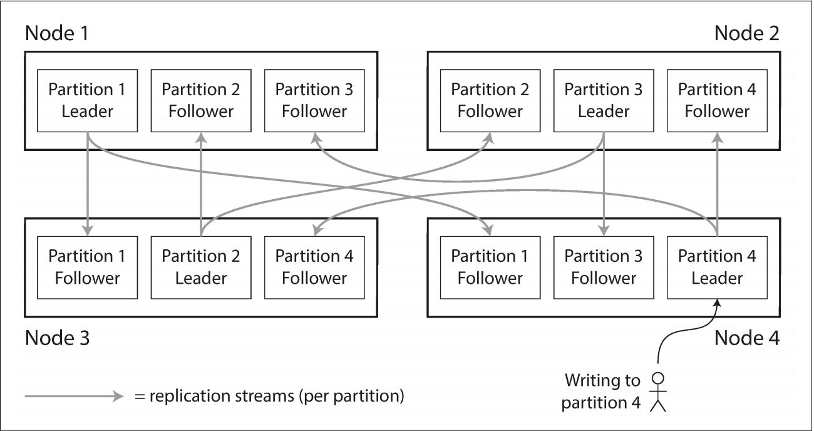
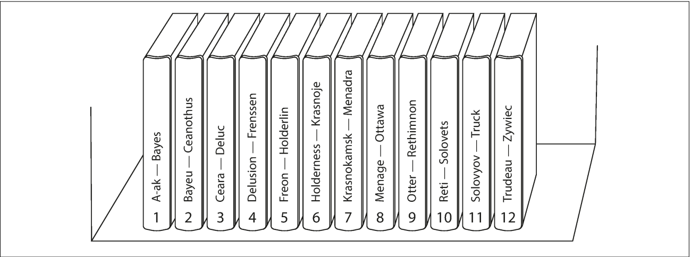

# 第六章：分区

> 我们必须摆脱计算机既定的规则不被它限制，我们必须先规划好数据怎么设计、优先级怎么定义，然后梳理关系，最后才是编写代码。
> — Grace Murray Hopper, *Management and the Computer of the Future* (1962)

在[第五章](chapter5.md)我们讨论了备份，在不同的节点上有多个拥有相同数据的备份。但是在大规模的数据集或者有着非常大的查询吞吐量的场景中，只有备份显然是不足够的：我们需要将数据分区，或者叫分片。[^i]

---

术语答疑

我们这里所说的分区在MongoDB，Elasticsearch和SolarCloud中通常称为分片。它和HBase中被称为region，BigTable中的tablet，Cassandra和Risk的vnode，Couchbase的vBucket是同样的概念。但是分区是最使用最广泛的称呼，所以我们这里也沿用这个称呼。

---

[^i]: Partitioning, as discussed in this chapter, is a way of intentionally breaking a large database down into smaller ones. It has nothing to do with *network partitions* (netsplits), a type of fault in the network betweennodes. We will discuss such faults in [Chapter 8](chapter8.md).

通常，分区被定义为每个数据段（每条记录，每一行或每个文档）都只归属于同一个分区。它有各式各样的实现方法，我们会在本章来讨论。实际上，每个分区都是它自己的一个小型数据看，尽管数据库可以支持在同一时间对多个分区同时进行操作。

我们想要把数据分区的最主要原因就是为了实现「**可伸缩性**」。在一个非共享的集群中，不同的数据可能会分配到不同的节点上（详情参见 [第二部分](#part2.md) 中对 *shared nothing* 的定义）。因此，大型数据库一般都会部署在多个磁盘上，这样查询也就会负载到多个处理进程中。

对于在单一分区上的查询操作，每个节点都可以独立的在它所在的分区上完成查询操作，所以，可以通过增加更多的节点来提高查询吞吐量。大型复杂的查询操作也可以把他们看作隐性的并行在不同的节点之上，尽管这看上去会变得复杂一些。

分区数据库是在19世纪80年代开创的，像Teradata 和 Tandem NonStop SQL，以及最近被提及到的 NoSql数据库和基于Hadoop的数据库都属于这类数据库。一些系统的设计目的是事务处理，一些是数据分析（详见 [事务处理或分析](#part3.md)）：数据库对于这两种不同的处理方式会有不同的处理方式，但是分区对于上述两种情况都适用。

## **分区与副本**

分区通常和副本结合来使用，以便能够将每个副本的数据存储到多个节点上。这也就意味着，即使每条记录只属于一个分区，它仍然能够存储在不同的服务节点上，以此来达到故障转移的目的。

一个节点上通常存储多于一个分区的数据，如果使用的是「主-从复制」模式，那么分区和副本结合的方式就如同[**图6-1**](#figure6-1) 所示。每个分区的领导者副本都分别被分配到了一个的节点上，而它的追随者副本则被分配到其它的节点上。每个分区都包括一些分区的领导者副本以及其它分区的追随者副本。

所有我们在[第五章](#chapter5.md)讨论的关于数据库副本的理论都适用于这里的分区副本。但是分区方案的选择是不依赖于副本方案的，所以在本章中我们要忽略掉之前副本机制的干扰，尽量让事情变得简洁。

<a id="figure6-1">**图6-1.**</a> 副本和分区的组合。每个节点的一个分区分别充当其它节点追随者分区的领导者。

## **键-值数据分区**

假设现在你想要把一大批数据进行分区。那么你怎样确定哪些记录存放到哪些节点上呢？

我们进行分区的目标就在于能够均匀的分布数据以此来实现查询操作均衡的负载到各个节点上。如果每个节点都均匀的分布一部分数据，理论上10个节点会是单个节点承载读写吞吐量的10倍（这里忽略复制的消耗）。

如果分区不均衡，则一些分区的数据会多于其它分区或者一些分区的查询量多于其它分区，我们称之为**偏斜（*skewed*）**。**偏斜**的出现会使得分区的效果大打折扣。极端情况下，所有的负载都命中同一个分区，那么我们10个分区中的9个就是无意义的，所以你的性能瓶颈就集中在这个单一的分区。像这种负载比率较高的分区我们称之为**热点（*hot spot*）**。

解决**热点**问题最简单的方法就是我们把记录随机的分配到不同的节点上。这样我们就会将数据十分均匀的分发到各个节点上，但是这样做有一个弊端：当你试图读取特定的记录时，就没有办法确定这条记录具体存储在哪个节点上，导致我们必须查询所有的节点才能将该数据查出来。

我们可以优化一下，假设我们现在的数据是一个总是通过主键来索引数据的简单的**键-值**数据模型。例如，一本老式的纸质百科全书，你可以通过标题来查找内容；当把所有的标题按照字母顺序排列好后，你就可以快速的找到你想要查询的条目内容。

### **基于key值区间分区**

### **基于key的哈希值分区**

### **负载偏斜与分区热点**

## **分区与二级索引**

### **基于文档二级索引分区**

### **基于关键字二级索引分区**

## **分区重平衡**

### **动态再平衡**

### **运维：自动还是手动重平衡**

## **请求路由**

### **并行查询**
