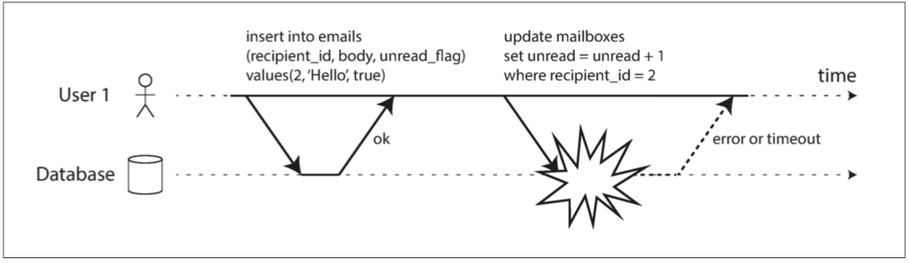

# 第七章：事务

> 一些创作者声称，出于一些性能和可用性的考虑，对通用的两阶段提交提供支持的代价是高昂的。我们有理由相信通过应用程序处理事务，总好过通过业务代码来处理繁杂的事务。
>
> — James Corbett 等.*Spanner: Google 全球分布式数据库* (2012)


在一个苛刻的数据系统中，很多事情都有可能出错：

* 数据库系统或者硬件系统随时可能出现故障（包括在写操作的过程中）。
* 应用系统随时可能崩溃（包括在执行一系统操作的途中）
* 网络中断将意外的断开应用和数据库或数据库其中一个节点的连接。
* 客户端服务可能同时对数据库执行写操作，导致彼此更改的数据被覆盖。
* 客户端可能感知不到只有部分更新成功的数据。
* 客户端之间的竞态可能导致的奇怪异常。

&emsp;&emsp;为了可靠性，系统必须处理这些缺陷从而保证他们不会对整个系统造成灾难性故障。然而，实现这些容错机制是一项重大的工程。它要求我们对所有可能出现异常的做出缜密的思考，以及需要做大量的测试来确保这些解决方案是真实有效的。

&emsp;&emsp;近十年来，**事务(transaction)** 机制都是作为简化这些问题的首选。事务机制可作为应用程序将一组读写操作当作一个整体逻辑单元来执行的一种可行方式。从概念上讲，一个事务中包含的所有读写操作都可看作一个整体:要么执行成功（commit **提交**），要么执行失败（abort **中止**、rollback **回滚**）。如果失败，应用程序可以安全的执行**重试**（retry）操作。有了事务，对应用来说处理异常将变得异常简单，因为应用不需要关心诸如：“一部分操作成功、一部分操作失败（不管出于什么原因）”的这种局部失败的状况。

&emsp;&emsp;如果你在工作中有过几年使用事务的体验，我们会下意识感觉事务是自然存在的，但事实是事务处理并不是凭空产生的，我们并不能理所当然的认为它就应该存在；他是为了简化应用程序访问数据库的编程模型而主动创建的。通过事务，应用程序可以不用关心并发问题以及一些其它潜在的错误场景，因为数据库替你做了这些工作（我们称之为 **安全担保-(safety guarantees)** ）;

&emsp;&emsp;其实并不是所有的应用都需要用到事务，有些时候弱化甚至完全放弃事务担保反而会更加有优势（例如：为了实现高性能或高可用）。甚至于说一些安全特性是可以在没有事务的情况来实现的。

&emsp;&emsp;那么我们怎么判断在什么情况下才需要事务呢？为了回答这个问题，我们首先需要明白越严格的事务担保机制，所花费的成本也就越高。尽管事务机制乍一看很简单，但实际上很多工作都被巧妙的隐藏在了实现细节之中了。

&emsp;&emsp;在这一章，我们会列举多个引发错误的示例，来探讨数据库用来防止出现这些错误的标准解决方案。我们会特别深入到 **并发控制** 领域，讨论各种可能引发的 **竞态条件** ，以及数据库是怎样实现如 **读已提交**（*read committed*）、**镜像隔离**（*snapshot isolation*）、**串行化**（*serializability*）等隔离级别的。

本章的讨论对于单机和分布式数据库都适用；到了[第八章](../part2/chapter8.md) 我们会专注于讨论仅在分布式系统中出现的一些特殊挑战。

## **事务的晦涩概念**

&emsp;&emsp;在今天，几乎所有的关系型数据库以及一些非关系型数据库都支持事务。他们中大多数都延用了IBM公司在1975年发布的第一款**SQL数据库**[1,2,3]- **IBM System R**系统的风格。尽管有一些实现细节的差异，但是基本思路在40年来几乎没有改变：MySQL，PostgreSQL，Oracle，SQL Server这些数据库上所支持的事务都与 **System R** 有着惊人的相似度。

&emsp;&emsp;在21世纪末，非关系型（**NoSQL**）数据库开始逐渐流行。他们旨在基于关系型数据库的基础之上，面对新的 **数据模型**（参见：[第二章](../part1/chapter2.md)）提供另一种默认包含**副本**（[第五章](pather5.md)）、**分区**（[第六章](pather6.md)）机制的选择。事务则成为了这次创新历程中的牺牲品：很多新一代的数据库完全摒弃或以一个相比我们之前理解要弱的多的保证机制重新定义了事务[4]。

&emsp;&emsp;随着这些分布式数据库越来越受到追捧，人们开始普遍感觉事务是阻碍可伸缩性性的最大敌人，并且坚信任何大型系统想要保证高性能和高可用就必须放弃使用事务[5,6]。另一方面，一些数据库服务商提出的事务保证是体现“重要应用”和“价值数据”的最起码要求这种观点，也被认为是纯粹的危言耸听。

&emsp;&emsp;但事实并没有这么简单：与其它所有技术一样，事务也有它的优势和局限性。为了弄清它其中所做的权衡，让我们深入到事务在常规操作以及各种极端情况（确实存在）下所提供保障的细节中一探究竟。

### ACID的含义

&emsp;&emsp;事务提供的安全保证，通常会被描述成我们所熟知的代表着“**原子性**”（*Atomicity*），“**一致性**”（*Consistency*），“**隔离性**”（*Isolation*）和“**持久性**”（*Durability*）的首字母缩写-**ACID**。它是在1983年由Theo Härder 和 Andreas Reuter [7]提出来，旨在为数据库构建容错机制的精确术语。

&emsp;&emsp;然而，在实践中，不同的数据库对ACID的实现不尽相同，例如，正如我们所看到的，对于“**隔离性**”的含义就存在着很多争议性[8]。理想很丰满...，但魔鬼往往隐藏在细节中。如今，当一个系统宣称他是“遵从ACID”的，我们并不能很确切的知道它到底给我们带来了哪些保证。

#### **原子性**

&emsp;&emsp;通常，原子描述的是一些不能够再分解为更细小部分的物体。这个词在计算机的不同的领域描述的意思大致相同但却又有些微妙的变化在其中。例如：在多线程程序中，如果一个线程执行一个原子性操作，那么就意味着另一个线程是不能在当前线程未执行完成之前读取到任何中间态的结果的。系统的状态只存在操作前态和操作后态，中间不会出现其它状态。

&emsp;&emsp;相比之下，在ACID的语境下，“**原子性**”（atomicity）与并发无关。它不是描述多个进程试图同时访问相同数据的场景，这其实是接下来 ACID中的 **I- isolation ** （[隔离性](#isolation)）所涵盖的问题。

&emsp;&emsp;相反，原子性描述的是多个客户端想要同时进行多次写操作，而在这些写操作的过程中，由于一些诸如进程崩溃，网络连接中断，磁盘空间不足，或者违反完整性约束之类原因而引发异常的场景。如果这些写操作可以组合到一个原子性的事务当中，当事务执行过程中出现异常情况没有执行完成（*已提交-committed*），事务将终止（*aborted*）执行，数据库将撤销或丢弃这之前已经执行的操作。

&emsp;&emsp;假设没有原子性，那么当我们执行多个变更动作的过程中突然发生错误，我们将很难分辨出哪些变更会对业务产生影响，哪些不会。如果这时候应用程序尝试再重新执行一次，是极有可能会重复之前的操作的，这样就会导致相同的变更被执行了两次，从而导致数据重复或失实。但是有了原子性机制这个问题是不是就变得简单的多了：如果事务被终止，应用程序可以保证没有任何改变发生，所以也就可以很坦然的进行重试操作了。

&emsp;&emsp;在错误发生时能够中止并且丢弃掉该事务之前所执行操作的这样一种能力，是 ACID 原子性的特性。或许“**可中止性**”（*abortability*）比起“**原子性**”（*atomicity*）可以描述的更加贴切，但是我们依旧会沿用“**原子性**”（*atomicity*）这个有共识性的词汇。

#### **一致性**

”**一致性**“这个词的含义太宽泛了:

* 在 [第五章](chapter5.md) 中我们讨论了异步复制系统中副本复制的最终一致性问题（参见：[第5章：延迟同步问题](chapter5#迟同步问题)）。
* 一些系统使用一致性哈希算法来进行分区重平衡 (参见： [第6章：一致性哈希](chapter6.md) )。
* 在CAP定理中（[第九章](chapter9.md)），一致性描述的是线性一致（参见：[第九章：线性一致](chapter9.md)）。
* 在 ACID 中，一致性则是指数据库应用处于“预期状态”的明确定义。

一个词竟然可以有4种完全不同的含义不见的是一件好事。

&emsp;&emsp;ACID一致性的概念是指在任何时候都会对你所操作的数据都要施加一个特定约束来保证它在逻辑上的“**不变性**”（*invariants*），例如在一个记账系统中，一个账户中的借款记录和贷款记录是始终保持收支平衡的。如果一个事务从一个有效的“**不变性**”状态开始，并且在这期间都根据特定约束保持着这种不变性的逻辑，那么最终的结果也必然也是符合这种“**不变性**”逻辑的。

&emsp;&emsp;然而，这种一致性的实现依赖于应用控制变量，它是通过应用定义操作规范来保证事务的正确性来实现一致性的。这些都不是通过数据库来保证的：即使你写入的数据可能打破这个这个"不变量"，数据库也不会拒绝写入（一些特殊情况的“不变性”还是能够被检测出来的，比如通过外键约束或者通过唯一主键约束，然而，通常情况下数据的有效和无效性是由应用定义的，而数据库仅仅是存储它们而已）。“**原子性**”，“**隔离性**”和“**持久化性**”是数据库的特性，至于“**一致性**”（在ACID的角度）它是归属于应用。应用可以依靠数据的原子性和隔离性来实现一致性，它不是仅靠数据库的能力就能实现的，所以从某种意义上来说“C”，也就是一致性，其实并不能把它纳入ACID的范畴。

#### <a id="isolation">隔离性</a>

&emsp;&emsp;大多数数据库都会在同一时间接入多个客户端。如果这些客户端分别请求数据库的不同数据是没有问题的，但是如果它们访问的是相同的数据库记录，这时候可能就会出现并发问题（*竞态条件*）。

&emsp;&emsp;<font color="#A7535A"> **图7-1**</font> 是这类问题的一个示例，如果说有两个客户端同时对数据库里的一条计数信息执行递增，每个客户端的步骤为：读出当前值，加1，然后把计算的新值写回（这里假定数据库本身不具备内建的自增操作能力）。在<font color="#A7535A"> **图7-1**</font>*中，因为发生了两次自增操作，所以我们寄希望于计数值由42增加到44，但实际上由于竟态条件的原因，计数值只增加到了43。

&emsp;&emsp;在ACID的场景中，“**隔离性**”意味着并发执行的操作相互之间是隔离的：彼此之间不能相互干扰。传统的数据库教科书把隔离性具象化为“**串行化**”（*serializability*），也就是说每一个事务在执行过程中都可以认为在当前的整个数据库中只有自己一个事务在执行。尽管在现实中事务的执行大抵都是并发执行的，但是数据库需要保证所有的事务提交后，执行的结果和事务按照顺序一个接一个执行的结果保持一致[10]。


<a id="figure7-1"><font color="#A7535A"> **图 7-1.**</font> </a>两个客户端同时对同一个计数值增加场景的竟态条件*

&emsp;&emsp;然而，通常情况下串行化的隔离策略很少被使用，其根本原因在于它会对性能产生负面影响。甚至于像Oracle 11g这些主流的数据库中，完全摒弃了这部分功能。尽管Oracle中也有一个称之为“**序列化**”的隔离级别，但实际上它的实现方式是一种相较于序列化弱的多的担保机制-“**快照隔离**”（*snapshot isolation*）[8,11]。我们将在[**弱隔离级别**](#WeakIsolationLevels)这一小节展开对“镜像隔离”以及“其它形式的隔离”的详细讨论。


#### 持久化性

&emsp;&emsp;数据库系统的愿景是提供一个让用户无需担心数据丢失的安全的存储场所。持久化保证事务一旦成功提交，即使发生硬件故障和数据库崩溃，也不会造成数据丢失。

&emsp;&emsp;在单节点数据库中，持久性通常意味着数据已经写入到如硬盘或SSD这种不易失的存储介质中。这里通常还涉及到预写日志（**WAL**）或其它的一些类似机制（参见：[第三章：构建可靠性B树](../part1/chapter3.md)），来保证当硬盘上的数据结构损坏是，能够利用这些机制恢复数据。在多节点数据库中，持久化意味着数据已经成功的复制到一定数量的节点上。为了提供持久性保证，数据库必须等到这些写操作写入并且复制完成才会把该事务记录为成功提交。

&emsp;&emsp;话说回来，正如我们在（[第一章：可靠性](../part1/chapter1.md)）中所讨论的，完美的持久化方案可能压根就不存在：当所有的硬盘和备份在同一时间都遭到损坏，任何的数据库在这种情况下也回天乏术。


---

<center><font face="宋体" size="4" color=black>复制与持久化</font></center>

<font face="幼圆" size="2" color=black>从历史上看，信息的持久化最开始是写入磁带中，后来发展为磁盘或者SSD，然后发展到今天多节点复制。</font>

<font size=2>那么哪一种实现方式更好呢？</font>

<font size=2>答案是-没有银弹：</font>

* <font size=2.5>当你写入磁盘所在的机器死机，数据即使没有丢失，当你重启机器或把数据复制到另外一台机器之前这段时间，系统是无法使用的。可复制的系统在这种情况下却能够保持可用性。</font>

* <font size=2.5>在执行特定输入时停电或者bug导致所有节点崩溃，导致所有副本同时瘫痪（参见：[第一章：可靠性](../part1/chapter1.md)），从而导致内存中的数据丢失。这种情况下相较于内存数据库，数据落盘就显的很有必要了。</font>

* <font size=2.5>在一个异步复制系统中，如果主节点失效则会导致当前的写操作丢失（参见：[第5章：处理节点异常](chapter5.md)）。</font>

* <font size=2.5>当电源突然断电时，有时候磁盘特别是SSD也不能保证准确性，即使执行了fsync（写盘一般分write()和fsync()）函数[12]后也不能保证数据的准确性。和其它软件类似，固件也有其缺陷。</font>

* <font size=2.5>存储引擎和文件系统之间也可能因为某些交互的波动而产生一些不可追溯的错误引起系统崩溃，也可能会导致磁盘上的文件损坏。</font>

* <font size=2.5>磁盘上的数据可能在我们没有察觉的情况下出现损坏[17]，如果这种情况一直持续，副本甚至当前备份都有可能发生损坏。这种情况就需要从历史备份中恢复数据。</font>

* <font size=2.5>一项关于SSD的研究数据表明，在使用的前4年中，至少有30%-80%的固态硬盘会出现一个坏块[18]。机械硬盘的虽然在出现坏块的概率上比固态硬盘低，但是发生整体损坏的概率要比固态硬盘高。</font>

* <font size=2.5>如果SSD有间断性的断电情况，那么将有极大可能性在未来的几周丢失数据，因为温度在这里也起到一定的决定作用[19]。</font>

  <br>

  <font size=2 color=#42426F>总之，没有哪一项技术能够绝对的保证安全。我们只有将写磁盘，机器间的复制，备份等功能组合起来，从而达到最大可能的降低风险。所以我们应对于任何在理论上承诺“保证”的系统要始终保持怀疑的态度。</font>

---


### 单对象和多对象操作

&emsp;&emsp;回顾一下，在ACID中，原子性和隔离性描述了当一个客户端在同一个事务中同时进行多个写操作数据库的执行机制：

*原子性*

&emsp;&emsp;<font size=3>如果在一系列的写入过程中发生异常，事务将会中止，在异常发生之前所有发生的操作都应该被丢弃。换句话说就是数据库可以通过一个“**全有或全无**”（all-or-nothing）的担保机制来代替你处理你所关系的部分失败场景。</font>

*隔离性*

&emsp;&emsp;<font size=3>同时运行的事务之间不应该相互干扰。举例来说，如果一个事务在做一些写操作，那么另一个事务要么可以看到它所有的写操作，要么一个也看不到，不存在只看到部分操作的场景。</font>

&emsp;&emsp;这些理论的前提都是基于你一次性操作多个对象（行、文档、记录）。通常在处理多数据片段同步控制时需要用到这种“**多对象事务**”（*multi-object transactions*）。<font color=#A7535A>**图7-2**</font>是一个邮箱应用的示例，如果你需要查看某个用户未读邮件的数量，你可以使用下面这条查询语句：

```sql
SELECT COUNT(*) FROM emails WHERE recipient_id = 2 AND unread_flag = true
```

&emsp;&emsp;但是如果某个用户的未读邮件数量特别多的话，你可能会发现你的查询将非常耗时，于是你决定将未读邮件的数量存储为一个单独字段（非常规化手段）。这样一来，每当有一个新的消息接收，你就要相应的增加未读消息的数值，当一个消息被阅读后，你还要相应的减少未读消息的数值。

&emsp;&emsp;在<font color=#A7535A>**图7-2**</font>中，用户2的异常情况是：邮箱列表显示有一条未读消息，但是由于‘增加未读消息数值’这个动作尚未完成，所以未读消息的数值显示的是0。隔离性通过控制用户2要么同时看到‘新增邮件’和‘更新邮件数值’这两个操作的结果，要么两者结果都看不到这样的一种机制，就能很好的预防这种错误的产生。


<a id='figure7-2'><font color=#A7535A>**图7-2.**</font></a>违反隔离性：一个事务读到了另一个未提交事务的写入结果（**脏读-*[dirty read]***）。


&emsp;&emsp;<font color=#A7535A>**图7-3**</font> 阐述了原子性的重要性：如果事务的执行过程中发生了异常，那么邮箱的内容和邮件的未阅读数量这两个数据将会不同步。在一个原子性的事务中，如果更新阅读数量失败，那么事务将会中止掉，并且新增的邮件也会回滚掉。



<a id='figure7-3'><font color=#A7535A>**图7-3.**</font></a>原子性可以保证当一个事务发生异常时，它可以撤消之前所做的操作以此来保证状态一致性。

&emsp;&emsp;多对象事务要求以某些方式明确的声明哪些读写操作归属于哪一个事务。在关系型数据库中，通常情况下客户端与服务端会通过TCP连接建立关系，所以对于这种特定的连接，在事务开始（ BEGIN TRANSACTION  ）和提交（COMMIT）这两者之间的所有操作都被认为是属于同一个事务。

&emsp;&emsp;很多非关系型数据库并没有提供这样一种把一类操作组合在一起的方式。尽管它们也提供了多对象的API（例如，键-值数据库可以利用 multi-put的方式把多个key值的更新放到一个操作中来完成），但这并不意味着它就具有事务语义，因为像multi-put这种命令的操作结果可能是部分key的更新成功，另外一部分key更新失败，最终结果是数据库处在一个部分更新状态。


#### 单对象写

&emsp;&emsp;原子性和隔离性同样适用于单对象的变更操作，例如，现在你正在把一个20 KB大小的JSON文档写入数据库：

* 当写入 10KB 的内容后，网络突然断开，这样的话是不是数据库仅仅存储了无法解析的10KB JSON数据碎片？
* 当用新数据去覆写磁盘的上旧数据是，如果写到一半，电源掉电，是不是意味着磁盘上的现有数据是新旧两种数据混杂在一起的？
* 客户端在写入数据的过程中，另一个客户端来读取这部分数据，那么它读到的是不是就是部分更新的值呢？

&emsp;&emsp;正是由于以上这些让人苦恼的问题，所以现有的存储引擎几乎都会在单个节点上，针对单体对象（如key-value键值对）提供原子性以及隔离性的能力。原子性可以基于崩溃恢复日志方式来实现（参见：[Making B-trees reliable]()）,隔离性可以通过在每个对象上的锁来实现（同一个对象在同一时刻值允许一个线程访问）。

&emsp;&emsp;一些数据库还提供了一些更复杂的原子性操作，例如自增操作，就可以不用再像[<font color="#A7535A"> **图7-1**</font>](#figure7-1)那样执行**读-改-写**操作了。另外一个同样受欢迎的是**比较-设置**，即我们大家所熟知的**CAS**（compare-and-set）操作，它能够保证我们对值的写操作是基于没有被另外一个并发的线程改变的前提下进行的（参见：[CAS]()）。

&emsp;&emsp;原子对象操作针对多个客户端同时对同一个对象进行写入的场景有奇效，因为它能够保证多个操作之间不会丢失更新（参阅：[防止丢失更新](#preventingLostUpdate)）。其实，这些都不算是传统事务的概念名词。包括CAS以及其它一些原子对象操作被冠以“轻量级事务”的称谓，甚至“ACID”也有一些噱头的意味在里面，这在一定程度上会让我们误认为这就是事务。然而真正的事务描述的是在多个对象上的一组操作被聚合为一个逻辑执行单元来执行。


#### 多对象事务的必要性

&emsp;&emsp;很多分布式存储引擎都不支持多对象事务，因为他们将很难跨分区操作，还会在对高可用性以及高性能有要求的系统中阻碍设计方案的实施。但是并不是说分布式数据库就不能实现事务，我们将会在[第九章](chapter9.md)再单独讨论分布式事务。

&emsp;&emsp;话说回来，我们真的一定需要多对象事务吗？有没有可能我们仅使用键-值数据模型或原子对象操作就能满足我们应用的需求？

&emsp;&emsp;的确在某些情况下，我们只需要操作原子对象的插入，更新和删除就足够了。但是还有很多其它对多个不同对象的写入场景需要我们来做协调：

* 在关系型数据模型中，一张表中的行数据通常会通过一个外键与另外一张表中的行数据建立关联（类似的，在图数据模型中，一个顶点通过边关联到其它的顶点）。多对象事务要求你能保证那些关联是有效的：当插入和其中一行有关联的几行数据时，外键必须是有效且是最新的，否则这些数据是没有意义的。[^<font color='#5A1216'>翻译FIX</font>]
* 在文档数据类型，那些经常需要在一起更新的字段，通常不属于同一个文档，当没有多对象事务场景的情况下进行更新，则将会被当作单对象来处理（参见：[ “Relational Versus Document Databases Today” page 38]()）[^FIX]。就像[<font color=#A7535A>**图7-2.**</font>](#figure7-2)中描述，当不标准的数据信息需要被更新时，你必须一次性的更新多个文档。在这种场景下要避免出现数据不完整从而导致数据不同步，事务就会显得尤为重要了。
* 在支持二级索引的数据库中（除了单纯的键值数据库外几乎所有的数据库都支持），需要你在每次更新数据的同时要更新索引。从事务的角度来说，索引只不过是另外一种数据库对象罢了，它和数据库对象的命运一样，脱离了隔离性加持，当前一条记录索引值更新而后一条记录还未来得及更新时，同样会出现在一条记录上有索引而在另一条记录上没有索引的情况。

&emsp;&emsp;尽管应用即使在没有事务的情况下依旧可以处理业务。但是一个缺少了原子性的应用对异常的处理将变的极其复杂，同样一个缺失隔离性的应用在面对并发问题是也会让它应接不暇。我们会在[弱隔离级别](#WeakIsolationLevels)这部分继续讨论，同时我们也会在[第十二章](../part3/chapter12.md)探讨一些其它的方案。


#### 处理异常和中断

&emsp;&emsp;当异常发生时可以中止操作并且可以很释然的进行重试是事务的一个很重要特性。ACID 数据库便秉承这种哲学思想：“但凡数据库系统中有半点违反原子性，隔离性或持久化性的设计，我们宁愿放弃也不能接受一个半成品的出现。”

&emsp;&emsp;但也不是所有数据库都奉行这种思想，特别是在一个像“**无主复制**”（参见：[无主复制]() leader‐less replication）这样一个更加关注以“最大努力原则”为 基础存储组件，换句话说就是存储引擎会尽它最大能力做它可以做到的事，当遇到异常时，它也不会对已经做了的事情做回滚操作-也就是说从异常中恢复这种机制的实现就交给了应用自己来实现。

&emsp;&emsp;异常总是会和我们不期而，而程序员往往都是从正向逻辑去思考问题，而非深入到错综复杂的异常场景中分析潜在的威胁。一些常用的对象关系映射（ORM）框架如"Rails’s ActiveRecord"和"Django"甚至根本就不会对事务的中止做重试处理，一旦发生异常，错误就会沿着调用栈向上传导，伴随着收到一个错误消息，用户所有的写入操作都会被丢弃。这真的是个笑话，因为中止的关键点就是能够安全的重试。

&emsp;&emsp;尽管对一个已经中止的事务进行重试是一种简单且有效的异常处理机制，但是否就意味着它是完美的吗：

* 如果事务实际上已经成功，但是当服务端向客户端发送提交成功确认包的时候网络异常（客户端没收到确认包则认为提交失败）。这时候客户端会进行重试操作，除非你有一个额外的应用级别的数据去重机制，否则将不可避免的造成数据操作重复执行两次。

* 如果异常是由于负载过高导致，那么重试操作反而会使这个问题变得更糟糕。为了避免这种恶性循环，你可以用’指数退避算法‘来限制重试次数，并且尽可能的把负载相关的异常与其它的异常分开处理。

* 只有对瞬时态的异常死锁、隔离限制、短暂网络中断、故障转移）进行重试操作才有价值；对于永久态的异常（比如违反一致性约束）重试将变得毫无意义。

* 如果事务脱离了数据库那么它的副作用便会显现出来，即便是事务中止也不能阻止这种副作用的产生。例如，当你发送邮件时，你并不希望每次事务的重试都要重新发送一次邮件。那么**[两阶段提交(2PL)](#twoPhaseCommit)**（*Commit and Two-Phase Commit*）可以帮助你实现不同的系统之间能够一起提交或一起中止。

* 如果在重试的过程中客户端执行异常，那么数据库将丢失所有的写入数据。

  

## <a id='WeakIsolationLevels'>弱隔离级别</a>

&emsp;&emsp;当两个事务操作的数据不存在交集，那么我们可以放心的让他们并行执行，因为他们互相之间没有依赖。当数据被一个事务读取的同时另外一个事务也在写入，或者当两个事务试图同时对同一份数据进行修改时，那么并发问题（竟态条件）就随之而来了。

&emsp;&emsp;并发异常因其只在特定的时间节点才会被触发，所以才会导致我们很难在测试的时候就发现它。像这样依赖时间因素的异常通常比较少发生，所以通常比较难以复现。我们也比较难以推断和定位出可能产生并发异常的地方，因为特别是在一些大型的应用系统中，你不一定知道到底完全的掌握都有哪些地方在访问数据库。开发一个同一时间只有一个用户访问的应用程序已经足够困难了，多个用户并发的操作将使得开发实现起来更加困难。因为在多用户并发操作的场景中数据无时无刻都在发生着变化。

&emsp;&emsp;鉴于以上原因，数据库一直都试图通过”**事务隔离**“机制为把并发问题封装起来提供给应用开发者。理论上，**可串行性**隔离机制提供的保证是让你的并发操作如同顺序执行一般（一次执行一个，不存在并发操作），这种隔离机制仿佛会让你置身于一个没有并发场景的幻境中，使得你整个人身心愉悦。

&emsp;&emsp;然而现实很残酷，隔离性并没有我们想的这么简单。**可串行性**隔离高昂的性能开销所带来的沉重代价，让很多数据库望而却步[8]。因此，通常情况下他们会针对部分并发问题采用一种更弱级别的隔离机制来防止它们发生，而不是对所有的并发问题都做处理。尽管这些隔离级别晦涩难懂，并且还可能会引入其它的一些问题，但在现实中他们依然会被采纳[23]。

&emsp;&emsp;事务的弱隔离级别导致的并发问题并不仅仅存在于理论层面，它还会造成钱财的损失[24,25]，财务审计上的负担[26]以及客户数据的破坏[27]。针对以上问题比较成熟的说法是：“如果你处理的是财务相关的数据，那么请尽量使用**ACID**数据库”。然而他们却忽略了一点，就是很多常用的关系型数据库（被认证为“**ACID**”机制的）依然在使用弱隔离级别，所以他们并不一定能百分百保证上述异常的发生。

&emsp;&emsp;与其盲目的依赖工具，不如在我们开发的过程中始终保持一颗清醒的头脑，明确各类可能存在的并发问题，并思考如何来避免这些问题的发生。这样我们才能依托已有的工具来构建出正确、可靠的应用程序。

&emsp;&emsp;在本小节，我们将介绍几种实践中在使用的**弱（非串行的）隔离级别**，详细讨论在什么样的竞态条件下可能发生哪些条件不会发生。这样就就能很在你的应用程序中从容的选择适合的隔离级别。一旦我们理解着这些，我们就会接着讨论“**可串行行**”隔离（参见：[可串行性](#Serializability)）。我们在讨论的隔离级别和使用的例子并不是官方的，如果你想对他们的属性做一些严谨的定义分析，可以参考文献[[28](),[29](),[30]()].

### 读已提交

最基础的隔离级别是**读已提交**（ *read committed*）。它提供了两个保证：

1. 当从数据库中读数据时，你只能读取到那些已经被提交的数据（无脏读：*no dirty reads*）。
2. 当写入数据到数据库时，你也只能重写那些已经提交了的数据（无脏写：*no dirty writes*）。

让我们进一步详细讨论这两个保证。


#### 无脏读

&emsp;&emsp;想象一下假设一个事务往数据库写入数据时事务未提交或中止，另外一个事务理应看到这些未提交的数据吗？如果可以，如果可以，我们将这种现象称为“**脏读**”（*dirty read*）[2]。

&emsp;&emsp;运行在一个“**读已提交**”隔离级别下的事务应当做到防止“**脏读**”的产生。也就是说只有当事务提交后它所写的数据才能被其它事务才有权限访问的到（全部的写数据都能被访问到）。这就如<font color="#A7535A"> **图7-4**</font>所示，当用户1把x设置为3这个事务还未提交之前，用户2拿到的x的值依旧是还是原来的值：2。


<a id="figure7-4"><font color="#A7535A"> **图7-4.**</font></a>无脏读：*只有当用户1的事务提交后，用户2看到x最新的值*。

以下是几点为什么我们要避免脏读的原因：

* 当一个事务需要更新多个对象时，有脏读意味着另外一个事务可以看到当前事务已经执行过的一部分更新数据，而剩余还未更新的部分事务是看不到的。这就像是[<font color="#A7535A"> **图7-2.**</font>](#figure7-2)一样，用户看到了最新未读的邮件，但是未读数量的值还是未更新的。像邮件中存在的这种脏读场景，站在用户的角度来说只看到数据库更新一部分数据后的状态将使得他会很困惑，另外也可能让其它事务作出错误的决定。
* 就像[<font color="#A7535A"> **图7-3.**</font>](#figure7-3)一样，如果事务中止，那事务中执行过的写操作都应当要回滚掉。如果数据库允许脏读，则意味着一个事务可能会看到事实上没有真正提交到数据库的稍后要回滚掉的数据。所造成的后果可想而知，我们的数据库将很快形如乱麻。

#### 无脏写

&emsp;&emsp;试想如果有两个事务同时对数据库中的同一个对象做更新操作将会有怎样的现象产生呢？他们之间先后的写入顺序我们不得而知，但是我们能想象的到后执行的事务一定会覆盖掉前一个事务的写入。

&emsp;&emsp;但是，如果前一个事务只写了部分数据还未提交这时候又会发生什么呢，后写入的事务还会不会覆盖掉前面事务写入的数据呢？如果答案是肯定的，那我们称这种现象为“**脏写**”（*dirty write*）[28]。运行在一个“**读已提交**”隔离级别下的事务同样也应当做到防止“**脏写**”的产生，通常的做法是阻塞第二个事务的写操作直到第一个事务提交或中止。

防止脏写，同样能够避免以下并发问题的产生：

* 当一个事务更新多个对象，允许脏写将会导致错误结果。如[<font color="#A7535A">**图7-5**</font>](#figure7-5)所示的一个二手车售卖网站所示，假设现在Alice和Bob同时想要购买同一辆车。购买一辆车需要对数据库进行两次写操作：一个是更新网站‘销售订单’信息为对应的购买者信息，另一个是要把给购买者的销售发票发送记录更新到‘发票记录’表。在[<font color="#A7535A">**图7-5**</font>](#figure7-5)中，交易是归属于Bob（因为他成功更新了’销售订单‘表），但是发票却发给了Alice（因为Alice成功更新了‘发票记录’表）。**读已提交**便可以规避这种问题。
* 但是，**读已提交**却不能很好的处理如[<font color="#A7535A">**图7-1**</font>](#figure7-1)中两个字增数之间的竟态场景。在这个场景中，第二个写发生在第一个事务提交之后，所以它并不属于脏写。但它依旧是有问题的，只不过是出于其他的一些原因，我们会在[**防止丢失更新**](#preventingLostUpdate)再来讨论怎么保证自增数的安全操作。


<a id="figure7-5"><font color="#A7535A"> **图7-5.**</font></a>因为脏读，不同事务的写冲突造成结果的混淆。


#### 读已提交实现

&emsp;&emsp;**读已提交**-是应用范围最广的隔离级别。它在Oracle11g, PostgreSQL, SQL Server 2012, MemSQL以及很多其它的数据库中都被作为了默认设置。

&emsp;&emsp;通常数据库使用行锁来防止脏读：当一个事务想要修改一个特定对象时（行或者文档），它首先要获取到这个对象上的锁，并且要一直持有这个锁，直到事务被提交或中止。另外所有给定的对象都只允许一个事务持有这把锁；如果有另外一个事务也想要来写这个对象，它必须等到上一个持有锁的事务提交或中止后才可能成功获取到锁并继续后续的操作。这里的锁是在”**读已提交**“模式（或更高级别隔离模式）下，数据库自动帮我们完成的。

&emsp;&emsp;我们要怎么来防止脏读呢？一种选择是和上面描述的一样使用锁，任何事务在读取对象前都先申请对象锁，然后在读取完数据后立即释放。这样能够保证当一个对象有脏的、未提交的数据时我们不会读到它（因为这个时候对象锁时被有写入操作的事务持有，而读事务是获取不到对象锁的）。

&emsp;&emsp;实际上，申请读锁并不是一个理想的避免脏读的选择，这是因为假如有一个很耗时的写事务会一直阻塞后续的只读事务，直到这个写事务完成。这极大的拖慢了只读事务的响应时间从而影响读取的效率：由于锁等待，很可能在某一环节上的处理阻滞波及到其它相关环节造成连锁反应，使得整个服务都会受到影响。

&emsp;&emsp;鉴于以上原因，多数数据库会采用[<font color="#A7535A">**图7-4**</font>](#figure7-4)所示的方法来防止脏读:对于每一个被写过的对象，不管是之前的事务提交的修改值还是当前持有锁的事务设置的新值，数据库都会记录。当某一个写入的事务还在进行中时，其它的读取事务读到的是旧值，只有当事务提交后，读事务才能读取到新写入的值。


### 镜像隔离（可重复读）

&emsp;&emsp;如果

### <a id='preventingLostUpdate'>防止丢失更新</a>


### 写偏斜和幻读


## <a id="Serializability">可串行性</a>

###  严格顺序执行


### <a id='twoPhaseCommit'>两阶段锁（2PL）</a>


### 乐观并发控制

