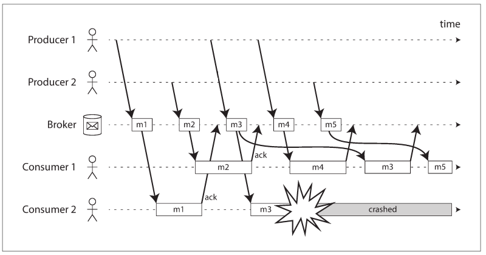

# 第十一章：流处理

> 复杂的系统都是从简单的系统演进而来的，从另一个角度来说，开始就很复杂的系统是根本不会被设计出来的。
>
> — 约翰·加尔, *Systemantics* (1975)

在[第十章](chapter10.md)中我们讨论了批处理-它是将一组文件作为输出然后在产出一组新的文件的技术。输出是**派生数据**（*derived data*）的一种形式；运行在批处理流程中的数据在必要的时候是可以再次生成的。我们了解到了这一简单却强大的理念是如何被应用于构建搜索索引、推荐系统、分析工具等领域。

但是，在[第十章](chapter10.md)中我们始终假设的一个命题是：输入是有边界的-即已知且有限的大小-所以批处理程序知道它何时完成了输入信息的读取。例如MapReduce的核心排序操作必须完整的读取所有的输入后才能开始输出结果：这就有可能会发生一个很小的键值数据记录很晚才被输入，因为这个小键值记录需要我们第一个输出，所以我们的输出不能很早进行（要等待这个最小键值输入后才能开始输出操作）。

实际上，很多数据之所以无边界是因为它们是随着时间的推移慢慢到达的：你的用户昨天和今天产生了数据，它明天还会继续产生更多的数据。除非你歇业，否者这个过程永远不会停止，所以在一定意义上，数据集从来不会有“完成（complete）”态\[[1](#ch11References1)]。因此，批处理程序必须人工的将数据划分为固定区间的数据块：例如：在每天结束的时候处理一天的有效数据，或者在每个小时结束后处理这一小时的有效数据。

以天为维度的批处理问题在于输入数据的变化只有在一天后才会对输出的结果有影响，这对很多急性子的用户来说太慢了。为了减少延迟，我们可以更频繁的执行批处理程序-例如每一秒都执行一次来处理上一秒的有效数据，甚至于说连续的，完全不划分固定区间，每个事件来临就立即处理。这便是「流处理」（*stream processing*）背后的思想。

通常，“流”指的是随着时间推移而逐渐可用的数据。这个概念出现在很多地方：在Unix的标准输入（stdin）和标准输出（stdout）中，编程语言（lazy lists）\[],文件系统API（例如Java的FileInputStream），TCP连接，通过互联网传输的音频和视频等等。

本章，我们将把事件流（event streams）视为一种数据管理机制：一种对应于我们上一章所介绍的，一种无界的，持续增量处理的批数据处理方式。我们首先会讨论流在网络中怎样表示、存储和传输。在“[数据库与流](#数据库与流)”中我们会讨论流和数据库之间的联系。最后，在“[流处理](#流处理)”中,我们会继续探讨处理这些流的方法和工具，以及它们用来构建应用的方式。

## 传输事件流

在批处理的世界，任务的输入输出一般是文件（可能是分布式的文件系统）。那么流又是怎样的呢？

当输入是文件（字节序列）时，首先要做的处理步骤通常是把它解析成为记录序列。在流处理的上下文中，一条记录通常会被称为**事件**（event），本质上它们是同一件事物：一种小的、独立的、不可变的含有事物发生时间节点信息的对象。一个事件通常会包含一个表明在一天中发生的时钟节点一致的时间戳（详见[单调和实时时钟](#单调和实时时钟)“Monotonic Versus Time-of-Day Clocks”）。

举个例子，这个发生的事件既可能是来自于用户执行的一个操作，如浏览网页或者支付一笔账款。也可能是来自于机器，如对温度进行的周期性测量或者是CPU的利用率指标。在[使用Unix工具的批处理](#使用Unix工具的批处理)这个例子中，web服务器的每一行日志便是一个事件。

事件的编码方式可能是字符串，或者是JSON，也可能是我们在[第五章](#chapter5)中讨论过的二进制表格。怎样编码决定了你可以怎样存储你的事件，例如你可以把它追加到文件中，也可以把它插入到关系型数据库表，又或者是把它写入到文档数据库中。另外你还可以通过网络把事件发送给其他节点来处理。

在批处理中，一次写入文件可能会被多个任务读取。类似的，在流处理的语境下，一个事件也是由生产者一次生成（也可称为发布者或发送者），然后可能被多个消费者消费（订阅者或者是收件人）\[[3](#anchor-3)]。在文件系统中，文件名用以标识一组相关记录；在「流处理」系统中，相关的事件通常会组合到**主题**（topic）或者**数据流**（stream）中。

原则上，文件或数据库足以连接生产者和消费者：生产者将它生产的每个事件写入到数据存储，然后每个消费者定期的从数据存储中轮询数据来检查从上次拉取后产生的新事件。实际上这正是批处理在每天结束时处理这一天有效数据的过程。

但是，若数据存储不是专门为这种用途而设计的，要在低延迟的情况下实现持续处理数据，轮询的代价是非常大的。你轮询操作越频繁，返回新事件的请求比例越低，系统开销也就越大。因此，当新事件产生时，我们最好主动通知消费者（而不是消费者轮询）。

传统数据库通常不能很好的支持这种通知机制：关系型数据库一般使用**触发器**（*triggers*），来承接这种变化（比如：往表里插入了一条数据），但是它们的能力非常有限，这更像是数据库事后的补偿设计\[[4](#ch11References4)]。所以，它是一种味了支撑事件通知而开发的特殊工具。

### 消息系统

向消费者通知新事件的通用方法就是使用消息系统（messaging system）：生产者发送一条包含事件的消息，然后推送给消费者。在前面我们在[“基于消息传递数据流”](#message-passing_dataflow)[page 136](#page136)介绍过，现在我们会进一步详细的介绍。

像Unix管道或者TCP链接这种建立在生产者和消费者之间的直接通信通道是实现消息系统的最简单方式。其实，大部分消息系统都是在基于这个模型演进的。不同的是，Unix管道和TCP链接是一个发送者对应一个接收者，而消息系统允许多个生产者节点往同一个topic发送消息且允许多个消费者节点从一个topic中接收消息。

在这种**发布/订阅**模型中，不同的系统采用不同的方法，并没有一个标准的答案可以同时满足不同的目的。想要区分这些系统，接下来的这两个问题将会对我们很有帮助：

1. **当生产者发送消息过快超过了消费者的接收范围会发生什么？**一般来说，有三种选择：丢弃消息，把消息缓存到队列，或者使用**背压**（也就是我们通常所说的流量控制-*flow control*；比如阻塞生产者来防止生产更多的消息）。例如，Unix管道和TCP链接就是使用了**背压**：他们使用了一个固定大小的缓冲区，当缓冲区满的时候，发送者会被阻塞直到有接收者从缓冲区消费数据（参见：[网络拥塞与排队](../part2/chapter7.md#网络拥塞与排队) 第282页）。

如果消息被缓存到队列，那么了解队列增长时会发生什么将会很重要。如果消息队列长度达到内存最大容量时系统会不回崩溃，或者消息是否需要写入到磁盘？如果写磁盘，那么磁盘访问会对消息系统\[[6](#ch11References6)]的性能产生什么影响？

2. **如果节点崩溃或者离线，是否会发生消息丢失？**

和数据库一样，持久化可能需要写磁盘/复制这些组合操作（详见：[复制与持久化](../part2/chapter7.md#复制与持久化)），这些操作都是有成本的。如果你可以容忍偶发的消息丢失，那么在相同的硬件配置下你或许可以获得更高的吞吐量以及更低的延时。

消息丢失是否可以被接受在很大程度上取决于应用。例如，像传感器的读数和统计这种周期性的传输场景，偶尔丢失消息是没有那么重要的，因为不管怎样，下一个新的数据很快就会再次发送出来。但是，需要特别注意的是如果大量数据丢失，而这些丢失的数据可能不会被立即觉察到，那么就会导致统计的错误\[[7](#ch11References7)].如果你是在对事件计数，那么交付的可靠性将会变得非常重要，因为在每次丢失消息之后意味着你后面的统计数都是错误的。

在[第十章](#chapter10.md)批处理系统中有一个很好的特性是它提供了强可靠性的保证：失败的任务是可以自动重试的，并且失败任务中输出部分也会自动被丢弃。这也就是说没有失败的情况下输出内容都是相同的，这利于我们简化程序模型。稍后在本章中我们会探讨如何在流处理情景下怎么来实现类似的保证。

#### 生产者消费者之间的直接消息传递

一部分消息系统在消费者和生产者之间采用无中间节点的直接网络通信：
* UDP 组播广泛的应用于像股票市场这种需要低延迟要求的金融行业\[[8](#ch111References8)]。尽管UDP本身是不可靠的，但应用层协议可以重新请求丢失的包（生产者必须记录它所发送包以便于在需要的时候可以重新发送）。
* 像[ZeroMQ\[[4](#ch11-References4)]无代理的消息库采用的方法类似，使用TCP或IP多播来实现消息的发布/订阅。
* StatsD\[[10](#ch11References10)]和Brubeck\[[7](#ch11References7)]使用不可靠的UDP消息来统计网络中机器的指标并对它们进行监控。（在StatsD协议中，计数器指标只有在接收到所有消息的情况下才正确；使用UDP只能是统计指标近似正确\[[11](#ch11References11)],令请参阅第283页 [TCP与UDP](../part2/chapter7#TPC与UDP)）。
* 如果消费者在网络上暴漏服务，那么生产者可以直接发送HTTP或RPC请求（参见：[基于服务的数据流：REST和RPC](../part1/chapter4.md#基于服务的数据流：REST和RPC)）来推送消息给消费者。这也正是[webhook](#ch11References12)背后的思想，一个服务的回调URL被注册到另一个服务中，并且每当事件发生时都会向该URL发送请求。

尽管这些直接消息系统在适配当前设计的目标下可以很好的工作，它们通常需要应用代码能意识到消息丢失。缺点是它们容错十分有限：尽管这个协议能够感知到网络中包的丢失并重新转发，前提是它们始终认为生产者和消费者一直处于在线状态。

如果有消费者离线，它可能会丢失掉发送出去还未到达的消息。一些协议允许生产者对失败的消息重新投送，但是当生产者崩溃是，这种方法可能就会失效了，这会导致本来需要重新投送的消息缓冲区丢失。

#### 消息代理

一种广泛的做法是使用**消息代理**（也称之为**消息队列**）来发送消息，本质上是一种优化消息流\[[13](#ch11References13)]处理方式的一类数据库。它作为服务器运行，生产者和消费者作为客户端与它连接。生产者写消息到代理服务器，消费者通过从代理服务器读取的方式来接收消息。

通过把数据集中在代理中的方式，这些系统可以从容的应对客户端的变化（连接、断开和故障），并且持久化的问题也同样的转移到了代理服务器上。某些消息代理仅仅将消息放到内存中，而另一些（取决于配置）会写入到磁盘，以此来保证代理服务器故障的时候不会丢失消息。对于速度比较慢的消费者，它们一般允许无限队列（而不是丢弃消息或者**背压**），当然这种选择也取决于配置。

排队的结果通常也使得消费者通常采用异步消费（*asynchronous*）：当生产者发送一条消息，通常只需要等待代理服务器确认消息已经进入到缓冲区，而不需要关心消费者处理消息的过程。向消费者交付通常发生在未来的某一个不确定的时间点——一般在几分之一秒内，但如果遇到队列积压，有时也会出现明显的延迟。

#### 消息代理和数据库对比

一些消息代理服务有时会使用XA或者JTA来实现两阶段提交（two-phase）协议（参见：[分布式事务实践](#分布式事务实践)）。这个特性使得它本质上与数据库非常相似，尽管消息代理与数据库之间仍然存在着明显的差异：

* 数据库通常会保留数据直到主动的删除，而大多数消息代理在把消息投递给消费者后就会自动的删除数据。这样的消息代理服务是不适合做数据的长期存储的。
* 因为消息会被很快删除的原因，可以认定大部分消息代理服务器的工作集相当的小——也就是说队列很短。如果是因为消费者速度变慢而代理服务需要缓存很多消息数据的话（可能没有足够的内存，那么多出来的消息会被写到磁盘），那么每个独立的消息被处理的时间都会拉长，从而导致整体的吞吐量下降\[[6](#ch11References6)]。
* 数据库通常支持**二级索引**和多种查找数据的方式，而消息代理通常支持订阅适配了某些正则表达式的topic数据子集。这些机制虽然不同，但本质上都是为客户端选择它们需要的部分数据。
* 当查询数据库时，结果集通常是基于数据的某一个时间点的快照；如果其他的客户端随后又写入一些数据到数据库改变了之前的查询结果集，第一个客户端是发现不了它的部分结果是过期数据的（除非它重新查询或者轮询查看更改内容）。相比之下，消息代理虽不支持随时查询，但是当数据变化时（即有新的有效消息）它会通知客户端；

这是消息代理服务的传统观念，像JMS\[[14](#ch11References14)] 和 AMQP \[[15](#ch11References15)]标准中也有所体现，并且像RabbitMQ,ActiveMQ, HornetQ, Qpid, TIBCO Enterprise Message Service, IBM MQ, Azure Service Bus, and Google Cloud Pub/Sub \[[16](#ch11References16)]等系统中都有实现.

#### 多消费者

当多个消费者从同一个主题中读取消息时，就会出现像 **[图11-1](#figure11-1)**表示的那样，有两种主流的消息投递模式会被用到：

- 负载均衡模式
	每个消息投递给其中一个消费者，从而消费者可以共享主题下的消息处理任务。消息代理可以任意的指定消费消息的消费者。这种模式适合消息处理代价比较高的场景，并且你可以通过增加消费者来水平扩展消息的处理能力。（在 AMQP 中，你可以通过让多个客户端从同一个队列中消费来实现负载均衡，在 JMS 中则被称为**共享订阅**。）

- 分发模式（扇出）
	每条消息都会投递给所有的消费者。分发模式允许多个独立的消费者各自收听到同一个消息的广播，而不会相互影响——流处理等价于几个不同的批处理任务读取同一个输入文件。（JMS的主题订阅和AMQP的交换机绑定都提供了这种特性。）

<a id="figure11-1"> **图 11-1.** </a> (a)负载均衡：在消费者中间共享同一个主题下的消费任务；（b）分发：每个消息都投递给多个消费者。

这两种模式可以组合：比入两组相互独立的消费者组可能都订阅了同一个topic，这样每组可以共同接收所有的消息，但是在组内每条消息只能有一个节点接收。

#### 确认和重传

消费者可能会随时崩溃，所以可能你会发生代理投递一个消息给消费者，但消费者从来没有处理它，或者在奔溃时只处理了一部分。为了确保消息不会丢失，消息代理使用**确认**（acknowledgments）：当客户端处理完一条消息后必须明确的告知代理服务，然后代理服务就可以把它从队列中移除。

如果接收确认消息时和客户端的连接关闭或超时，那么代理服务会认为消息未被处理，然后会把这条消息再次投递给另一个消费者。（要注意，消息实际上可能完全处理完成，但是确认消息在网络传输中丢失了。为了处理这种场景就需要一个原子性的提交协议，正如[“分布式事务实践”](../part2/chapter9.md#分布式事务实践)。）

当与**负载均衡**结合时，重新投递的行为在对消息的排序中会产生一个有趣的影响。在 **[图11-2]**中，消费者通常是根据生产者发送的顺序来处理消息。但是，当消费者1处理消息m4的同时，消费者 2处理消息m3发生故障。那么未被确认的消息m3随后被投递给了消费者1，结果就是消费者1按照m4，m3，m5的顺序来处理消息。因此，m3和m不是按照生产者1的发送顺序来处理的。

<a id="figure11-2"> **图 11-2.**</a> 消费者2在处理消息m3的时候发生了故障，随后消息被投递给了消费者1。

尽管消息代理尝试保持消息的顺序（正如JMS和AMQP协议要求的那样），但在组合负载均衡的时候，消息投递不可避免的导致消息的重排序。为了解决这个问题，你可以让每个消费者单独的使用一个消息队列（即不使用负载均衡特性）。如果消息之间是完全相互独立那么消息重排序就不算是一个问题，但是消息顺序对消息之间存在依赖关系的情况下是非常重要的，我们会在本章后面继续来讨论。

### 分区日志

通过网络发送的数据包或者发送给网络服务的请求通常是不会持久化操作痕迹的瞬时操作。尽管是可以永久记录（使用抓包和日志），我们通常不会考虑使用这种方式。尽管消息代理服务会把消息持久化写入到磁盘，但当消息投递给消费者后又会很快的被删除，因为消息代理是构建在**瞬时消息思维模式**之上的。

数据库和文件系统则采用完全相反的方式：任何写入数据库或文件的数据通常都是期望被永久保存，至少在显式的删除之前是这样。

这种思维方式上差异对于如何创建派生数据有很大影响。在[第十章](#chapter10.md)讨论中，批处理的一个关键特性就是你可以重复的执行并尝试处理步骤，但是并不会有损害输入数据的风险（因为输入是**只读的**）。这并不是AMQP/JMS风格的消息：接收了一个确认的消息对数据是有损坏性的，因为被消费者确认过的消息会被消息代理删除，所以你不能通过重复消费者操作来获得相同的数据。

如果你在消息系统中增加一个新的消费者，它通常只能接收到从它注册的时间点往后发送的消息；所有之前的消息都已经丢失并且不能被回复。相对于文件和数据库，则可以随时增加客户端，并且可以读取到以前任意写入的数据（是要应用程序没有明确的覆盖或删除数据）。

那为什么我们不能结合数据库的持久化和消息数据的低延迟混合起来使用呢？这正是**消息日志代理**背后的思想。

#### 基于日志的消息存储

日志仅仅是磁盘上的一个支持追加的记录序列。我们之前在[第三章](../part1/chapter3.md)的**日志结构存储引擎**和**预写日志**（WAL技术：write-ahead logs）以及[第五张](../part2/chapter5.md)的副本中讨论过日志。

我们可以使用同样的结构来实现消息代理：生产者通过将消息追加到日志的末尾来发送消息，消费者通过依次读取日志来接收消息。如果消费者读取到了日志的末尾，那么它将会等待消息追加的通知。UNIX的tail -f 工具，正是基于这种工作思路来实现监听是否有数据追加到文件。

为了打破单个磁盘所能提供的高吞吐量的上限，日志支持分区（[第六章](../part2/chapter6.md)的内容）。不同的分区可以分布在不同的机器上，每一个分区的日志都是隔离的，从而可以实现独立于其他分区的读取和写入。一个主题可以定义成带有相同类型数据的一组分区。如[图11-3](#figure11-3)所示：

在每个分区中，代理服务为每条消息会分配一个单调递增的序列号或偏移量-*offset*(在图11-3，方框中的数字便是偏移量）。

<a id="figure11-3"> **图 11-3.**</a>生产者通过追加到主题分区文件的方式发送消息，然后消费者依次读取。

Apache Kafka\[[17](#ch11References17),[18](#ch11References18)],Amazon Kinesis Steams\[[19](#ch11References19)],和Twitter的DistributedLog\[[20](#ch11References20),[21](#ch11References21)] 是这种基于日志的消息代理实现方式。Google Cloud Pub/Sub 的架构也是类似，但是它是通过暴漏JMS风格的API的方式而非通过抽象日志的方式\[[16](#ch11References16)].尽管这些消息代理把所有的消息都写入磁盘，但是他们依然能够通过多服务器分区的方式实现百万级别的消息吞吐量，并且可以通过消息复制来实现容错性\[[22](#ch11References22),[23](#ch11References23)].

#### 日志与传统消息系统对比

基于日志的方式可以很自然的支持消息的分发/扇出(fan-out)，因为多个消费者可以做到不相互影响独立的读取日志-读取消息不回将它从日志中删除。为了在一组消费者之间实现负载均衡，代理可以将整个分区分配给消费者组的节点，而不是单独的将消息分配给消费者客户端。

每个客户端都会消费到分配给它的分区的所有消息。通常，当消费者被指定一个日志分区后，它将直接以单线程的方式依次从分区中读取消息。这种粗粒度的负载均衡方式有以下缺陷：
* 一个主题的消费的节点数最多等于该主题下分区数，因为同一个分区内的消息被投递给了同一个节点。[^注i]
* 如果单个消息处理缓慢，它会阻塞分区内后续的消息（这是一种对头阻塞的方式；参见：第13页的[性能描述](../part1/chapter1.md#性能描述)）。

---
 注i： 可以创建一个负载均衡方案，在这个方案中，两个消费者通过读取全部消息来共享处理分区的工作，单其中一个只考虑偶数偏移量的消息，而另一个处理奇数偏移量的消息。或者，可以将消息处理扩展到线程池，但这种方法会使消费者偏移管理变得复杂。通常，单线程处理分区是优选的，并且可以通过使用更多的分区来增加并行性。

---

因此，在消息处理成本高昂，你希望在消息一条一条的基础上并行处理，并且消息没有有序性要求的场景中，JMS/AMQP类型消息代理会更合适。另一方面，当需要高吞吐量，每条消息都需要快速处理并且要保证消息顺序的场景下，基于日志的消息存储更适合。

#### 消费者偏移

顺序的消费分区中的消息可以很容易的知道哪些消息是已经被处理的：所有位移小于消费者当前便宜量的消息都是已经被处理过的消息，所有大于消费者当前便宜量的消息都是还未处理的。所以消息代理不再需要为每条消息再标记确认信息——只需要周期性的记录消费者的偏移量即可。记录开销的减少以及批量处理和流水线操作有助于提高基于日志的系统的吞吐量。

偏移量实际上和主从复制数据库中常见的日志序列号非常相似，我们在第五章中[**配置新的从节点**](../part2/chapter5.md#配置新的从节点)讨论过这种这种场景。在数据库复制中，日志序列号可以能够让追随者在和领导者断连后再次接入，而不会中断这断连期间的任何写入数据。同样这里也使用了相同的原则：消息代理的行为就像数据库领导者一样，消费者就像追随者。

如果消费者节点故障，那么这个故障的消费分区将会分配给消费者组中的另外一个节点，它会接着最后一次记录的偏移量继续消费。如果消费者消费了部分数据后还未来得及记录消费偏移量，那么这些消息在重新启动后将会在一次被消费处理。我们会在本章的后续部分来讨论这个问题的处理方式。

#### 磁盘空间利用

如果你只是往日志里面追加写入，那么最后会造成磁盘空间溢出。为了回收磁盘空间，日志实际上是分段的，老的日志段会不定期的被删除或者被存档。（稍后我们会讨论更多更复杂的释放磁盘空间的方法。）

这就意味着如果一个很慢的消费者不能够维持消息消费的速率，那么它的消费偏移量将远远落后甚至偏移位置指向了一个删除后的日志片段，这就会导致一些消息的丢失。实际上，日志实现了一个有限大小的缓冲区也就是我们所熟知的**圆形缓冲区**或**环形缓冲区**，当它满的时候就会把旧的消息丢弃（覆盖掉）。但是，因为这个缓冲区在磁盘上，所有它的空间可能会非常大。

我们做一个粗略的计算。在撰写本文的时候，典型的硬盘容量一般是6TB，顺序写的吞吐量是150M/s。如果按照磁盘最快的速率写入消息，写满硬盘大约花费11个小时。所以，磁盘可以保留11个小时内的有效数据，接着后续写入的新消息便会覆盖旧消息。保即使你加再多的磁盘和机器，这个比率仍然不会发生改变。但实际中，很少能够达以磁盘的满带宽速度写入，所以日志通常可以保留几天甚至几周的有效数据。

无论你保留的时间有多长，日志的吞吐量基本保持恒定，因为所有的消息最终都会写入到磁盘\[[18](#ch11References18)]。这种操作方式和默认把消息写入缓存，只有当消息队列增长过快时才会将它们写入磁盘的方式形成鲜明的对比：当消息队列很短时系统很快，当队列过长以致于开始写磁盘时速度就会变的很慢，所以吞吐量取决于要保留历史数据的大小。

#### 消费者跟不上生产者时

在本章开始的[消息系统](#消息系统)部分，我们讨论了当消费者消费的速率跟不上生产者生产的速率时的三种选择:丢弃消息，把消息缓存到队列或者背压。在这中分类方式下，基于日志的方式其实是一种针对数据庞大但是大小固定（取决于硬盘容量）的一种缓冲区的实现方式。

如果一个消费者落后太多，以致于它要请求的消息太旧已经不在磁盘上了（被新消息覆盖），那么它将无法读取到这些消息——实际上代理服务器会丢弃掉比缓冲区所能容纳的最大容量更早的消息。你可以监测消费者距离日志起点的落后状况，并在它显著落后的时候发起告警。如果缓冲区够大，那么将会有足够的时间来让手工处理慢消费者，并在它开始丢失消息之前追赶上来。

尽管某个消费者由于落后太多而开始丢失数据，但也只对这个消费者有影响；它不会影响到其它消费者服务。这实际上有很多的操作便利：你可以真实的去消费生产日志来用于开发，测试或用以调试而不必担心它会影响生产服务。当一个消费者关闭或故障而停止消费——唯一需要保留下来的就只有它的**消费位移**；

这种方式与传统的消息代理相比，你需要关心的是删除掉那些关闭了的消费者的队列——不然他们会持续的增加一些不必要的消息，并会和还在运行的消费者抢夺内存。

#### 消息重放

我们注意到之前在使用AMQP和JMS风格的消息代理时，处理和消息确认是一个破坏性的操作，因为它会导致消息从代理服务中被删除。但是，在基于日志的消息代理中，消费消息更像是从文件中读取数据：它是一个不会更改日志的只读操作。

除了消费者的输出外，处理数据过程的唯一影响只是消费者的位移向前移动而已。因为位移是由消费者控制的，所以在必要的时候它可以很容易的操作：例如，为了重新处理昨天的有效数据，你可以拷贝一份从消费者昨天开始时间位移处的数据，将它输出到不同的地方。伴随着你处理程序的变化，你可以无数次的重复这样的操作。

在这种通过重复的转换处理将输入数据和输出数据明显分隔开的方面，使得基于日志消息发送更像是上一章的批处理，它可以允许我们进行更多测验并很容易的从错误或者bug中恢复，同样也使得它成为在组织内集成数据流的一个很好的工具[24](#ch11References24)。

## 数据库与流

我们已经做了很多消息代理和数据库之间的比较。尽管他们在传统上属于两种不同的工具种类，但是我们看到基于日志的消息代理已经成功将数据库的思想应用到了消息投送上。也可以反过来说：从消息投送和流处理的思想应用于数据库。

我们之前说过一个事件就是对某件事情发生时间点的记录。这个事件的产生可能是用户的一个动作（例如：输入查询操作），或者是一个传感器的数据读取，但也是需要写入到数据库中。实际上写入数据库中的是一个可以被获取、存储和处理的事件。这一现象表明，数据库与数据流之间的联系比日志在磁盘上的存储（这个是基础）更加紧密。

事实上，**日志复制**（[日志复制实现](../part1/chapter4.md#日志复制实现)）便是一种由领导者在事务处理过程中写数据库的事件流。追随者将这些写入流应用到自己数据库的独立副本中，因此最终会得到一个相同数据的精确副本。复制日志中会记录描述产生数据变化的事件。

在[**全序广播**](#全序广播)中，我们也发现状态机复制原则：如果每一个事件都代表对数据库的写入，并且所有的副本都以相同的顺序处理相同的事件，那么所有副本最终都会达到一个相同的状态。（事件的处理是一个确定性的操作。）这又是另外一个事件流的经典案例！

这一部分我们首先来看在各种数据系统中出现的一个问题，然后探索如何通过将事件流的思想引入到数据库来解决这个问题。

### 保持系统同步

通过本书我们可以看到，并没有一个完美的系统可以同时满足所有的数据存储，查询和处理需求。实践中，多数优秀的应用都需要通过结合多种技术来满足需求：例如，OLTP数据库被用作用户请求的服务，使用缓存来增加请求速度，使用全文索引来处理搜索请求，数据仓库用作分析等等。他们中的每一个都拥有独立的数据副本，并以他们所做的任务性能更好的方式来存储。

当相同或相关的数据出现在多个不同的地方时，他们相互之间需要保证同步：如果数据库中的一条数据发生改变，那么缓存，搜素引擎以及数据仓库中的数据同样需要更新。对于数据仓库通常使用ETL执行来实现（详见：[数据仓库](../part1/chapter1.md#数据仓库)），做法是先全量复制数据，进行数据转换，然后将他们批量加载到数据仓库——说白了就是批处理。同样，我们在第411页的[批处理工作流输出](#批处理工作流输出)中看到，如何使用批处理创建搜索索引、推荐系统和其他派生数据系统。

如果周期性的全量数据库转储太慢，有时候双写也会被用作一个备选方案来使用，当数据发生变更时应用代码会显式的写入到各个系统中：比如，首先写数据库，接着更新搜素索引，然后失效缓存数据（或者并发的执行这些操作）。

但是双写有一些致命的问题，其中一个便是[图11-4](#figure11-4)中所示的**竞态条件**。在这个例子中，两个客户端同时更新X：client-1想要设置它为A，client-2想把它设置成B。两个客户端都是把新值先写入到数据库，然后再写入到搜索索引。由于时机不佳，请求是交叉的：数据库首先看到的是client-1设置的值A，然后client-2写入把该值设置为B，所以数据库里最终的值是B。搜索索引首先看到的是client-2的写入，然后是client-1，所以搜索索引最终看到的值是A。尽管没有错误发生，但是这两个系统之间发生了永久不一致性。

<a id="figure11-4"> **图 11-4.** </a> 数据库中，X首先被设置为了A，然后设置成B，在搜索索引中写入的顺序是相反的。

除非你额外的增加一些并发监测机制，比如我们在[检测并发写入](#检测并发写入)中讨论过的版本向量，你可以不用关心并发写入的发生——一个值可以简单直接的覆盖掉另外一个值。

双写的另外一个问题在于当其中一个写成功后另外一个可能写入失败。这是一个容错问题而非并发问题，但是它仍能对两个系统相互之间不一致产生影响。保证他们要么同时成功要么同时失败是原子性提交问题的一个案例，它解决起来通常成本较高（参见：[原子性提交和两阶段提交](#原子性提交和两阶段提交)（**2PC**））。

如果只有一个只包含领导者节点的数据库副本，那么领导者将决定写入操作的顺序，因此状态机复制机制适用于数据库副本间的协同工作。但是，在图[图11-4](#figure11-4)中，不是单领导者：数据库和搜索索引可能有他们单独的领导者，他们既不互相追随，也不相互影响（参加：[多领导者副本](#多领导者副本)）。

如果确实只有一个领导者的情况还好——比如让数据库作为领导者——如果我们可以把搜索索引作为数据库的一个追随者。但是这在实践中可行吗？

### 变更数据捕获

大多数数据库复制日志的问题是他们长期以来注重的是数据库内部的实现细节，而非公共的API。客户端应该通过数据模型和查询语句来从数据库中查询数据，而不是去解析复制日志再把数据从中提取出来。

几十年来，许多数据库就连写入数据的变更日志文档都没有。基于这个原因就很难拿到数据库所有数据的变动并把它们复制到像搜索索引，缓存或者数据仓库这类不同技术栈的存储组件中去。

最近，人们对**变更数据捕获**（*change data capture*-CDC）兴趣日益浓厚，它通过观察所有写入数据库数据的变化过程，然后以某种可以被复制到其他系统的方式提取数据。如果数据是即时写入的且它们的变化是可以流式操作的，那么CDC尤其值得我们去关注。

例如，你可以捕获数据库中数据的变更，并且持续的把同样的变更应用到搜索索引中。如果日志的变更顺序相同，那么你可以认为搜索索引中的数据和数据库中的数据是一致的。搜索索引和其他任何派生数据系统一样都是流变更的消费者而已，如图[图11-5](#figure11-5)所示：

<a id="figure11-5"> **图 11-5.** </a>将数据按序写入数据库，然后以相同的顺序把数据应用到其他的系统中。

#### 数据变更捕获实现

我们可以把日志的消费者称为**数据派生系统**[#派生数据],这是我们在[**第三部分**](#../part3/#第三部分)介绍的:存储在搜索索引和数据仓库中的数据仅仅是系统记录的另外一种视图。变更数据捕获是为了确保对发生在系统记录中的所有数据变更能够反应在派生数据系统中从而保证派生系统是数据的精确复制的一种机制。

本质上**变更数据捕获**使得某个数据库成为了领导者（某个变更数据可被捕获到的），而其它系统则称为了它的追随者。基于日志的消息代理可以很好的适配传输数据源变更事件的任务，因为它可以保证消息的顺序（避免了图[图11-2](#figure11-2)的乱序问题）。

数据库触发器可以被用来实现**数据捕获**（参见：[基于触发器的复制](#基于触发器的复制)）通过注册触发器来监控数据表的所有变更，并将相应条目添加到变更日志表中。但是这种机制很脆弱并有显著的性能开销。尽管解析日志的方式会带来一些比如处理方式的变化这样的挑战，但起码它看起比较健壮。

领英的Databus\[[25](#ch11References25)]，脸书的Wormhole\[[26](#ch11References26)],和雅虎的Sherpa\[[27](#ch11References27)]都广泛的使用这种思想。Bottled Water通过对预写日志的转译为PostGreSQL实现了CDC\[[28](#ch11References28)],Maxwell和Debezium通过解析binlog日志，为MySQL实现了同样的事情\[[29](#ch11References29),[30](#ch11References30),[31](#ch11References31)],Mongoriver通过读MongoDB的oplog为MongoDB\[[32](#ch11References32),[33](#ch11References33)],以及GoldenGate为Oracle\[[34](#ch11References34),[35](#ch11References35)]也都提供了同样的实现。

像消息代理，变更数据捕获通常是异步的:数据库记录系统不需要等到消费者应用后再提交。这种设计在增加一个慢消费者时通常比较有优势，因为它不会对系统记录造成太大影响，但是它同样也有劣势就是复制延迟问题（参见：[复制延迟问题](#复制延迟问题)）。

#### 快照初始化

如果你拥有数据库的全量变更数据日志，那么你就可以通过对日志的重放重新构建出整个数据库状态。但是，很多时候，永久的保留变更需要很大的磁盘空间，而且应用它们花费的时间也会很长，所以日志需要被清理。

构建一个全文索引，例如,如果你需要整个数据库的全量拷贝——那么仅有最近变化的日志是不够的，因为会丢失不是最近才更新的数据项。但是，如果你要的不是整个历史日志，那么你可以从一个一致性快照开始，就像我们之前在[**配置新的从节点**](../part2/chapter5.md#配置新的从节点)所讨论的。

数据库的快照必须和变更日志中的一个已知的位置或者偏移量项对应，这样你才能在快照处理完成后在哪一个节点开始应用新的变更。部分CDC工具集成了快照功能，而其他工具则以手动模式操作。

#### 日志压缩

如果你可以保证仅保留有限数量的历史日志，你可以在每次增加新的派生系统时，都可以执行快照处理。不过，日志压缩为我们提供了更好的替代方案。

我们之前在[哈希索引](#哈希索引)中讨论过日志压缩，在日志结构化存储引擎部分（参加[图3-2](#figure3-2)的例子）。原则很简单：存储引擎周期性的使用相同的关键字搜索日志记录，删除重复项，只保留最近一次更新的记录。压缩和合并处理运行在后台。

在日志结构存储引擎中，带有特殊空值的更新（即墓碑标记）即表示该值已被删除，然后它就会在日志压缩中被移除。但是只要某个key不被覆盖或删除，它就会永远的呆在日志中。日志压缩所需要的磁盘空间只取决于数据库当前的内容，而不是数据库的写入次数。如果某个key被频繁的覆写，之前的值最终会被垃圾回收，仅会保留最近的一次写入的值。

同样的原理也适用于基于日志的消息代理和变更数据捕获。如果CDC系统设置为每个变更都需要一个主键，并且每个键的更新都会去更新它的旧值，那么我们就只需要保留特定键的最新值就可以了。

现在，你可以随时重建你的派生数据系统，如搜索索引，你可以新起一个新的消费者，然后从topic压缩日志的0偏移量位置开始消费，然后顺序扫描日志中的全量数据。日志保证一定会包含数据库中每一个键的最新值（也有可能存在一些旧值）——换句话说，你可以使用它得到数据库内容的全量拷贝而无需在额外制作一个CDC数据源数据库的快照。

Apache Kafka支持这种日志压缩特性。正如我们将在本章后面看到的，它允许消息代理被持久化存储，而不单单是作为临时消息传递。

#### 变更流的API支持

越来越多的数据库开始将变更数据流的支持作为一等函数，而非采用CDC惯常的改造升级和逆向工程方案。例如，RethinkDB允许查询订阅查询结果变更的通知\[[36](#ch11References36)],Firebase\[[37](#ch11References37)]和CouchDB\[[38](#ch11References38)]提供了基于动态消息的数据同步，该功能同时对应用程序开放，Meteor使用MongoDB的oplog去订阅数据变更并实时更新用户界面\[[39](#ch11References39)]。

VoltDB 允许事务从数据库中以流的形式持续的导出数据\[[40](#ch11References40)]。数据库将关系型数据模型的输出当作一张表，但是这张表是不允许查询的。该数据流由已提交事务按照提交顺序写入该特殊表的元组日志构成。外部消费者可以异步地使用该日志，并使用它来更新派生数据系统。

Kafka Connect\[[41](#ch11References41)]致力于将适用于多种数据库系统的变更数据捕获工具与Kafka进行集成.一旦变更事件流在Kafka中，它就可以被用来更新如搜索索引这种派生数据系统，并且可以输入到接下来我们要提到的流处理系统中。

### 事件溯源
我们讨论的这些观点与事件溯源（*event sourcing*）存在相似之处，后者是领域驱动设计（DDD）社区开发的一种技术\[[42](#ch11References42),[43](#ch11References43),[44](#ch11References44)]。我们会简要的介绍下**事件溯源**，因为它包含了流处理系统的一些有用和相关的观点。

和变更数据捕获类似，事件溯源涉及将应用程序状态的所有变更记录为变更日志。最大的区别在于事件溯源是在一个不同的抽象层次上来应用这种理念：

* **在变更数据中**，应用以一种可变的方式来使用数据库，它可以在需要的时候随时更新和删除。变更数据是在底层从数据中提取的（比如，通过解析复制日志），它确保了从数据提取数据的写入顺序和数据库实际的写入顺序是一致的，避免了[图11-4](#figure11-4)中的竞态条件。应用程序对数据的写入无需关心CDC的动作。

* **在事件溯源中**，应用程序逻辑基于写入事件日志的不可变性进行显式构建。基于此，事件存储是追加写入（appendonly）的，更新和删除是不推荐的或者是应该被禁止的。事件被定义为在应用层发生的所有影响的事情，而不仅仅是底层的状态变动。

事件源是数据建模的一种强有力的技术：从应用层的观点将用户操作记录为不可变事件更有意义，而不仅仅是将这些操作的记录在可变的数据库中。事件溯源使应用程序的演进变得更加容易，它能够更容易的帮助我们理解事情为什么发生的真实原因，从而避免程序bug（参见：[不可变事件的优势](#不可变事件的优势)）。

例如，存储“学生取消课程注册”事件，清晰的表达了以中立方式的单一动作意图，但是副作用是“一条数据从注册表中被删除了，然后学生反馈表中新增了一条取消原因数据”这对数据库稍后的使用方式存在诸多不确定性。如果增加一个新的应用功能——例如，“这个位置将提供给候补名单中的下一个”——事件溯源方法使得新副作用能够轻松地从现有事件中被链式触发。

事件溯源和编年数据模型类似\[[45](#ch11References45)],事件日志与星型模式中的事实表之间也存在相似性(参见：[星型和雪花型：分析模式](#星型和雪花型：分析模式))。

事件存储的专用数据库\[[46](#ch11References46)]已经被开发出来用于解决应用事件溯源，但总体而言，这种实现方式并不依赖任何特定工具。传统的数据库或者基于日志方式的消息代理也是可以被用来以这种风格构建应用的。

#### 从事件日志中推导当前状态

一个事件日志本身并不是非常有用，因为用户通常期望看到系统的当前状态，而不是历史的更改记录。例如，在购物网站上，用户期望能够看到它们购物车的当前内容，而非一个它们对购物车所做的所有操作的追加列表。

因此，采用事件溯源的应用程序需要记录事件日志（表示数据写入了系统）然后转换为适用于对用户展示的应用状态（数据从系统读取的方式\[[47](#ch11References47)]）。转换可以使用任意的逻辑，但要它一定要准确以便于你可以从事件日志重新运行它而推导出相同的应用状态。

就像变更数据捕获，通过对事件日志的重放可以让你重新构建系统的当前状态。但是，日志压缩需要的处理方式不同：

* CDC事件用于更新记录时，通常会包含该记录的完整新版本，所以，主键的当前值完全由该主键的最新事件决定，日志压缩可以丢弃相同主键的先前事件。

* 另一方面，事件溯源是事件的更高层次建模：事件通常表达用户操作的意图，而非该操作引发的状态更新机制。在这种情况下，后续事件通常不会覆盖先前事件，因此需要完整的历史记录才能重建最终状态。日志压缩无法以相同的方式实现。

采用事件溯源的应用通常会通过某种机制存储基于事件日志推导出的当前状态快照，这样就无需反复处理完整日志。不过这仅是为提升读取速度和系统崩溃恢复效率的性能优化方案——其核心理念是让系统能够永久存储所有原始事件，并在需要时重新处理完整日志。关于这一设计假设的详细讨论，请参阅第463页[“不可变性的局限性”](#不可变性的局限性)章节。

#### 命令和事件

事件溯源哲学特别强调区分事件与指令\[[48](#ch11References48)]。当用户首次发起一次请求时，它初始是一条指令：此时仍可能失败，例如某些完整性条件被违反。如果校验成功且命令被接受，它就会变成一个持久化和不可变的事件。

例如，如果用户尝试注册特定用户名，或者预订飞机或剧院的座位，那么应用必须要检查这个用户名或者座位是否已经被占用。（我们之前在第364页的[“容错共识”](#容错共识)中讨论过这个例子。）当该检查成功，应用程序可以生成一个事件，以表明特定用户名已被特定用户ID注册，或特定座位已被特定客户预订。

当事件生成时，它就成为事实。即使客户后来决定更改或取消预订，事实仍然是他们以前为一个特定的座位保留了预订，更改或取消是一个后续添加的单独的事件。

事件流的消费者不允许拒绝事件:当消费者看到该事件时，它已经成为日志中不可更改的一部分了，而且可能已经被其他消费者看到了。因此，任何命令的验证都必须同步进行，且必须在事件发生前完成——例如，通过采用可序列化的事务机制，该机制以原子方式验证命令并发布事件。

或者，用户预订座位的请求可以分为两个事件：先进行临时预订，待预订确认后，再进行单独的确认操作（如第350页[“使用全序广播实现可线性化存储“](#使用全序广播实现可线性化存储)所述）。这种拆分使得验证过程能够以异步方式运行。

### 状态、流和不变性

我们在[第10章](#chapter10.md)中看到，批处理得益于输入文件的不可变性，所以您可以在现有输入文件上运行实验性处理作业，而不用担心会影响它们。正是这种不可变性原则，使得事件溯源和变更数据捕获技术如此强大。

我们通常认为数据库是存储应用程序当前状态的，这种表示方式是为读取优化的，而且通常是最方便为服务提供查询的。状态的本质是变化的，所以数据库支持更新和删除数据，以及插入数据。这与不可变性如何契合？

当系统状态发生变化时，这种状态是经过时间推移的事件演变所形成的。例如，当前可用座位列表源自已处理的预订记录，账户余额由账户的贷方和借方交易构成，而网页服务器的响应时间曲线则是所有请求响应时间的汇总结果。

无论系统状态如何变化，总有一系列事件促成了这些改变。即便某些操作被执行又撤销，这些事件的发生本质依然成立。关键在于：动态状态与只读的不可变事件日志并非相互矛盾，而是同一事物的两个方面。所有变更的日志记录，即变更日志，完整呈现了系统状态随时间推移的演变轨迹。

如果你对数学感兴趣，可能会这样理解：应用状态是将事件流随时间积分后的结果，而变化流则是将状态随时间微分后的结果，如图[图11-6](#figure11-2)所示\[[49](#ch11References49),[50](#ch11References50),[51](#ch11References51)]。这种类比虽有局限（例如状态的二阶导数似乎没有实际意义），但却是理解数据概念的有益起点。

<a id="figure11-5"> **图 11-6.** </a>当前应用状态和事件流之间的联系。

若能妥善保存变更日志，就能确保系统状态的可复现性。若将事件日志视为系统记录的核心，所有可变状态皆由此推导而来，就能更清晰地追踪数据在系统中的流转路径。正如帕特·赫兰德\[[52](#ch11References52)]所言：

`
事务日志完整记录数据库的所有变更操作。要修改日志，高速追加写入是唯一可行方式。从这个角度看，数据库内容实际上只是日志中最新记录值的缓存。说白了，数据库就是日志中某个子集的缓存。这个被缓存的子集恰好对应日志中每个记录和索引值的最新状态。
`

我们在[“日志压缩”](#日志压缩)中讨论过的日志压缩，是桥接日志和数据库状态差异的一种途径：它会丢弃被覆盖的版本，仅保留每条记录的最新版本。

### 不可变事件的优势

数据库的不可变性是一个古老的概念。例如，会计师已经在财务记账中使用不可变性有数百年历史了。当交易发生时，
它会被记录在一个仅追加的财务账簿中（ledger），这本质上是一份记录货币、商品或服务交易的账簿。诸如损益表或资产负债表等财务报表，是通过汇总账簿中的交易数据而生成的\[[53](#ch11References53)]。

当会计人员出现差错时，不会直接删除或修改账簿中的错误交易，而是会添加一笔补偿性交易来纠正错误，比如退还错误收费。由于这些错误交易对于审计来说是比较重要的，因此会永久保留在账簿中。若基于错误账簿得出的不准确数据已被公开发布，后续会计期间的数据就会包含修正项。这种会计处理方式完全符合行业规范\[[54](#ch11References54)]。

虽然审计性在金融系统中尤为重要，但对许多不受严格监管的系统同样具有重要价值。正如第413页[“批处理输出的哲学"](#“批处理输出的哲学)所述，若意外部署了存在漏洞的代码，导致数据库写入错误数据，而该代码具备破坏性覆盖数据的能力，恢复工作将变得异常困难。采用只追加记录的不可变事件日志时，就能更轻松地诊断问题根源并实现快速恢复。

不可变事件不仅能记录当前状态，还能捕捉更多细节。以电商网站为例，当顾客将商品加入购物车后又将其移除时，虽然从订单完成的角度看第二次操作会抵消第一次，但分析时仍需记录顾客曾考虑过该商品却最终放弃的决策过程。这种潜在需求可能促使他们日后下单，也可能找到替代商品。这类信息会被记录在事件日志中，若数据库在删除购物车商品时自动清除记录，这些关键信息就会丢失\[[42](#ch11References42)]。

### 从同一事件日志中导出多个视图

此外，通过将可变状态与不可变事件日志分离，可以从同一事件日志中推导出多种不同的读取导向表示形式。这种机制类似于多消费者共享数据流的场景（[图11-5](#figure11-5)）：例如，分析型数据库Druid直接通过Kafka采用此方案进行数据摄取\[[55](#ch11References55)]，Pista-Chio作为分布式键值存储系统，将Kafka用作提交日志\[[56](#ch11References56)]，而Kafka Connect的数据接收器则能将数据导出至各类数据库和索引\[[41](#ch11References41)]。对于搜索服务器等其他存储与索引系统而言，采用分布式日志作为输入源同样具有合理性（详见第452页[“保持系统同步”](#保持系统同步)章节）。

通过将事件日志与数据库进行显式转换，可有效提升应用的持续演进能力：当需要以全新方式呈现现有数据时，即可基于事件日志为新功能构建独立的读取优化视图,并可以在不修改现有系统的前提下与现有系统并行。在现有系统中并行运行旧系统与新系统，通常比执行复杂的模式迁移更为简便。当旧系统不再需要时，可直接关闭并回收其资源\[[47](#ch11References47),[57](#ch11References57)]。

存储数据通常相当简单，如果你不必担心如何查询和访问数据；许多模式设计、索引和存储引擎的复杂性都是为了支持某些查询和访问模式（参见[第3章](../part1/chapter3.md)）。因此，通过将数据写入的形式与读取的形式分离，并允许多种不同的读取视图，你获得了很大的灵活性。这一理念有时被称为**命令查询责任分离**（CQRS）\[[42](#ch11References42),[58](#ch11References58),[59](#ch11References59)]。

传统数据库和模式设计方法基于一个谬误：数据必须以查询时的格式进行存储。关于规范化与反规范化（参见第33页[“多对一与多对多关系”](#多对一与多对多关系)）的争论，在能够将写入优化的事件日志数据转换为读取优化的应用状态时，其重要性便大打折扣。在读取优化的视图中反规范化数据是完全合理的，因为这种转换过程本身就能提供与事件日志保持一致性的机制。

在[负载描述](#描述负载)中，我们探讨了Twitter的主页时间线——这个功能就像邮箱一样，会缓存特定用户关注对象最近发布的推文。这又是一个读取优化状态的典型案例：主页时间线具有高度去规范化特性，因为你的推文会被所有关注者的时间线重复展示。不过，扇出服务能将这种重复状态与新推文及新增关注关系保持同步，从而让重复展示变得可控。

### 并发控制

事件溯源和变更数据捕获最大的缺点在于，事件日志的使用者通常是异步的，因此存在这样的可能性：用户可能先向日志写入数据，随后从日志派生的视图中读取时，发现写入操作尚未反映在读取的视图中。我们此前在第162页的[读己写](#读己写)一文中讨论过这个问题及可能的解决方案。

一种解决方案是将读视图的更新与事件日志的追加操作同步进行。这需要通过事务将写入操作整合为原子单元，因此要么需要将事件日志和读视图存储在同一个系统中，要么需要跨系统使用分布式事务。另一种方案可参考第350页[全序广播实现线性化存储](#全序广播实现线性化存储)中讨论的方法。

另一方面，通过事件日志推导当前状态还能简化并发控制的某些方面。多对象事务的需求（参见第228页的[“单对象与多对象操作”](#单对象与多对象操作)）主要源于单个用户的动作需要在多个不同位置修改数据。通过事件溯源技术，您可以设计出能够完整描述用户操作的事件。这样一来，用户操作只需在一处进行写入——即将事件追加到日志中——这一操作很容易实现原子化。

若事件日志与应用状态采用相同分区机制（例如处理客户事件时，仅需更新应用状态的第3分区），则简单的单线程日志消费者无需对写操作进行并发控制——由于其设计特性，每次仅处理单个事件（另见第252页[“实际串行执行”](#)章节）。日志通过为分区内的事件定义串行顺序，消除了并发操作的非确定性问题[24]。当事件涉及多个状态分区时，就需要进行更复杂的工作处理，这将在[第12章](#chapter12.md)详细讨论。

### 不可变更性限制

许多不采用事件驱动模型的系统仍依赖不可变性：各类数据库内部通过不可变数据结构或多版本数据来支持时间点快照（参见第241页[“索引与快照隔离”](#索引与快照隔离)章节）。Git、Mercurial和Fossil等版本控制系统同样依靠不可变数据来保存文件的版本历史。

要永久保存所有变更的不可变历史记录，其可行性究竟如何？答案取决于数据集的更新频率。对于那些主要进行数据添加、很少更新或删除的工作负载，实现不可变历史记录相对容易。但对于那些在相对较小的数据集上频繁进行更新和删除的工作负载，不可变历史记录可能会变得难以管理——不仅体积庞大到令人望而却步，还可能引发碎片化问题，此时压缩机制和垃圾回收的性能就成为保障系统稳定运行的关键所在\[[60](#ch11References60),[61](#ch11References61)]。

除性能考量外，某些情况下即便数据不可修改，仍需出于管理目的删除。例如：隐私法规要求用户注销账户后删除个人信息；数据保护法规定需清除错误信息；或发生敏感信息意外泄露时需及时封控。

在此类场景下，仅在日志中追加事件来标记数据已删除是不够的——实际上需要重写历史记录，假装这些数据从未存在过。例如，Datomic将此功能称为“消减”\[[62](#ch11References62)]，而Fossil版本控制系统则采用类似概念，称为“回避”\[[63](#ch11References63)]。

实际删除数据的难度远超预期\[[64](#ch11References64)]，因为数据副本可能存在于多个位置：例如存储引擎、文件系统和固态硬盘（SSD）通常采用新位置写入而非原地覆盖的方式\[[52](#ch11References52)]，而备份数据往往被刻意设置为不可修改状态，以防止意外删除或损坏。删除操作更多地是“增加数据检索的难度”，而非真正地“使数据无法被检索”。尽管如此，你有时仍需尝试，正如我们将在[“立法与自我监管”](#“立法与自我监管”)章节中所见。

## 流处理

目前为止，在本章节我们已经讨论过流的来源（用户行为事件，元器件和写数据库），也讨论了流的传输（通过直接消息流，消息代理以及事件日志）。

接下来我们讨论的是你拿到流之后可以做什么——就是说，你可以对它进行处理。大体上，有这三种选择：

1. 你可以将事件中的数据写入到数据库、缓存、搜索索引或者相似的存储系统，以便可以被其它客户端查询。如[图11-5](#figure11-5)所示，当数据变更发生时，这是一种很好的和系统其它部分保持数据库同步的方式——尤其是流的消费者只有写数据库这一种客户端的情况。向存储系统中写入的流处理相当于我们在“批处理工作流输出”中讨论的类似。

2. 你可以以某种方式把事件推送给用户，比如说发送提醒邮件或者推送提醒通知，又或者是把数据流事件生成一个实时的直观的看板。在这种场景下，人就成为了该信息流的最终消费者。

3. 你可以处理一个或多个输入流来生成一个或多个输出流。

## 流处理的适用场景

## 小结

---
## 引用

[<a id="ch11References1">1</a>] Tyler Akidau, Robert Bradshaw, Craig Chambers, et al.: [“The Dataflow Model: A Practical Approach to Balancing Correctness, Latency, and Cost in Massive-Scale,Unbounded, Out-of-Order Data Processing,”](https://www.vldb.org/pvldb/vol8/p1792-Akidau.pdf) Proceedings of the VLDB Endowment,volume 8, number 12, pages 1792–1803, August 2015. doi:10.14778/2824032.2824076

[<a id="ch11References2">2</a>] Harold Abelson, Gerald Jay Sussman, and Julie Sussman: [Structure and Interpretation of Computer Programs](https://mitpress.mit.edu/sicp/), 2nd edition. MIT Press, 1996. ISBN:978-0-262-51087-5, available online at mitpress.mit.edu

[<a id="ch11References3">3</a>] Patrick Th. Eugster, Pascal A. Felber, Rachid Guerraoui, and Anne-Marie Kermarrec: “[The Many Faces of Publish/Subscribe](https://www.cs.ru.nl/~pieter/oss/manyfaces.pdf),” ACM Computing Surveys, volume 35, number 2, pages 114–131, June 2003. doi:10.1145/857076.857078

[<a id="ch11References4">4</a>] Joseph M. Hellerstein and Michael Stonebraker: [Readings in Database Systems](http://redbook.cs.berkeley.edu/),4th edition. MIT Press, 2005. ISBN: 978-0-262-69314-1, available online at redbook.cs.berkeley.edu

[<a id="ch11References5">5</a>] Don Carney, Uğur Çetintemel, Mitch Cherniack, et al.: “[Monitoring Streams – A New Class of Data Management Applications](https://www.vldb.org/conf/2002/S07P02.pdf),” at 28th International Conference on Very Large Data Bases (VLDB), August 2002.

[<a id="ch11References6">6</a>] Matthew Sackman: “[Pushing Back](lshift.net/blog/2016/05/05/pushing-back/),” lshift.net, May 5, 2016.

[<a id="ch11References7">7</a>] Vicent Martí: “[Brubeck, a statsd-Compatible Metrics Aggregator](https://githubengineering.com/brubeck/),” githubengineering.com, June 15, 2015.

[<a id="ch11References8">8</a>] Seth Lowenberger: “[MoldUDP64 Protocol Specification V 1.00](https://www.nasdaqtrader.com/content/technicalsupport/specifications/dataproducts/moldudp64.pdf),” nasdaqtrader.com, July 2009.

[<a id="ch11References9">9</a>] Pieter Hintjens: [ZeroMQ – The Guide](https://zguide.zeromq.org/page:all). O’Reilly Media, 2013. ISBN: 978-1-449-33404-8

[<a id="ch11References10">10</a>] Ian Malpass: “[Measure Anything, Measure Everything](https://codeascraft.com/2011/02/15/measure-anything-measure-everything/),” codeascraft.com, February 15, 2011.

[<a id="ch11References11">11</a>] Dieter Plaetinck: “[25 Graphite, Grafana and statsd Gotchas](https://blog.raintank.io/25-graphite-grafana-and-statsd-gotchas/),” blog.raintank.io,March 3, 2016.

[<a id="ch11References12">12</a>] Jeff Lindsay: “[Web Hooks to Revolutionize the Web](https://progrium.com/blog/2007/05/03/web-hooks-to-revolutionize-the-web/),” progrium.com, May 3,2007.

[<a id="ch11References13">13</a>] Jim N. Gray: “[Queues Are Databases](http://research.microsoft.com/pubs/69641/tr-95-56.pdf),” Microsoft Research Technical Report MSR-TR-95-56, December 1995.

[<a id="ch11References14">14</a>] Mark Hapner, Rich Burridge, Rahul Sharma, et al.: “[JSR-343 Java Message Service (JMS) 2.0 Specification](https://jcp.org/en/jsr/detail?id=343),” jms-spec.java.net, March 2013.

[<a id="ch11References15">15</a>] Sanjay Aiyagari, Matthew Arrott, Mark Atwell, et al.: “[AMQP: Advanced Message Queuing Protocol Specification](https://www.rabbitmq.com/resources/specs/amqp0-9-1.pdf),” Version 0-9-1, November 2008.

[<a id="ch11References16">16</a>] “[Google Cloud Pub/Sub: A Google-Scale Messaging Service](https://cloud.google.com/pubsub/architecture),” cloud.google.com,2016.

[<a id="ch11References17">17</a>] “[Apache Kafka 0.9 Documentation](https://kafka.apache.org/documentation.html),” kafka.apache.org, November 2015.

[<a id="ch11References18">18</a>] Jay Kreps, Neha Narkhede, and Jun Rao: “[Kafka: A Distributed Messaging System for Log Processing](http://www.longyu23.com/doc/Kafka.pdf),” at 6th International Workshop on Networking Meets Databases (NetDB), June 2011.

[<a id="ch11References19">19</a>] “[Amazon Kinesis Streams Developer Guide](https://docs.aws.amazon.com/streams/latest/dev/introduction.html),” docs.aws.amazon.com, April 2016.

[<a id="ch11References20">20</a>] Leigh Stewart and Sijie Guo: “[Building DistributedLog: Twitter’s HighPerformance Replicated Log Service](https://blog.twitter.com/2015/building-distributedlog-twitter-s-high-performance-replicated-log-service),” blog.twitter.com, September 16, 2015.

[<a id="ch11References21">21</a>] “[DistributedLog Documentation](https://distributedlog.incubator.apache.org/docs/latest/),” Twitter, Inc., distributedlog.io, May 2016.

[<a id="ch11References22">22</a>] Jay Kreps: “[Benchmarking Apache Kafka: 2 Million Writes Per Second (On Three Cheap Machines)](https://engineering.linkedin.com/kafka/benchmarking-apache-kafka-2-million-writes-second-three-cheap-machines),” engineering.linkedin.com, April 27, 2014.

[<a id="ch11References23">23</a>] Kartik Paramasivam: “[How We’re Improving and Advancing Kafka at LinkedIn](https://engineering.linkedin.com/apache-kafka/how-we_re-improving-and-advancing-kafka-linkedin),” engineering.linkedin.com, September 2, 2015.

[<a id="ch11References24">24</a>] Jay Kreps: “[The Log: What Every Software Engineer Should Know About RealTime Data’s Unifying Abstraction](https://engineering.linkedin.com/distributed-systems/log-what-every-software-engineer-should-know-about-real-time-datas-unifying),” engineering.linkedin.com, December 16, 2013.

[<a id="ch11References25">25</a>] Shirshanka Das, Chavdar Botev, Kapil Surlaker, et al.: “[All Aboard the Databus](http://www.socc2012.org/s18-das.pdf)!,” at 3rd ACM Symposium on Cloud Computing (SoCC), October 2012.

[<a id="ch11References26">26</a>] Yogeshwer Sharma, Philippe Ajoux, Petchean Ang, et al.: “[Wormhole: Reliable Pub-Sub to Support Geo-Replicated Internet Services](https://www.usenix.org/system/files/conference/nsdi15/nsdi15-paper-sharma.pdf),” at 12th USENIX Symposium on Networked Systems Design and Implementation (NSDI), May 2015.

[<a id="ch11References27">27</a>] P. P. S. Narayan: “[Sherpa Update](http://web.archive.org/web/20160801221400/https://developer.yahoo.com/blogs/ydn/sherpa-7992.html),” developer.yahoo.com, June 8, .

[<a id="ch11References28">28</a>] Martin Kleppmann: “[Bottled Water: Real-Time Integration of PostgreSQL and Kafka](https://martin.kleppmann.com/2015/04/23/bottled-water-real-time-postgresql-kafka.html),” martin.kleppmann.com, April 23, 2015.

[<a id="ch11References29">29</a>] Ben Osheroff: “[Introducing Maxwell, a mysql-to-kafka Binlog Processor](https://developer.zendesk.com/blog/introducing-maxwell-a-mysql-to-kafka-binlog-processor),” developer.zendesk.com, August 20, 2015.

[<a id="ch11References24">30</a>] Randall Hauch: “[Debezium 0.2.1 Released](http://debezium.io/blog/2016/06/10/Debezium-0/),” debezium.io, June 10, 2016.

[<a id="ch11References31">31</a>] Prem Santosh Udaya Shankar: “[Streaming MySQL Tables in Real-Time to Kafka](https://engineeringblog.yelp.com/2016/08/streaming-mysql-tables-in-real-time-to-kafka.html),” engineeringblog.yelp.com, August 1, 2016.

[<a id="ch11References32">32</a>] “[Mongoriver](https://github.com/stripe/mongoriver),” Stripe, Inc., github.com, September 2014.

[<a id="ch11References33">33</a>] Dan Harvey: “[Change Data Capture with Mongo + Kafka](https://www.slideshare.net/slideshow/change-data-capture-with-mongodb-and-kafka/51345480),” at Hadoop Users Group UK, August 2015.

[<a id="ch11References34">34</a>] “[Oracle GoldenGate 12c: Real-Time Access to Real-Time Information](https://www.oracle.com/us/products/middleware/data-integration/oracle-goldengate-realtime-access-2031152.pdf),” Oracle White Paper, March 2015.

[<a id="ch11References35">35</a>] “[Oracle GoldenGate Fundamentals: How Oracle GoldenGate Works](https://www.youtube.com/watch?v=6H9NibIiPQE),” Oracle Corporation, youtube.com, November 2012.

[<a id="ch11References36">36</a>] Slava Akhmechet: “[Advancing the Realtime Web](https://rethinkdb.com/blog/realtime-web/),” rethinkdb.com, January 27,
2015.

[<a id="ch11References37">37</a>] “[Firebase Realtime Database Documentation](https://firebase.google.com/docs/database?hl=zh-cn),” Google, Inc., firebase.google.com,May 2016.

[<a id="ch11References38">38</a>] “[Apache CouchDB 1.6 Documentation](http://docs.couchdb.org/en/latest/),” docs.couchdb.org, 2014.

[<a id="ch11References39">39</a>] Matt DeBergalis: “[Meteor 0.7.0: Scalable Database Queries Using MongoDB Oplog Instead of Poll-and-Diff](http://info.meteor.com/blog/meteor-070-scalable-database-queries-using-mongodb-oplog-instead-of-poll-and-diff),” info.meteor.com, December 17, 2013.

[<a id="ch11References40">40</a>] “[Chapter 15. Importing and Exporting Live Data](https://docs.voltdb.com/UsingVoltDB/ChapExport.php),” VoltDB 6.4 User Manual,docs.voltdb.com, June 2016.

[<a id="ch11References41">41</a>] Neha Narkhede: “[Announcing Kafka Connect: Building Large-Scale LowLatency Data Pipelines](confluent.io/blog/announcing-kafka-connect-building-large-scale-low-latency-data-pipelines),” confluent.io, February 18, 2016.

[<a id="ch11References42">42</a>] Greg Young: “[CQRS and Event Sourcing](https://www.youtube.com/watch?v=JHGkaShoyNs),” at Code on the Beach, August 2014.

[<a id="ch11References43">43</a>] Martin Fowler: “[Event Sourcing](http://martinfowler.com/eaaDev/EventSourcing.html),” martinfowler.com, December 12, 2005.

[<a id="ch11References44">44</a>] Vaughn Vernon: [Implementing Domain-Driven Design](https://vaughnvernon.co/?page_id=168). Addison-Wesley Professional, 2013. ISBN: 978-0-321-83457-7

[<a id="ch11References45">45</a>] H. V. Jagadish, Inderpal Singh Mumick, and Abraham Silberschatz: “[View Maintenance Issues for the Chronicle Data Model](http://www.mathcs.emory.edu/~cheung/papers/StreamDB/Histogram/1995-Jagadish-Histo.pdf),” at 14th ACM SIGACT-SIGMODSIGART Symposium on Principles of Database Systems (PODS), May 1995. doi:10.1145/212433.220201

[<a id="ch11References46">46</a>] “[Event Store 3.5.0 Documentation](http://docs.geteventstore.com/),” Event Store LLP, docs.geteventstore.com,
February 2016.

[<a id="ch11References47">47</a>] Martin Kleppmann: [Making Sense of Stream Processing](http://www.oreilly.com/data/free/stream-processing.csp). Report, O’Reilly Media,
May 2016.

[<a id="ch11References48">48</a>] Sander Mak: “[Event-Sourced Architectures with Akka](http://www.slideshare.net/SanderMak/eventsourced-architectures-with-akka),” at JavaOne, September 2014.

[<a id="ch11References49">49</a>] Julian Hyde: [personal communication](https://twitter.com/julianhyde/status/743374145006641153), June 2016.

[<a id="ch11References50">50</a>] Ashish Gupta and Inderpal Singh Mumick: Materialized Views: Techniques,Implementations, and Applications. MIT Press, 1999. ISBN: 978-0-262-57122-7

[<a id="ch11References51">51</a>] Timothy Griffin and Leonid Libkin: “[Incremental Maintenance of Views with Duplicates](https://homepages.inf.ed.ac.uk/libkin/papers/sigmod95.pdf),” at ACM International Conference on Management of Data (SIGMOD),May 1995. doi:10.1145/223784.223849

[<a id="ch11References52">52</a>] Pat Helland: “[Immutability Changes Everything](http://www.cidrdb.org/cidr2015/Papers/CIDR15_Paper16.pdf),” at 7th Biennial Conference on Innovative Data Systems Research (CIDR), January 2015.

[<a id="ch11References53">53</a>] Martin Kleppmann: “[Accounting for Computer Scientists](https://martin.kleppmann.com/2011/03/07/accounting-for-computer-scientists.html),” martin.kleppmann.com, March 7, 2011.

[<a id="ch11References54">54</a>] Pat Helland: “[Accountants Don’t Use Erasers](https://blogs.msdn.microsoft.com/pathelland/2007/06/14/accountants-dont-use-erasers/),” blogs.msdn.com, June 14, 2007.

[<a id="ch11References55">55</a>] Fangjin Yang: “[Dogfooding with Druid, Samza, and Kafka: Metametrics at Metamarkets](https://metamarkets.com/2015/dogfooding-with-druid-samza-and-kafka-metametrics-at-metamarkets/),” metamarkets.com, June 3, 2015.

[<a id="ch11References56">56</a>] Gavin Li, Jianqiu Lv, and Hang Qi: “[Pistachio: Co-Locate the Data and Compute for Fastest Cloud Compute](https://yahoohadoop.tumblr.com/post/116365275781/pistachio-co-locate-the-data-and-compute-for),” yahoohadoop.tumblr.com, April 13, 2015.

[<a id="ch11References57">57</a>] Kartik Paramasivam: “[Stream Processing Hard Problems – Part 1: Killing Lambda](https://engineering.linkedin.com/blog/2016/06/stream-processing-hard-problems-part-1-killing-lambda),” engineering.linkedin.com, June 27, 2016.

[<a id="ch11References58">58</a>] Martin Fowler: “[CQRS](https://martinfowler.com/bliki/CQRS.html),” martinfowler.com, July 14, 2011.

[<a id="ch11References59">59</a>] Greg Young: “[CQRS Documents](cqrs.files.wordpress.com/2010/11/cqrs_documents.pdf),” cqrs.files.wordpress.com, November 2010.

[<a id="ch11References60">60</a>] Baron Schwartz: “[Immutability, MVCC, and Garbage Collection](http://www.xaprb.com/blog/2013/12/28/immutability-mvcc-and-garbage-collection/),” xaprb.com,December 28, 2013.

[<a id="ch11References61">61</a>] Daniel Eloff, Slava Akhmechet, Jay Kreps, et al.: “[Re: Turning the Database Inside-out with Apache Samza](https://news.ycombinator.com/item?id=9145197),” Hacker News discussion, news.ycombinator.com,March 4, 2015.

[<a id="ch11References62">62</a>] “[Datomic Development Resources: Excision](https://docs.datomic.com/excision.html),” Cognitect, Inc., docs.datomic.com.

[<a id="ch11References63">63</a>] “[Fossil Documentation: Deleting Content from Fossil](http://fossil-scm.org/index.html/doc/trunk/www/shunning.wiki),” fossil-scm.org, 2016.

[<a id="ch11References64">64</a>] Jay Kreps: “[The irony of distributed systems is that data loss is really easy but deleting data is surprisingly hard](twitter.com/jaykreps/status/582580836425330688),” twitter.com, March 30, 2015.

[<a id="ch11References65">65</a>] David C. Luckham: “[What’s the Difference Between ESP and CEP](http://www.complexevents.com/2006/08/01/what%E2%80%99s-the-difference-between-esp-and-cep/)?,” complexevents.com, August 1, 2006.

[<a id="ch11References66">66</a>] Srinath Perera: “[How Is Stream Processing and Complex Event Processing (CEP) Different](https://www.quora.com/How-is-stream-processing-and-complex-event-processing-CEP-different)?,” quora.com, December 3, 2015.

[<a id="ch11References67">67</a>] Arvind Arasu, Shivnath Babu, and Jennifer Widom: “[The CQL Continuous Query Language: Semantic Foundations and Query Execution](http://research.microsoft.com/pubs/77607/cql.pdf),” The VLDB Journal,volume 15, number 2, pages 121–142, June 2006. doi:10.1007/s00778-004-0147-z

[<a id="ch11References68">68</a>] Julian Hyde: “[Data in Flight: How Streaming SQL Technology Can Help Solve the Web 2.0 Data Crunch](http://queue.acm.org/detail.cfm?id=1667562),” ACM Queue, volume 7, number 11, December 2009. doi:10.1145/1661785.1667562

[<a id="ch11References69">69</a>] “[Esper Reference, Version 5.4.0](http://www.espertech.com/esper/release-5.4.0/esper-reference/html_single/index.html),” EsperTech, Inc., espertech.com, April 2016.

[<a id="ch11References70">70</a>] Zubair Nabi, Eric Bouillet, Andrew Bainbridge, and Chris Thomas: “[Of Streams and Storms](https://developer.ibm.com/streamsdev/wp-content/uploads/sites/15/2014/04/Streams-and-Storm-April-2014-Final.pdf),” IBM technical report, developer.ibm.com, April 2014.

[<a id="ch11References71">71</a>] Milinda Pathirage, Julian Hyde, Yi Pan, and Beth Plale: “[SamzaSQL: Scalable Fast Data Management with Streaming SQL](https://github.com/milinda/samzasql-hpbdc2016/blob/master/samzasql-hpbdc2016.pdf),” at IEEE International Workshop on High-Performance Big Data Computing (HPBDC), May 2016. doi:10.1109/IPDPSW.2016.141

[<a id="ch11References72">72</a>] Philippe Flajolet, Éric Fusy, Olivier Gandouet, and Frédéric Meunier: “[HyperLog Log: The Analysis of a Near-Optimal Cardinality Estimation Algorithm](http://algo.inria.fr/flajolet/Publications/FlFuGaMe07.pdf),” at Conference on Analysis of Algorithms (AofA), June 2007.

[<a id="ch11References73">73</a>] Jay Kreps: “[Questioning the Lambda Architecture](oreilly.com/ideas/questioning-the-lambda-architecture),” oreilly.com, July 2, 2014.

[<a id="ch11References74">74</a>] Ian Hellström: “[An Overview of Apache Streaming Technologies](https://databaseline.wordpress.com/2016/03/12/an-overview-of-apache-streaming-technologies/),” databaseline.wordpress.com, March 12, 2016.

[<a id="ch11References75">75</a>] Jay Kreps: “[Why Local State Is a Fundamental Primitive in Stream Processing](https://www.oreilly.com/content/why-local-state-is-a-fundamental-primitive-in-stream-processing/),”oreilly.com, July 31, 2014.

[<a id="ch11References76">76</a>] Shay Banon: “[Percolator](https://www.elastic.co/blog/percolator),” elastic.co, February 8, 2011.

[<a id="ch11References77">77</a>] Alan Woodward and Martin Kleppmann: “[Real-Time Full-Text Search with Luwak and Samza](https://martin.kleppmann.com/2015/04/13/real-time-full-text-search-luwak-samza.html),” martin.kleppmann.com, April 13, 2015.

[<a id="ch11References78">78</a>] “[Apache Storm 1.0.1 Documentation](https://storm.apache.org/releases/1.0.1/index.html),” storm.apache.org, May 2016.

[<a id="ch11References79">79</a>] Tyler Akidau: “[The World Beyond Batch: Streaming 102](oreilly.com/ideas/the-world-beyond-batch-streaming-102),” oreilly.com, January 20, 2016.

[<a id="ch11References80">80</a>] Stephan Ewen: “[Streaming Analytics with Apache Flink](https://www.confluent.io/kafka-summit-2016-systems-advanced-streaming-analytics-with-apache-flink-and-apache-kafka),” at Kafka Summit, April 2016.

[<a id="ch11References81">81</a>] Tyler Akidau, Alex Balikov, Kaya Bekiroğlu, et al.: “[MillWheel: Fault-Tolerant Stream Processing at Internet Scale](research.google.com/pubs/pub41378.html),” at 39th International Conference on Very Large
Data Bases (VLDB), August 2013.

[<a id="ch11References82">82</a>] Alex Dean: “[Improving Snowplow’s Understanding of Time](http://snowplowanalytics.com/blog/2015/09/15/improving-snowplows-understanding-of-time/),” snowplowanalytics.com, September 15, 2015.

[<a id="ch11References83">83</a>] “[Windowing (Azure Stream Analytics)](https://msdn.microsoft.com/en-us/library/azure/dn835019.aspx),” Microsoft Azure Reference,msdn.microsoft.com, April 2016.

[<a id="ch11References84">84</a>] “[State Management](https://samza.apache.org/learn/documentation/0.10/container/state-management.html),” Apache Samza 0.10 Documentation, samza.apache.org,December 2015.

[<a id="ch11References85">85</a>] Rajagopal Ananthanarayanan, Venkatesh Basker, Sumit Das, et al.: “[Photon:Fault-Tolerant and Scalable Joining of Continuous Data Streams](http://research.google.com/pubs/pub41318.html),” at ACM International Conference on Management of Data (SIGMOD), June 2013. doi:10.1145/2463676.2465272

[<a id="ch11References86">86</a>] Martin Kleppmann: “[Samza Newsfeed Demo](https://github.com/ept/newsfeed),” github.com, September 2014.

[<a id="ch11References87">87</a>] Ben Kirwin: “[Doing the Impossible: Exactly-Once Messaging Patterns in Kafka](https://ben.kirw.in/2014/11/28/kafka-patterns/),”ben.kirw.in, November 28, 2014.

[<a id="ch11References88">88</a>] Pat Helland: “[Data on the Outside Versus Data on the Inside](http://cidrdb.org/cidr2005/papers/P12.pdf),” at 2nd Biennial Conference on Innovative Data Systems Research (CIDR), January 2005.

[<a id="ch11References89">89</a>] Ralph Kimball and Margy Ross: The Data Warehouse Toolkit: The Definitive Guide to Dimensional Modeling, 3rd edition. John Wiley & Sons, 2013. ISBN:
978-1-118-53080-1

[<a id="ch11References90">90</a>] Viktor Klang: “[I’m coining the phrase ‘effectively-once’ for message processing with at-least-once + idempotent operations](twitter.com/viktorklang/status/789036133434978304),” twitter.com, October 20, 2016.

[<a id="ch11References91">91</a>] Matei Zaharia, Tathagata Das, Haoyuan Li, et al.: “[Discretized Streams: An Efficient and Fault-Tolerant Model for Stream Processing on Large Clusters](https://www.usenix.org/system/files/conference/hotcloud12/hotcloud12-final28.pdf),” at 4th USENIX Conference in Hot Topics in Cloud Computing (HotCloud), June 2012.

[<a id="ch11References92">92</a>] Kostas Tzoumas, Stephan Ewen, and Robert Metzger: “[High-Throughput, LowLatency, and Exactly-Once Stream Processing with Apache Flink](http://data-artisans.com/high-throughput-low-latency-and-exactly-once-stream-processing-with-apache-flink/),” data-artisans.com,August 5, 2015.

[<a id="ch11References93">93</a>] Paris Carbone, Gyula Fóra, Stephan Ewen, et al.: “[Lightweight Asynchronous Snapshots for Distributed Dataflows](https://arxiv.org/abs/1506.08603),” arXiv:1506.08603 [cs.DC], June 29, 2015.

[<a id="ch11References94">94</a>] Ryan Betts and John Hugg: [Fast Data: Smart and at Scale](http://www.oreilly.com/data/free/fast-data-smart-and-at-scale.csp). Report, O’Reilly Media, October 2015.

[<a id="ch11References95">95</a>] Flavio Junqueira: “[Making Sense of Exactly-Once Semantics](http://conferences.oreilly.com/strata/hadoop-big-data-eu/public/schedule/detail/49690),” at Strata+Hadoop World London, June 2016.

[<a id="ch11References96">96</a>] Jason Gustafson, Flavio Junqueira, Apurva Mehta, Sriram Subramanian, and Guozhang Wang: “[KIP-98 – Exactly Once Delivery and Transactional Messaging](https://cwiki.apache.org/confluence/display/KAFKA/KIP-98+-+Exactly+Once+Delivery+and+Transactional+Messaging),”cwiki.apache.org, November 2016.

[<a id="ch11References97">97</a>] Pat Helland: “[Idempotence Is Not a Medical Condition](https://citeseerx.ist.psu.edu/viewdoc/download?doi=10.1.1.401.1539&rep=rep1&type=pdf),” Communications of the ACM, volume 55, number 5, page 56, May 2012. doi:10.1145/2160718.2160734

[<a id="ch11References98">98</a>] Jay Kreps: “[Re: Trying to Achieve Deterministic Behavior on Recovery/Rewind](http://mail-archives.apache.org/mod_mbox/samza-dev/201409.mbox/%3CCAOeJiJg%2Bc7Ei%3DgzCuOz30DD3G5Hm9yFY%3DUJ6SafdNUFbvRgorg%40mail.gmail.com%3E),”email to samza-dev mailing list, September 9, 2014.

[<a id="ch11References99">99</a>] E. N. (Mootaz) Elnozahy, Lorenzo Alvisi, Yi-Min Wang, and David B. Johnson:“[A Survey of Rollback-Recovery Protocols in Message-Passing Systems](https://www.cs.utexas.edu/~lorenzo/papers/SurveyFinal.pdf),” ACM Computing Surveys, volume 34, number 3, pages 375–408, September 2002. doi:10.1145/568522.568525

[<a id="ch11References100">100</a>] Adam Warski: “[Kafka Streams – How Does It Fit the Stream Processing Landscape?](https://softwaremill.com/kafka-streams-how-does-it-fit-stream-landscape/),” softwaremill.com, June 1, 2016.

